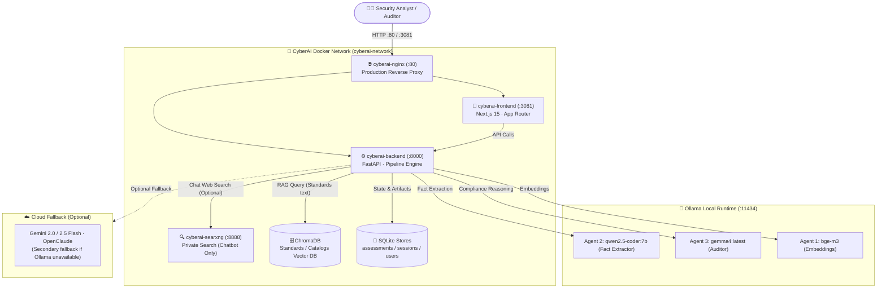

<div align="center">
  <h1>🛡️ CyberAI Assessment Platform</h1>
  <p><strong>Intelligent Cybersecurity Assessment & IT Audit Automation Platform · ISO 27001:2022 / TCVN 11930:2017</strong></p>
  <p>
    <a href="README.md"></a>
    <a href="README_vi.md"></a>
  </p>
  <p>
    
    
    
    
    
    
    
    
    
  </p>
</div>

---

**CyberAI Assessment Platform** is an enterprise-grade cybersecurity pre-audit assessment platform. The system assists organizations and IT teams in evaluating readiness against the international standard **ISO/IEC 27001:2022** (93 controls, 495 max weighted points) and Vietnamese national standard **TCVN 11930:2017** (34 controls, 271 max weighted points under Decree 85/2016/ND-CP).

> [!IMPORTANT]
> **Pre-Audit Advisory Scope**: The platform is an automated pre-audit preparation and self-assessment tool. It provides gap analysis and technical audit traces, but does **not** replace accredited third-party certification bodies and does **not** automatically issue legal compliance certificates.

---

## 📑 Table of Contents

| # | Section | Description |
|---|---------|-------------|
| 1 | [🚀 Quick Start & Docker](#1--quick-start--docker) | Run Development & Production with Docker Compose |
| 2 | [✨ Key Features](#2--key-features) | Core Pillars & Multi-Agent Pipeline |
| 3 | [🏗️ System Architecture](#3-️-system-architecture) | Service Topology & Data Boundary |
| 4 | [⚖️ Assessment Policy & Scoring Invariants](#4-️-assessment-policy--scoring-invariants) | 5 Authoritative Verdicts, 10-5-3-1 Weight Scheme |
| 5 | [🔍 Evidence, Manifest & Audit Trace](#5--evidence-manifest--audit-trace) | File integrity, Fact Cards, and Unified Result |
| 6 | [🤖 AI Models & Web Search Scope](#6--ai-models--web-search-scope) | Real verified models, Chatbot-only SearXNG |
| 7 | [⚙️ Environment Variables](#7-️-environment-variables) | `.env.example` Reference |
| 8 | [📚 Technical Documentation](#8--technical-documentation) | Links to In-Depth Technical Documents |
| 9 | [📄 License](#-license) | MIT License |

---

## 1. 🚀 Quick Start & Docker

The repository provides clearly separated configurations for Development and Production:

### Development Mode (with Source Code Bind Mount & Hot-Reload)
```bash
# 1. Clone repository
git clone https://github.com/NghiaDinh03/CyberAI-Assessment-project.git
cd CyberAI-Assessment-project

# 2. Setup environment
cp .env.example .env

# 3. Launch Development stack
docker compose -f docker-compose.dev.yml up -d

# 4. View logs
docker compose -f docker-compose.dev.yml logs -f
```

### Production Mode (Pre-built Image, No Source Mount, Nginx Reverse Proxy)
```bash
# Launch Production stack
docker compose -f docker-compose.prod.yml up -d --build
```

### 🌐 Service Ports & Routing

| Service | Port (Host) | Container Port | Mode | Description |
|---|---|---|---|---|
| 🌐 **Nginx Reverse Proxy** | `:80` | `80` | Prod only | Reverse proxy HTTP port 80, SSE streaming |
| 🖥️ **Frontend UI** | `:3081` | `3000` | Dev & Prod | Next.js 15 interface (i18n EN/VI) |
| ⚡ **Backend API** | `:8000` | `8000` | Dev & Prod | FastAPI REST server, Multi-Agent pipeline |
| 🔍 **SearXNG Search** | `:8888` | `8080` | Dev & Prod | Local meta-search engine (**Chatbot only**) |
| 🦙 **Ollama Runtime** | `:11434` / `:11435` | `11434` | Host / Container | `gemma4:latest`, `qwen2.5-coder:7b`, `bge-m3` |

```bash
# Check service health
curl -f http://localhost:8000/health
```

---

## 2. ✨ Key Features

| Feature Pillar | Technical Implementation |
|----------------|--------------------------|
| **📋 1. Standardized Assessment Pipeline** | • 4-step wizard: Scope & Org -> Infrastructure -> Controls Checklist -> Review & AI Mode<br>• Authoritative catalogs: ISO 27001:2022 (93 controls) & TCVN 11930:2017 (34 controls)<br>• Tesseract OCR & native parser for technical evidence (PDF, PNG/JPG, TXT, LOG, CONF)<br>• Multi-Agent reasoning: RAG Standard Retrieval -> Fact Extraction -> Compliance Audit -> Report Synthesis |
| **⚖️ 2. Strict Weighted Compliance Scoring** | • Unified 5 Authoritative Verdicts: `satisfied`, `partial`, `not_evidenced`, `missing`, `needs_expert_review`<br>• Exact 10-5-3-1 weight scheme; denominator includes all catalogue controls (no N/A exclusion)<br>• Complete separation between **Raw Coverage** (self-declared) and **Weighted Compliance** (evidence-verified) |
| **🛡️ 3. Evidence Manifest & Audit Trace** | • Distinguishes Template Preview vs Uploaded Evidence vs Assessment Manifest<br>• Every manifest record stores `file_id`, `sha256`, `parser_or_ocr`, mapped controls, and ingestion status<br>• Single source of truth: `UnifiedAssessmentResult` drives JSON, Audit Trace, SoA XLSX, Risk Register XLSX, DOCX, and PDF |
| **💬 4. AI Security Chatbot & RAG** | • Interactive Q&A referencing ISO 27001 / TCVN 11930 standard texts from ChromaDB vector store<br>• Optional Web Search via local SearXNG instance (clearly toggled by user, **Chatbot only**)<br>• Web Search is strictly isolated and never introduced into assessment scoring |
| **🔐 5. Security & Persistence** | • User authentication with Salted PBKDF2/SHA-256 password hashing<br>• Persistent volumes for SQLite databases (`users.db`, `sessions.db`, `assessments.db`), ChromaDB vector store, and exports |

---

## 3. 🏗️ System Architecture



---

## 4. ⚖️ Assessment Policy & Scoring Invariants

### 4.1. Five Authoritative Verdicts
The platform evaluates evidence strictly against 5 standardized verdicts:

| Verdict | Factor | Meaning | Contribution to Weighted Compliance |
|:---|:---:|:---|:---:|
| `satisfied` | **1.0** | Full technical evidence satisfies all control requirements | Full weight points ($w \times 1.0$) |
| `partial` | **0.5** | Evidence demonstrates partial implementation | 50% weight points ($w \times 0.5$) |
| `not_evidenced` | **0.0** | Control self-declared implemented but lacks verified evidence | 0 points |
| `missing` | **0.0** | Control not implemented or no evidence provided | 0 points |
| `needs_expert_review` | **0.0** | Conflict detected between self-declaration and evidence, or unparseable | 0 points (requires manual expert review) |

> [!WARNING]
> **No Controls Excluded**: The `not_applicable` (N/A) verdict is completely eliminated from the scoring pipeline. All controls in the catalogue participate in the denominator. Any legacy records containing N/A are normalized to `needs_expert_review` (factor 0.0), maintaining the invariant total catalogue denominator.

### 4.2. Weighted Compliance Formula
$$\text{Weighted Compliance} = \frac{\sum (w_i \times \text{verdict\_factor}_i)}{\sum w_{\text{catalogue}}} \times 100\%$$

- **Weight Points**: Critical = 10, High = 5, Medium = 3, Low = 1.
- **Fixed Denominator Invariants**:
  - **ISO/IEC 27001:2022**: Exactly **93 controls**, $\sum w_{\text{catalogue}} = \mathbf{495.0}$ max points.
  - **TCVN 11930:2017**: Exactly **34 controls**, $\sum w_{\text{catalogue}} = \mathbf{271.0}$ max points.
- AI confidence is metadata only and is never multiplied into the compliance score.

### 4.3. Raw Coverage vs. Weighted Compliance
- **Raw Coverage**: $\frac{\text{self\_declared\_implemented}}{\text{total\_controls}} \times 100\%$. Represents self-declared intention, **not** an evidence-verified compliance achievement.
- Merely uploading evidence does not grant points; only an authoritative `satisfied` or `partial` verdict from technical analysis contributes to Weighted Compliance.

---

## 5. 🔍 Evidence, Manifest & Audit Trace

### 5.1. Three Evidence Concepts
1. **Template / Demo Preview**: Sample system profiles for demonstration. Clearly marked with a banner and never treated as real technical evidence.
2. **Uploaded Evidence**: Raw files uploaded by the user (PDF, image, configuration files, logs).
3. **Assessment Evidence Manifest**: Authoritative, cryptographically verified record of files ingested in a specific assessment run (`assessment_id`, `run_id`, `file_id`, SHA-256, OCR status, mapped controls). SHA-256 proves file integrity, not semantic correctness.

### 5.2. Single Source of Truth
All output formats (Audit Trace JSON, Statement of Applicability XLSX, Risk Register XLSX, Executive Summary DOCX, and PDF) are generated from the identical validated `UnifiedAssessmentResult` model, ensuring 100% mathematical consistency across all deliverables.

---

## 6. 🤖 AI Models & Web Search Scope

### 6.1. Verified Runtime Models
- **Agent 1 (Embeddings & Standards RAG)**: `bge-m3` (1024-dimensional multilingual dense & sparse retrieval).
- **Agent 2 (Evidence Fact Extractor)**: `qwen2.5-coder:7b` (Extracts technical facts, parameters, and creates Fact Cards).
- **Agent 3 (Compliance Auditor)**: `gemma4:latest` (Performs GAP analysis, risk scoring, and assigns verdicts).
- **Agent 4 (Report Exporter)**: Internal deterministic template generator (`report_docx_generator.py`, `soa_exporter.py`, `risk_register_exporter.py`).

### 6.2. Web Search Isolation
- Web Search is powered by a local **SearXNG** container (`http://searxng:8080`).
- **Web Search is exclusively available in the AI Chatbot** when explicitly toggled on by the user.
- Web Search is **never** invoked or used as an evidence source during Assessment execution.

---

## 7. ⚙️ Environment Variables

Key settings from [`.env.example`](.env.example):

| Variable | Default | Description |
|:---|:---|:---|
| `OLLAMA_URL` | `http://host.docker.internal:11434` | Ollama API endpoint on host |
| `MODEL_1_EXTRACTOR` | `qwen2.5-coder:7b` | Technical evidence fact extraction model |
| `MODEL_2_AUDITOR` | `gemma4:latest` | Primary compliance auditor model |
| `MODEL_3_EMBEDDING` | `bge-m3` | Standards embedding model |
| `SEARXNG_URL` | `http://searxng:8080` | Local SearXNG endpoint (**Chatbot only**) |
| `PREFER_LOCAL` | `true` | Enforces 100% offline local inference |
| `INFERENCE_TIMEOUT` | `1800` | Model inference timeout in seconds |
| `JWT_SECRET` | — | Secret key for session tokens (≥32 chars required in prod) |
| `CORS_ORIGINS` | `http://localhost,http://localhost:80,http://localhost:3000,http://localhost:3081` | Allowed client origins |

---

## 8. 📚 Technical Documentation

For complete technical details, consult the authoritative documentation suite:

| Document | Focus & Scope |
|:---|:---|
| [**Architecture Overview**](docs/ARCHITECTURE.md) | Multi-tier service topology, data isolation, and network architecture |
| [**Assessment Workflow**](docs/ASSESSMENT_WORKFLOW.md) | Step-by-step pipeline from upload to fact extraction, RAG, and audit |
| [**Scoring & Verdicts Specification**](docs/SCORING_AND_VERDICTS.md) | 5 verdicts, 10-5-3-1 weight rules, 495/271 invariants, mathematical proofs |
| [**Evidence & Audit Trace**](docs/EVIDENCE_AND_AUDIT_TRACE.md) | Evidence Manifest, Fact Cards, SHA-256 verification, and audit records |
| [**Chatbot & Web Search**](docs/CHATBOT_AND_WEB_SEARCH.md) | Chatbot RAG, SearXNG private search integration, and boundary isolation |
| [**Deployment Guide**](docs/DEPLOYMENT.md) | Docker Dev & Prod setups, Nginx reverse proxy, and hardware sizing |
| [**Testing & Reproduction Guide**](docs/TESTING_AND_REPRODUCTION.md) | Deterministic test commands, test suites, and reproduction environments |

---

## 📄 License

Distributed under the MIT License. See [LICENSE](LICENSE) for more information.
