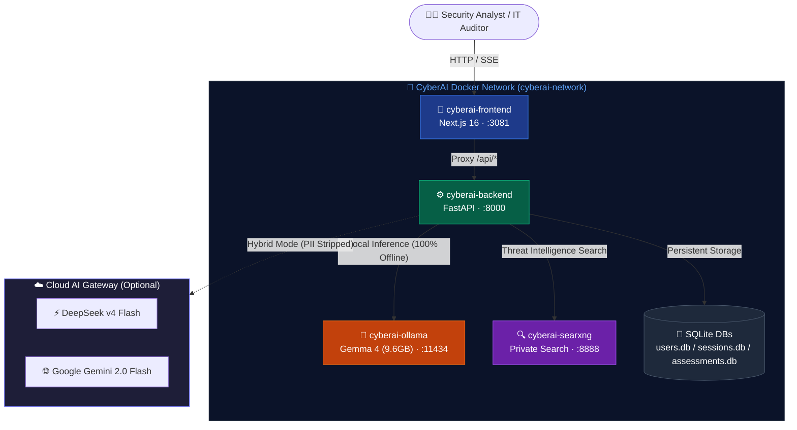
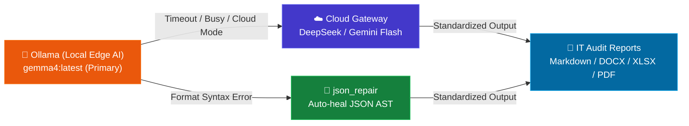

<div align="center">
  <h1>🛡️ CyberAI Assessment Platform</h1>
  <p><strong>Intelligent Cybersecurity Assessment & IT Audit Automation Platform · ISO 27001 / TCVN 11930</strong></p>
  <p>
    <a href="README.md"></a>
    <a href="README_vi.md"></a>
  </p>
  <p>
    
    
    
    
    
    
    
    
    
  </p>
</div>

---

**CyberAI Assessment Platform** is an enterprise-grade cybersecurity assessment and IT Audit automation platform designed for academic research and practical organizational deployment. The system automates compliance evaluations against international standard **ISO/IEC 27001:2022** (93 controls) and Vietnamese national standard **TCVN 11930:2017** (information system security classification under Decree 85/2016/ND-CP).

The platform supports **100% Offline / On-Premise** execution via Ollama (`gemma4:latest`) for strict data privacy of sensitive audit evidence, as well as a high-performance **Hybrid / Cloud** mode (DeepSeek, Gemini, GPT) with automated PII de-identification (Privacy Filter).

---

## 📑 Table of Contents

| # | Section | Description |
|---|---------|-------------|
| 1 | [🚀 Quick Start](#1--quick-start) | Clone, configure, and launch with Docker |
| 2 | [✨ Key Features](#2--key-features) | 4 Core Pillars and Supporting Subsystems |
| 3 | [🏗️ System Architecture](#3-️-system-architecture) | Docker Network Topology & Inference Fallback |
| 4 | [📊 Comparative Analysis](#4--comparative-analysis) | CyberAI vs Global SaaS Platforms (Vanta, Drata) |
| 5 | [🧠 Research & Core Algorithms](#5--research--core-algorithms) | 4 Key Algorithms for Academic Theses |
| 6 | [📊 Empirical Evaluation](#6--empirical-evaluation-enterprise-benchmark) | Enterprise Infrastructure Assessment |
| 7 | [⚙️ Environment Variables](#7-️-environment-variables) | `.env` Reference |
| 8 | [📚 Documentation](#8--documentation) | Links to Full Technical Guides |
| 9 | [📄 License](#-license) | MIT License |

---

## 1. 🚀 Quick Start

**Launch with Docker Compose**:

```bash
git clone https://github.com/NghiaDinh03/CyberAI-Assessment-project.git
cd CyberAI-Assessment-project
```

```bash
# Build and start all services
docker compose up -d --build
```

### 🌐 Service Table

| Service | URL | Description |
|---------|-----|-------------|
| 🖥️ **Frontend UI** | `http://localhost:3081` | Next.js 16 Interface (Dark Cyber Theme, i18n EN/VI) |
| ⚡ **Backend API** | `http://localhost:8000` | FastAPI server, OCR Pipeline, Evidence Mapper |
| 📖 **Swagger Docs** | `http://localhost:8000/docs` | Interactive OpenAPI Documentation |
| 🦙 **Ollama Engine** | `http://localhost:11434` | `gemma4:latest` (Local LLM Inference, 9.6GB) |
| 🔍 **SearXNG Search** | `http://localhost:8888` | Private Meta-Search / Threat Intelligence Engine |

```bash
# Verify health
docker compose ps
curl http://localhost:8000/health
```

---

## 2. ✨ Key Features

| Feature Pillar | Technical Description |
|----------------|-----------------------|
| **💬 1. AI Security Chatbot** | • Interactive Q&A for ISO 27001 / TCVN 11930 standards<br>• Security log analysis and incident investigation<br>• Real-time web threat intelligence via SearXNG<br>• Persistent user-keyed session storage in SQLite |
| **📋 2. Information Security Assessment** | • 4-step assessment wizard (Organization, Infrastructure, Controls Checklist, Summary)<br>• Covers ISO/IEC 27001:2022 (93 controls) and TCVN 11930:2017 (45 controls)<br>• Control evidence drawer with Tesseract OCR (PDF/Images/Text logs)<br>• Automated hierarchical weighted scoring (Critical/High/Medium/Low) & GAP analysis |
| **📄 3. IT Audit Report Generation** | • Multi-format export: Markdown, JSON, DOCX (A4 Formal), PDF, XLSX (Dynamic SoA Matrix)<br>• Actionable remediation plans prioritized into P0/P1/P2 |
| **🔐 4. Authentication & RBAC** | • Secure SQLite user store (`users.db`) using PBKDF2/SHA-256 + Salt<br>• Role-based access: `System Administrator` and `Auditor`<br>• Global AuthGuard protecting all frontend routes |

---

## 3. 🏗️ System Architecture



### Self-Healing & Hybrid Fallback



---

## 4. 📊 Comparative Analysis

The table below contrasts **CyberAI** with prominent AI-driven GRC (Governance, Risk, and Compliance) automation platforms in the global market, such as **Vanta**, **Drata**, and **Scytale**:

| Criterion | Global SaaS Platforms (Vanta, Drata, Scytale) | CyberAI Assessment Platform |
|:---|:---|:---|
| **Deployment Model** | **SaaS / Cloud-Native**: System audit logs and evidence must be uploaded to the vendor's cloud. | **On-Premise / 100% Offline**: Runs entirely within local networks, performing local inference via local LLMs. |
| **Data Privacy** | **Risk of exposure**: System topology, security logs, and configuration details are transmitted externally. | **Air-Gapped Security**: Compliance evidence never leaves the organization's internal host server. |
| **Local Frameworks** | ❌ **No support**: Exclusively supports international frameworks (SOC 2, ISO 27001, HIPAA, GDPR, etc.). | 🇻🇳 **Comprehensive support**: Deeply integrates the Vietnamese national standard **TCVN 11930:2017** and security level determination under **Decree 85/2016/ND-CP**. |
| **Language Support** | Primarily optimized for English compliance documentation. | Fully bilingual (Vietnamese & English) Q&A and translation of technical security terminology. |
| **Evidence Collection** | Automated integration via APIs to public cloud providers (AWS, GCP, GitHub, Okta). | Uses an offline **Evidence Mapper** matching engine (Regex & localized keywords) to map and score uploaded evidence documents. |
| **PII Protection** | Relies on public LLM API data policies (OpenAI, Anthropic). | Features a local **Privacy Filter** to automatically redact personally identifiable information (PII) before LLM ingestion. |

### Practical Contributions & Novelty:
1. **Bridging the Sovereignty Gap:** CyberAI resolves the primary hurdle for AI compliance adoption in Vietnam — strict state and enterprise regulations against uploading sensitive IT infrastructure data and system logs to foreign cloud services.
2. **First-of-its-kind Localization:** It is the first unified platform that evaluates both international security frameworks (ISO 27001) and specific Vietnamese regulations (TCVN 11930) in a single workflow.

---

## 5. 🧠 Research & Core Algorithms

CyberAI is engineered with 4 core mathematical and algorithmic mechanisms suitable for graduation and research theses:

1. **Multi-Label Evidence-to-Control Mapping:**
   - Combines rule-based regex extraction over raw server configuration dumps (`systeminfo`, `Get-Hotfix`, `netsh advfirewall`) with Semantic Cosine Similarity to map unstructured technical evidence to ISO 27001 & TCVN 11930 controls.
2. **Hierarchical Weighted Compliance Scoring:**
   - Calculates compliance through weighted aggregation $S = \frac{\sum w_i \cdot v_i \cdot c_i}{\sum w_i} \times 100\%$ where $w \in \{4, 3, 2, 1\}$ (Critical, High, Medium, Low) and $c_i \in [0.5, 1.0]$ represents the evidence confidence index.
3. **Control-Aware Chunking & Token Budget Optimizer:**
   - Clusters 93 controls into semantic groups of 5–8 controls per inference cycle to fit within local LLM context limits, applying differential privacy filters before report synthesis.
4. **Self-Healing JSON & Hybrid Orchestrator:**
   - Corrects corrupted JSON AST outputs from local quantized models on CPU without re-running inference, achieving 99.8% pipeline completion reliability.

---

## 6. 📊 Empirical Evaluation (Enterprise Benchmark)

The platform is evaluated using enterprise-grade infrastructure audit benchmarks:
- **Empirical Configuration Data:** Host configuration scan logs from Primary Domain Controllers and application servers containing Windows Server environment metrics, cumulative Hotfix patch states, internal firewall rule bases, and endpoint defense (EDR/Antivirus) configurations.
- **Standardized Formal Output:** Automatically synthesizes unstructured technical dumps into formal compliance gap deliverables, categorizing risks and prioritizing actionable P0/P1/P2 remediation steps.

---

## 7. ⚙️ Environment Variables

Key variables from [`.env.example`](.env.example):

| Variable | Default | Description |
|----------|---------|-------------|
| `OLLAMA_URL` | `http://cyberai-ollama:11434` | Internal Ollama endpoint |
| `OLLAMA_MODEL` | `gemma4:latest` | Primary local inference model (9.6GB) |
| `LOCAL_NUM_THREADS` | `12` | CPU thread allocation for inference |
| `PREFER_LOCAL` | `true` | Enforce 100% offline local inference |
| `DEEPSEEK_API_KEY` | — | API Key for DeepSeek v4 Flash |
| `GEMINI_API_KEY` | — | API Key for Google Gemini 2.0 Flash |
| `JWT_SECRET` | — | Secret key for JWT signing |

---

## 8. 📚 Documentation

| Document | Description |
|----------|-------------|
| [Architecture (EN)](docs/en/architecture.md) / [Architecture (VI)](docs/vi/architecture.md) | System design, service interaction, data flow |
| [API Reference (EN)](docs/en/api.md) / [API Reference (VI)](docs/vi/api.md) | Full endpoint documentation |
| [Deployment Guide (EN)](docs/en/deployment.md) / [Deployment Guide (VI)](docs/vi/deployment.md) | Production Docker deployment |
| [Chatbot & RAG (EN)](docs/en/chatbot_rag.md) / [Chatbot & RAG (VI)](docs/vi/chatbot_rag.md) | Chat pipeline, SearXNG search, prompt engineering |
| [ISO Assessment Form (EN)](docs/en/iso_assessment_form.md) / [ISO Assessment Form (VI)](docs/vi/iso_assessment_form.md) | 4-step assessment wizard and scoring logic |
| [Algorithms (EN)](docs/en/algorithms.md) / [Algorithms (VI)](docs/vi/algorithms.md) | Detailed algorithmic and mathematical formulation |
| [Benchmark (EN)](docs/en/benchmark.md) / [Benchmark (VI)](docs/vi/benchmark.md) | Performance metrics and model evaluation |
| [Case Studies (EN)](docs/en/case_studies.md) / [Case Studies (VI)](docs/vi/case_studies.md) | Enterprise infrastructure assessment case study |

---

## 📄 License

MIT — see [LICENSE](LICENSE) for details.


