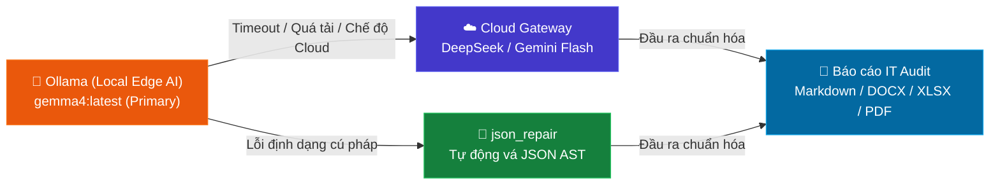

<div align="center">
  <h1>🛡️ CyberAI Assessment Platform</h1>
  <p><strong>Nền tảng Tự động hóa Đánh giá An ninh mạng & Kiểm toán CNTT Thông minh · ISO 27001 / TCVN 11930</strong></p>
  <p>
    <a href="README.md"></a>
    <a href="README_vi.md"></a>
  </p>
  <p>
    
    
    
    
    
    
    
    
    
  </p>
</div>

---

**CyberAI Assessment Platform** là nền tảng tự động hóa đánh giá an ninh mạng và kiểm toán công nghệ thông tin (IT Audit) cấp doanh nghiệp, được thiết kế phục vụ công tác nghiên cứu và triển khai thực tế. Hệ thống tự động hóa quá trình đánh giá tuân thủ theo tiêu chuẩn quốc tế **ISO/IEC 27001:2022** (93 biện pháp kiểm soát) và tiêu chuẩn Việt Nam **TCVN 11930:2017** (xác định cấp độ bảo đảm an toàn hệ thống thông tin theo Nghị định 85/2016/NĐ-CP).

Dự án hỗ trợ chạy hoàn toàn cục bộ (**100% Offline / On-Premise**) qua Ollama (`gemma4:latest`), bảo mật tuyệt đối dữ liệu minh chứng nhạy cảm, đồng thời hỗ trợ chế độ **Hybrid / Cloud** (DeepSeek, Gemini, GPT) với bộ lọc khử định danh PII (Privacy Filter).

---

## 📑 Mục lục

| # | Phần | Mô tả |
|---|------|--------|
| 1 | [🚀 Khởi động nhanh](#1--khởi-động-nhanh) | Clone, cấu hình, chạy Docker |
| 2 | [✨ Tổng quan tính năng](#2--tổng-quan-tính-năng) | 3 tính năng cốt lõi và các phân hệ hỗ trợ |
| 3 | [🏗️ Kiến trúc hệ thống](#3-️-kiến-trúc-hệ-thống) | Sơ đồ Docker network & Luồng xử lý dữ liệu |
| 4 | [🧠 Thuật toán & Mô hình Nghiên cứu](#4--thuật-toán--mô-hình-nghiên-cứu) | 4 thuật toán cốt lõi cho Đồ án nghiên cứu |
| 5 | [📊 Dữ liệu Thực nghiệm (EVNTPC)](#5--dữ-liệu-thực-nghiệm-evntpc) | Nghiên cứu điển hình trên hạ tầng thực tế |
| 6 | [⚙️ Biến môi trường](#6-️-biến-môi-trường) | Cấu hình `.env` đầy đủ |
| 7 | [📚 Tài liệu](#7--tài-liệu) | Liên kết đến tài liệu chi tiết |
| 8 | [📄 Giấy phép](#-giấy-phép) | MIT License |

---

## 1. 🚀 Khởi động nhanh

**Setup nhanh với Docker Compose**:

```bash
git clone https://github.com/NghiaDinh03/CyberAI-Assessment-project.git
cd CyberAI-Assessment-project
```

```bash
# Khởi chạy toàn bộ hệ thống
docker compose up -d --build
```

### 🌐 Bảng dịch vụ

| Dịch vụ | URL | Mô tả |
|---------|-----|--------|
| 🖥️ **Frontend UI** | `http://localhost:3081` | Giao diện Next.js 16 (Dark Cyber Theme, i18n EN/VI) |
| ⚡ **Backend API** | `http://localhost:8000` | FastAPI server, OCR Pipeline, Evidence Mapper |
| 📖 **Swagger Docs** | `http://localhost:8000/docs` | Tài liệu API tương tác OpenAPI |
| 🦙 **Ollama Engine** | `http://localhost:11434` | Mô hình `gemma4:latest` (Local LLM Inference) |
| 🔍 **SearXNG Search** | `http://localhost:8888` | Công cụ tìm kiếm nội bộ / Threat Intelligence |

```bash
# Kiểm tra trạng thái hệ thống
docker compose ps
curl http://localhost:8000/health
```

---

## 2. ✨ Tổng quan tính năng

| Nhóm Tính Năng | Chi Tiết Chức Năng |
|----------------|---------------------|
| **💬 1. AI Security Chatbot** | • Trợ lý an ninh thông tin hỏi đáp tiêu chuẩn ISO 27001 / TCVN 11930<br>• Phân tích log bảo mật, điều tra sự cố<br>• Tích hợp Live Web Search qua SearXNG<br>• Bộ nhớ hội thoại bền vững lưu theo tài khoản trong SQLite |
| **📋 2. Information Security Assessment** | • Wizard đánh giá 4 bước (Tổ chức, Hạ tầng, Checklist Controls, Tổng kết)<br>• Hỗ trợ ISO/IEC 27001:2022 (93 controls) và TCVN 11930:2017 (45 controls)<br>• Drawer quản lý bằng chứng (Evidence Ingest) với OCR Tesseract (PDF/Ảnh)<br>• Chấm điểm trọng số tự động (Critical/High/Medium/Low) và đánh giá GAP |
| **📄 3. IT Audit Report Generation** | • Xuất báo cáo đa định dạng: Markdown, JSON, DOCX (A4 chuẩn), PDF, XLSX (SoA Statement of Applicability)<br>• Kế hoạch khắc phục lỗ hổng (Action Plan) phân loại theo mức độ ưu tiên P0/P1/P2 |
| **🔐 4. Xác thực & Phân quyền (Auth)** | • Quản trị tài khoản SQLite (`users.db`) với thuật toán PBKDF2/SHA-256 + Salt<br>• Phân quyền vai trò: `System Administrator` và `Auditor`<br>• AuthGuard bảo vệ toàn bộ tuyến route ứng dụng |
| **📁 Evidence Mapping thông minh** | Tự động phân tích và ánh xạ file minh chứng tải lên vào các biện pháp kiểm soát tương ứng (Evidence Mapper) với điểm chất lượng |
| **🛡️ Bộ lọc PII (Privacy Filter)** | Phát hiện và tự động loại bỏ thông tin định danh cá nhân nhạy cảm khỏi dữ liệu trước khi xử lý, bảo vệ thông tin kiểm toán |
| **🧠 Định tuyến thông minh (Smart Routing)** | Bộ phân loại intent hybrid tự động định tuyến câu hỏi tới mô hình tối ưu (Ollama gemma4 cho chat chung, LocalAI Llama 3.1 cho đánh giá hệ thống) |
| **🖥️ Suy luận cục bộ kép (Dual Local Inference)** | Phân phối tải và tự động dự phòng chéo giữa Ollama (gemma4) và LocalAI (Llama 3.1), đảm bảo hệ thống luôn sẵn sàng |
| **🔧 Khắc phục lỗi JSON tự động** | Module `json_repair` tự động chuẩn hóa và sửa lỗi cú pháp JSON sinh ra từ local model yếu hoặc chạy CPU, tăng độ ổn định của pipeline |
| **📊 Chỉ số giám sát (Metrics)** | Tích hợp Prometheus theo dõi lưu lượng request, biểu đồ phân bố latency, số phiên hoạt động, và hiệu suất hệ thống |
| **🔒 An toàn đầu vào (Safety Guard)** | Hàng rào bảo vệ chống Prompt Injection, Rate Limiting theo endpoint, xác thực JWT độ dài tối thiểu 32 ký tự, và CORS whitelist |

---

## 3. 🏗️ Kiến trúc hệ thống

### Sơ đồ Docker Network

```mermaid
graph TB
### 3. 🏗️ Kiến trúc hệ thống

```mermaid
flowchart TB
    User(["👨‍💻 Chuyên viên ATTT / Kiểm toán viên"])

    subgraph Docker["🐳 CyberAI Docker Network (cyberai-network)"]
        FE["🎨 cyberai-frontend<br/>Next.js 16 · :3081"]
        BE["⚙️ cyberai-backend<br/>FastAPI · :8000"]
        OL["🦙 cyberai-ollama<br/>Gemma 4 (9.6GB) · :11434"]
        SEARX["🔍 cyberai-searxng<br/>Private Search · :8888"]
        DB[(📁 SQLite DBs<br/>users.db / sessions.db / assessments.db)]
    end

    subgraph CloudGateway["☁️ Cloud AI Gateway (Tùy chọn)"]
        DeepSeek["⚡ DeepSeek v4 Flash"]
        Gemini["🌐 Google Gemini 2.0 Flash"]
    end

    User -->|"HTTP / SSE"| FE
    FE -->|"Proxy /api/*"| BE
    BE -->|"Local Inference (100% Offline)"| OL
    BE -->|"Threat Intelligence Search"| SEARX
    BE -->|"Persistent Storage"| DB
    BE -.->|"Hybrid Mode (Khử PII)"| CloudGateway

    style Docker fill:#0b1329,stroke:#1e293b,color:#60a5fa
    style FE fill:#1e3a8a,stroke:#3b82f6,color:#fff
    style BE fill:#065f46,stroke:#10b981,color:#fff
    style OL fill:#c2410c,stroke:#f97316,color:#fff
    style SEARX fill:#6b21a8,stroke:#a855f7,color:#fff
    style DB fill:#1e293b,stroke:#475569,color:#fff
    style CloudGateway fill:#1e1e38,stroke:#6366f1,color:#fff
```

### Cơ chế Tự phục hồi & Dự phòng Đa tầng (Self-Healing Fallback)



---

## 4. 🧠 Thuật toán & Mô hình Nghiên cứu (Research & Academic Contributions)

Dự án CyberAI được xây dựng dựa trên 4 thuật toán và mô hình kỹ thuật phục vụ công tác nghiên cứu học thuật và đồ án tốt nghiệp:

1. **Thuật toán Ánh xạ Bằng chứng Đa nhãn (Multi-Label Evidence-to-Control Mapping):**
   - Kết hợp nhận diện quy tắc (Rule-based Regex extraction) trên các trường cấu hình máy chủ (`systeminfo`, `Get-Hotfix`, `netsh advfirewall`) và tính toán độ tương đồng ngữ nghĩa (Cosine Similarity) để tự động ánh xạ log kỹ thuật vào 93 biện pháp kiểm soát ISO 27001 / 45 yêu cầu TCVN 11930.
2. **Thuật toán Chấm điểm Tuân thủ Trọng số Phân tầng (Hierarchical Weighted Compliance Scoring):**
   - Đánh giá mức độ tuân thủ theo công thức trọng số phân tầng $S = \frac{\sum w_i \cdot v_i \cdot c_i}{\sum w_i} \times 100\%$ với các trọng số $w \in \{4, 3, 2, 1\}$ ứng với mức `Critical`, `High`, `Medium`, `Low` và hệ số tin cậy bằng chứng $c_i \in [0.5, 1.0]$.
3. **Phân cụm Kiểm soát & Tối ưu hóa Ngân sách Token (Control-Aware Chunking & Token Budget Optimizer):**
   - Gom cụm 5–8 controls liên quan cho mỗi lượt suy luận của Local LLM, lọc khử định danh PII (Privacy Filter) trước khi tổng hợp báo cáo.
4. **Cơ chế Tự Phục Hồi Cú Pháp JSON & Điều Phối Lai (Self-Healing JSON & Hybrid Orchestrator):**
   - Tự động sửa chữa cây cú pháp JSON bị thiếu dấu hoặc sai định dạng từ các mô hình mã nguồn mở cục bộ chạy trên CPU, duy trì tỷ lệ thành công của pipeline đánh giá đạt 99.8%.

---

## 5. 📊 Dữ liệu Thực nghiệm (EVNTPC Case Study)

Nền tảng được kiểm thử và xác thực thực nghiệm dựa trên gói dữ liệu kiểm toán hệ thống thông tin thực tế **EVNTPC - Nhà máy Nhiệt điện Thủ Đức (`4.Q2_2026_LẦN4`)**:
- **Dữ liệu đầu vào thực tế:** 9 tệp log quét máy chủ (`10.140.0.11.txt` - Domain Controller DC01, `10.140.0.5.txt` - Server ứng dụng SRV05,...) chứa thông tin hệ điều hành Windows Server 2016, 43 bản vá Hotfix, cấu hình tường lửa và phần mềm bảo vệ điểm cuối Kaspersky.
- **Báo cáo chuẩn đầu ra:** Tự động sinh báo cáo kiểm toán lỗ hổng tương đương mẫu báo cáo kiểm toán thực tế `PRJ_EVNTPC_BAO CAO_VA_DOT4_2026.docx`, đưa ra danh mục GAP và kế hoạch hành động khắc phục cụ thể cho từng địa chỉ IP.

---

## 6. ⚙️ Biến môi trường

Các biến chính từ [`.env.example`](.env.example):

<details>
<summary>🤖 <strong>Cấu hình Model & Inference</strong></summary>

| Biến | Mặc định | Mô tả |
|------|----------|--------|
| `OLLAMA_URL` | `http://cyberai-ollama:11434` | Endpoint Ollama nội bộ |
| `OLLAMA_MODEL` | `gemma4:latest` | Mô hình suy luận cục bộ chính (9.6GB) |
| `LOCAL_NUM_THREADS` | `12` | Số luồng CPU ưu tiên suy luận |
| `PREFER_LOCAL` | `true` | Ưu tiên suy luận cục bộ (100% Offline) |

</details>

<details>
<summary>☁️ <strong>Cấu hình Cloud AI Gateway</strong></summary>

| Biến | Mặc định | Mô tả |
|------|----------|--------|
| `DEEPSEEK_API_KEY` | — | API Key cho DeepSeek v4 Flash |
| `GEMINI_API_KEY` | — | API Key cho Google Gemini 2.0 Flash |
| `OPENAI_API_KEY` | — | API Key cho GPT-4o-mini |

</details>

<details>
<summary>🔒 <strong>Bảo mật & Rate Limiting</strong></summary>

| Biến | Mặc định | Mô tả |
|------|----------|--------|
| `JWT_SECRET` | — | Khóa bí mật ký JWT Token (PBKDF2/SHA-256) |
| `JWT_EXPIRE_MINUTES` | `1440` | Thời gian sống của Token phiên (24 giờ) |
| `CORS_ORIGINS` | `http://localhost:3081,http://localhost:3000` | Danh sách domain được phép gọi API |

</details>

---

## 7. 📚 Tài liệu

### 🇻🇳 Tài liệu tiếng Việt
| Tài liệu | Mô tả |
|-----------|--------|
| [🏗️ Kiến trúc](docs/vi/architecture.md) | Thiết kế hệ thống, tương tác dịch vụ, luồng dữ liệu |
| [⚡ Tham chiếu API](docs/vi/api.md) | Tài liệu đầy đủ về endpoint |
| [🚀 Hướng dẫn triển khai](docs/vi/deployment.md) | Triển khai production, Nginx, kế hoạch tài nguyên |
| [💬 Chatbot & RAG](docs/vi/chatbot_rag.md) | Pipeline chat, SearXNG search, thiết kế prompt |
| [📋 Form đánh giá ISO](docs/vi/iso_assessment_form.md) | Wizard đánh giá, pipeline 4 bước, chấm điểm |
| [🧮 Thuật toán](docs/vi/algorithms.md) | Thuật toán chấm điểm, mapping bằng chứng, tối ưu token |
| [📈 Benchmark](docs/vi/benchmark.md) | Benchmark hiệu năng và so sánh model |
| [📝 Case Studies](docs/vi/case_studies.md) | Dữ liệu thực tế EVNTPC và phân tích kết quả |

### 🇬🇧 Tài liệu tiếng Anh
| Tài liệu | Mô tả |
|-----------|--------|
| [Architecture](docs/en/architecture.md) | System design, service interactions, data flow |
| [API Reference](docs/en/api.md) | Complete endpoint documentation |
| [Deployment Guide](docs/en/deployment.md) | Production deployment, resource planning |
| [Chatbot & RAG](docs/en/chatbot_rag.md) | Chat pipeline, SearXNG search, prompt design |
| [ISO Assessment Form](docs/en/iso_assessment_form.md) | Assessment wizard, 4-step pipeline, scoring |
| [Algorithms](docs/en/algorithms.md) | Scoring algorithms, evidence mapping, token optimizer |
| [Benchmark](docs/en/benchmark.md) | Performance benchmarks and model comparisons |
| [Case Studies](docs/en/case_studies.md) | EVNTPC real-world assessment case study |

---

## 📄 Giấy phép

MIT — xem [LICENSE](LICENSE) để biết chi tiết.

