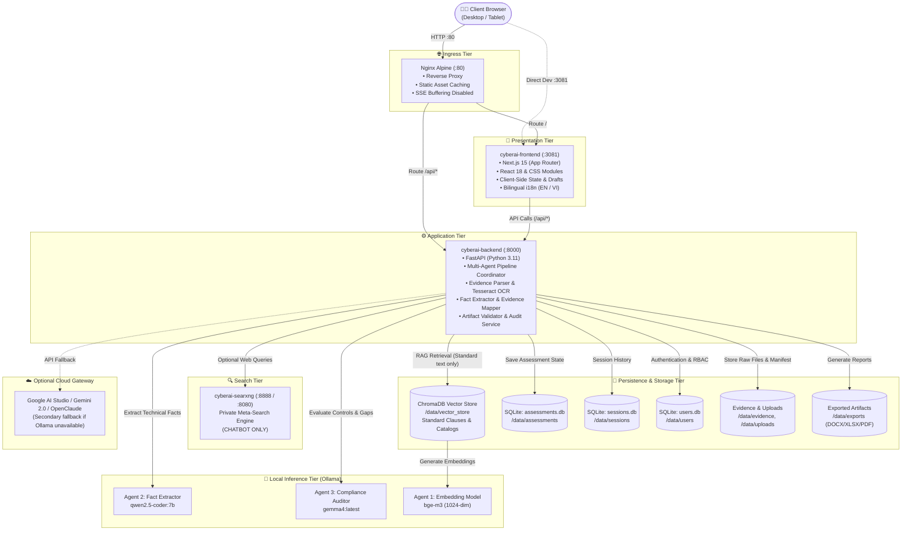
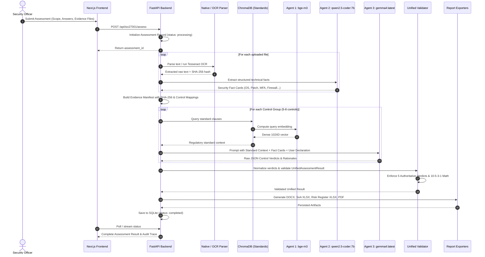

# System Architecture Specification

## 1. Overview & Architectural Philosophy

The **CyberAI Assessment Platform** is designed as a secure, on-premise-first pre-audit assessment system. It automates technical gap analysis, evidence correlation, and risk profiling against **ISO/IEC 27001:2022** and **TCVN 11930:2017**.

The architecture adheres to three core design principles:
1. **Data Sovereignty & Air-Gap Compatibility**: Technical evidence (network configurations, firewall rules, server logs, user lists) can be processed 100% locally via on-premise language models (Ollama).
2. **Clear Boundary Separation**:
   - The **Assessment Pipeline** relies strictly on standard catalogues, parsed technical evidence, Fact Cards, and deterministic schema validators.
   - The **Vector Database (ChromaDB)** stores *only* standard definitions, regulatory decrees, and control clauses. Enterprise evidence is **never** vectorized or stored in the vector database.
   - **Web Search** is strictly isolated to the interactive AI Chatbot and is **never** used during assessment scoring.
3. **Audit Reproducibility**: All compliance scores, gap classifications, and export artifacts are derived from an immutable, validated `UnifiedAssessmentResult` object linked to a verifiable Evidence Manifest with SHA-256 integrity hashes.

---

## 2. Multi-Tier Service Topology

---

## 3. Data Isolation & Privacy Boundaries

### 3.1. Standard Text vs. Enterprise Evidence
| Dimension | Standard Knowledge Base | Uploaded Enterprise Evidence |
|:---|:---|:---|
| **Content** | ISO/IEC 27001:2022 clauses, Annex A descriptions, TCVN 11930:2017 decree requirements | Server configs (`systeminfo`, `sshd_config`), firewall dumps, password policy screenshots, audit logs |
| **Storage Engine** | **ChromaDB Vector Store** (`/data/vector_store`) | **Local Encrypted/Protected Filesystem** (`/data/evidence/`) |
| **Indexing** | Vectorized into semantic chunks via `bge-m3` embedding model | **Never vectorized**. Stored as raw files with SHA-256 hashes |
| **Access in Pipeline** | Retrieved via Cosine similarity to provide regulatory context | Extracted by native parsers / OCR into structured **Security Fact Cards** |

### 3.2. Web Search Strict Isolation
- **SearXNG** is exposed only to the `ChatService` when the user explicitly enables the Web Search toggle in the Chatbot interface.
- Web search query results are annotated with `[Web Search: URL]` citations in the chat stream.
- **The Assessment Pipeline has zero dependency on Web Search**. Neither Agent 2 (Fact Extractor) nor Agent 3 (Compliance Auditor) can trigger external web requests.

---

## 4. Multi-Agent Orchestration Model

The assessment pipeline coordinates 4 specialized functional roles:

---

## 5. Persistence Architecture

### 5.1. Relational & Key-Value Storage (SQLite in WAL Mode)
- **`assessments.db`**: Stores assessment metadata, progress percentage, execution logs, and complete serialized `UnifiedAssessmentResult` JSON bodies.
- **`sessions.db`**: Stores chatbot conversation sessions and message histories.
- **`users.db`**: Stores credentials hashed with salted PBKDF2/SHA-256 and RBAC role assignments (`ADMIN`, `AUDITOR`).

### 5.2. File-Based Storage
- `/data/evidence/`: Ingested technical evidence files organized by assessment ID.
- `/data/exports/`: Generated DOCX reports, Statement of Applicability Excel files, Risk Register workbooks, and PDF documents.
- `/data/vector_store/`: Persistent ChromaDB index for standard regulatory texts.

---

## 6. Security & Hardening Architecture

1. **Authentication**: JWT tokens signed using HMAC-SHA256 with mandatory minimum 32-character secret length (`JWT_SECRET`).
2. **CORS Enforcement**: Whitelist restricts requests to configured local and internal host origins.
3. **Rate Limiting**: In-memory token bucket rate limiters prevent API abuse on chat, assessment, and benchmark endpoints.
4. **Prompt Injection Defense**: Input sanitization blocks prompt-injection patterns (`ignore previous instructions`, `act as`, system prompt overrides).
5. **Conflict Resolution Fallback**: When an irreconcilable conflict between self-declaration and evidence is detected, the pipeline automatically forces the control to `needs_expert_review` (factor 0.0), logging a safety fallback event in the Audit Trace.
