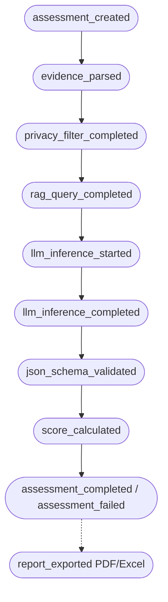

# Runtime Audit Trace Architecture & Empirical Verification

## 1. Executive Summary & Objective

The **Audit Trace System** provides an append-only, tamper-evident runtime verification mechanism for the CyberAI Assessment Platform. It cryptographically proves and documents every processing stage in ISO 27001 / TCVN 11930 assessments and real-time advisory chat sessions.

### Key Guarantees:
- **Empirical Ground Truth**: Stores the *actual model used* from runtime inference responses (e.g. `gemma4:latest` via Ollama local hardware or Claude fallback), not just static UI labels.
- **RAG Provenance**: Records collection names, knowledge base versions, query hashes, and retrieved chunk IDs/scores.
- **Append-Only Immutability**: All records are written to SQLite (`audit_events`) in append-only mode; records cannot be modified or deleted via business APIs.
- **Privacy & Secret Redaction**: Zero plaintext storage of raw prompts, responses, passwords, bearer tokens, or PII. All sensitive payloads are salted and hashed with SHA-256 (`[REDACTED_HASH:<sha256:12>]`).
- **Distributed Traceability**: A uniform `run_id` and `assessment_id` (or `chat_session_id`) links every lifecycle stage chronologically.

---

## 2. Audit Event Lifecycle & State Machine



---

## 3. Database Schema (`audit_events`)

```sql
CREATE TABLE IF NOT EXISTS audit_events (
    id INTEGER PRIMARY KEY AUTOINCREMENT,
    event_id TEXT UNIQUE NOT NULL,
    assessment_id TEXT,
    chat_session_id TEXT,
    request_id TEXT,
    run_id TEXT NOT NULL,
    event_type TEXT NOT NULL,
    status TEXT NOT NULL,
    code_version TEXT,
    created_at TEXT NOT NULL,
    payload_json TEXT NOT NULL
);

CREATE INDEX IF NOT EXISTS idx_audit_events_assessment_id ON audit_events(assessment_id, created_at ASC);
CREATE INDEX IF NOT EXISTS idx_audit_events_chat_session_id ON audit_events(chat_session_id, created_at ASC);
CREATE INDEX IF NOT EXISTS idx_audit_events_run_id ON audit_events(run_id);
CREATE INDEX IF NOT EXISTS idx_audit_events_type ON audit_events(event_type);
```

---

## 4. Redacted Audit Trace JSON Sample

Below is an authentic sample of exported audit trace data retrieved from `GET /api/iso27001/assessments/{id}/audit-trace`:

```json
{
  "assessment_id": "assess-7c81a29f-3d18-4f51-b841-8664b58e76a0",
  "summary": {
    "total_audit_events": 9,
    "rag_collections_queried": ["iso27001"],
    "actual_models_used": ["gemma4:latest"],
    "total_tokens_consumed": 1840,
    "code_version": "v1.2.0-rel"
  },
  "events": [
    {
      "id": 1,
      "event_id": "evt_8f1b63792019484ca9bdfa0e",
      "assessment_id": "assess-7c81a29f-3d18-4f51-b841-8664b58e76a0",
      "run_id": "run_43bce82f1092",
      "event_type": "assessment_created",
      "status": "completed",
      "code_version": "v1.2.0-rel",
      "created_at": "2026-08-26T09:20:10.104Z",
      "payload": {
        "standard": "iso27001",
        "model_mode": "local",
        "org_name": "TechBank Global JSC",
        "implemented_controls_count": 5,
        "total_controls": 93,
        "has_evidence": true
      }
    },
    {
      "id": 2,
      "event_id": "evt_34a819bdfc814bfaae9c8112",
      "assessment_id": "assess-7c81a29f-3d18-4f51-b841-8664b58e76a0",
      "run_id": "run_43bce82f1092",
      "event_type": "rag_query_completed",
      "status": "completed",
      "code_version": "v1.2.0-rel",
      "created_at": "2026-08-26T09:20:11.205Z",
      "payload": {
        "collection_name": "iso27001",
        "knowledge_base_version": "kb_v2026.08",
        "query_hash": "sha256:d8e8fca20194726481...",
        "top_k": 3,
        "ranked_results": [
          { "rank": 1, "record_id": "iso27001_chunk_4", "score": 0.942, "control_id": "A.5.1" },
          { "rank": 2, "record_id": "iso27001_chunk_12", "score": 0.891, "control_id": "A.8.1" }
        ]
      }
    },
    {
      "id": 3,
      "event_id": "evt_731ba20948acfe10948bf882",
      "assessment_id": "assess-7c81a29f-3d18-4f51-b841-8664b58e76a0",
      "run_id": "run_43bce82f1092",
      "event_type": "llm_inference_completed",
      "status": "completed",
      "code_version": "v1.2.0-rel",
      "created_at": "2026-08-26T09:20:15.820Z",
      "payload": {
        "phase": "chunk_analysis_group_1",
        "requested_model": "gemma4:latest",
        "actual_model": "gemma4:latest",
        "provider": "ollama",
        "fallback_used": false,
        "prompt_hash": "[REDACTED_HASH:9b28fa104821]",
        "response_hash": "[REDACTED_HASH:4fa8172638bc]",
        "usage_metrics": {
          "prompt_tokens": 1240,
          "completion_tokens": 600,
          "total_tokens": 1840,
          "total_duration_ns": 4615000000
        },
        "output_schema_valid": true
      }
    },
    {
      "id": 4,
      "event_id": "evt_91b72a419472fa0182479bc1",
      "assessment_id": "assess-7c81a29f-3d18-4f51-b841-8664b58e76a0",
      "run_id": "run_43bce82f1092",
      "event_type": "score_calculated",
      "status": "completed",
      "code_version": "v1.2.0-rel",
      "created_at": "2026-08-26T09:20:16.012Z",
      "payload": {
        "standard": "iso27001",
        "achieved_score": 5,
        "max_score": 93,
        "compliance_percentage": 5.4
      }
    },
    {
      "id": 5,
      "event_id": "evt_e71b294029471abdf9284102",
      "assessment_id": "assess-7c81a29f-3d18-4f51-b841-8664b58e76a0",
      "run_id": "run_43bce82f1092",
      "event_type": "assessment_completed",
      "status": "completed",
      "code_version": "v1.2.0-rel",
      "created_at": "2026-08-26T09:20:16.120Z",
      "payload": {
        "standard": "iso27001",
        "compliance_percentage": 5.4,
        "total_duration_seconds": 6.016
      }
    }
  ]
}
```

---

## 5. Verification API Endpoints

1. **Assessment Audit Trace**:
   - `GET /api/iso27001/assessments/{assessment_id}/audit-trace`
   - **Access Control**: Owner match or role `admin`/`auditor`.
   - Returns aggregated runtime metrics + ordered event stream.

2. **Chat Session Audit Trace**:
   - `GET /api/chat/sessions/{session_id}/audit-trace`
   - Returns chronological LLM inference and RAG query events for the dialogue.
