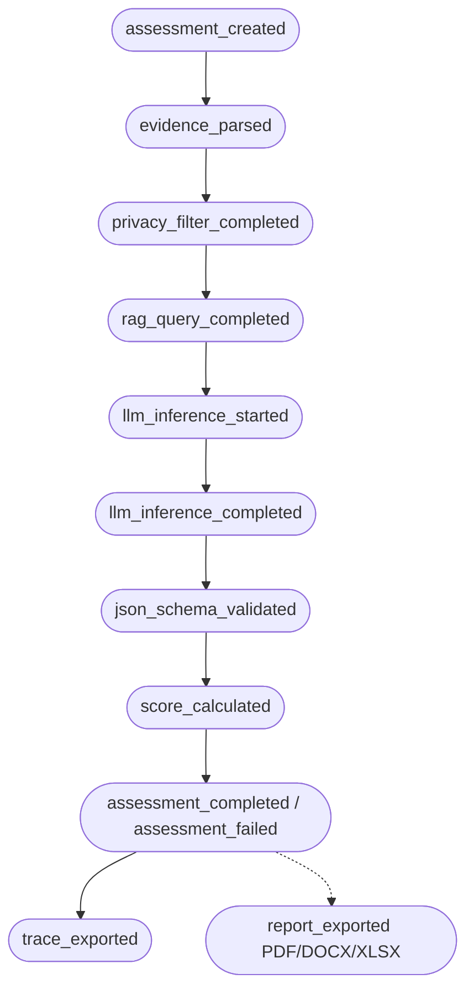

# Runtime Audit Trace Architecture & Empirical Verification

## 1. Executive Summary & Objective

The **Audit Trace System** provides a structured runtime telemetry and verification mechanism for the CyberAI Assessment Platform. It cryptographically proves and documents every processing stage in ISO 27001 / TCVN 11930 assessments and real-time advisory chat sessions.

> [!IMPORTANT]
> **Technical Scope Disclaimer:**
> The audit trace is a **technical pipeline telemetry record** to verify RAG and LLM pipeline behavior, runtime model execution, and evidence integrity. It is **not** an immutable legal audit log or a replacement for official regulatory compliance certification.

### Key Guarantees:
- **Empirical Ground Truth**: Captures the *actual model used* from runtime inference responses (e.g., `qwen2.5-coder:7b` / `gemma4:latest` via Ollama local hardware or cloud fallback), not just static UI labels.
- **RAG Provenance & Embedding Telemetry**: Fully records collection name, knowledge base version, query hash (SHA-256), `embedding_provider`, `embedding_model` (`bge-m3:latest`), `embedding_dimensions` (1024), `distance_metric` (`cosine`), and ranked retrieval scores.
- **Append-Only Technical Log**: Records are persisted in SQLite (`audit_events`) and automatically exported as standalone `data/audit_traces/{assessment_id}.json` upon assessment completion for bundle packaging.
- **Privacy & Secret Redaction**: Zero plaintext storage of raw prompts, responses, passwords, bearer tokens, internal hostnames, or private IP addresses (`192.168.***.***`). All sensitive payloads are hashed with SHA-256 (`[REDACTED_HASH:<sha256:12>]`).
- **Distributed Traceability**: Unified `assessment_id`, `run_id`, and `code_version` link every artifact (JSON, SoA XLSX, Risk Register XLSX, DOCX, PDF, and Manifest) chronologically.

---

## 2. Audit Event Lifecycle & State Machine



---

## 3. Database Schema (`audit_events`)

```sql
CREATE TABLE IF NOT EXISTS audit_events (
    id INTEGER PRIMARY KEY AUTOINCREMENT,
    event_id TEXT UNIQUE NOT NULL,
    assessment_id TEXT,
    chat_session_id TEXT,
    request_id TEXT,
    run_id TEXT NOT NULL,
    event_type TEXT NOT NULL,
    status TEXT NOT NULL,
    code_version TEXT,
    created_at TEXT NOT NULL,
    payload_json TEXT NOT NULL
);

CREATE INDEX IF NOT EXISTS idx_audit_events_assessment_id ON audit_events(assessment_id, created_at ASC);
CREATE INDEX IF NOT EXISTS idx_audit_events_chat_session_id ON audit_events(chat_session_id, created_at ASC);
CREATE INDEX IF NOT EXISTS idx_audit_events_run_id ON audit_events(run_id);
CREATE INDEX IF NOT EXISTS idx_audit_events_type ON audit_events(event_type);
```

---

## 4. Redacted Audit Trace JSON Sample

Below is an authentic sample of exported audit trace data retrieved from `GET /api/iso27001/assessments/{id}/audit-trace`:

```json
{
  "assessment_id": "assess-7c81a29f-3d18-4f51-b841-8664b58e76a0",
  "summary": {
    "total_audit_events": 9,
    "rag_collections_queried": ["iso27001"],
    "actual_models_used": ["gemma4:latest", "qwen2.5-coder:7b"],
    "total_tokens_consumed": 1840,
    "code_version": "6a15651c9d0f"
  },
  "events": [
    {
      "id": 1,
      "event_id": "evt_8f1b63792019484ca9bdfa0e",
      "assessment_id": "assess-7c81a29f-3d18-4f51-b841-8664b58e76a0",
      "run_id": "run_43bce82f1092",
      "event_type": "assessment_created",
      "status": "completed",
      "code_version": "6a15651c9d0f",
      "created_at": "2026-09-07T09:20:10.104Z",
      "payload": {
        "standard": "iso27001",
        "model_mode": "local",
        "org_name": "Acme Corp [Sanitized]",
        "total_controls": 93,
        "total_files": 3,
        "evidence_files": ["security_policy.pdf", "firewall_rule_masked.txt", "access_log_masked.log"]
      }
    },
    {
      "id": 2,
      "event_id": "evt_34a819bdfc814bfaae9c8112",
      "assessment_id": "assess-7c81a29f-3d18-4f51-b841-8664b58e76a0",
      "run_id": "run_43bce82f1092",
      "event_type": "rag_query_completed",
      "status": "completed",
      "code_version": "6a15651c9d0f",
      "created_at": "2026-09-07T09:20:11.205Z",
      "payload": {
        "collection_name": "iso27001",
        "knowledge_base_version": "kb_v2026.09",
        "embedding_provider": "ollama",
        "embedding_model": "bge-m3:latest",
        "embedding_dimensions": 1024,
        "distance_metric": "cosine",
        "query_hash": "sha256:d8e8fca20194726481734910...",
        "top_k": 3,
        "results_count": 2,
        "ranked_results": [
          { "rank": 1, "record_id": "iso27001_chunk_4", "score": 0.942, "clause_or_title": "A.5.1 Information Security Policy" },
          { "rank": 2, "record_id": "iso27001_chunk_12", "score": 0.891, "clause_or_title": "A.8.1 User Endpoint Devices" }
        ]
      }
    },
    {
      "id": 3,
      "event_id": "evt_731ba20948acfe10948bf882",
      "assessment_id": "assess-7c81a29f-3d18-4f51-b841-8664b58e76a0",
      "run_id": "run_43bce82f1092",
      "event_type": "llm_inference_completed",
      "status": "completed",
      "code_version": "6a15651c9d0f",
      "created_at": "2026-09-07T09:20:15.820Z",
      "payload": {
        "phase": "chunk_analysis_group_1",
        "requested_model": "gemma4:latest",
        "actual_model": "gemma4:latest",
        "provider": "ollama",
        "fallback_used": false,
        "prompt_hash": "[REDACTED_HASH:9b28fa104821]",
        "response_hash": "[REDACTED_HASH:4fa8172638bc]",
        "usage_metrics": {
          "prompt_tokens": 1240,
          "completion_tokens": 600,
          "total_tokens": 1840,
          "total_duration_ns": 4615000000
        },
        "output_schema_valid": true
      }
    },
    {
      "id": 4,
      "event_id": "evt_91b72a419472fa0182479bc1",
      "assessment_id": "assess-7c81a29f-3d18-4f51-b841-8664b58e76a0",
      "run_id": "run_43bce82f1092",
      "event_type": "score_calculated",
      "status": "completed",
      "code_version": "6a15651c9d0f",
      "created_at": "2026-09-07T09:20:16.012Z",
      "payload": {
        "standard": "iso27001",
        "control_coverage": {
          "self_declared_implemented": 47,
          "evidence_supported_implemented": 15,
          "not_evidenced_or_missing": 46,
          "total_controls": 93,
          "raw_percentage": 50.54
        },
        "weighted_compliance": {
          "weighted_score": 237.5,
          "weighted_max_score": 430.0,
          "percentage": 55.23,
          "algorithm": "iso27001_domain_weighted_v1"
        }
      }
    },
    {
      "id": 5,
      "event_id": "evt_e71b294029471abdf9284102",
      "assessment_id": "assess-7c81a29f-3d18-4f51-b841-8664b58e76a0",
      "run_id": "run_43bce82f1092",
      "event_type": "assessment_completed",
      "status": "completed",
      "code_version": "6a15651c9d0f",
      "created_at": "2026-09-07T09:20:16.120Z",
      "payload": {
        "standard": "iso27001",
        "weighted_compliance_percentage": 55.23,
        "raw_coverage_percentage": 50.54,
        "total_duration_seconds": 6.016
      }
    }
  ]
}
```

---

## 5. Evidence Manifest & Privacy Sanitization

For every assessment, an `evidence_manifest` is compiled:
- **Masked Filenames**: Private IP patterns (`192.168.1.1` $\to$ `192.168.***.***`) and secret tokens (`auth_a9f8b2c410` $\to$ `auth_[REDACTED]`) are stripped before writing metadata.
- **Cryptographic Hashing**: File contents are digested with SHA-256 for integrity checks without embedding raw logs or configs.
- **Fact Card Linkage**: Records which Fact Cards and controls are mapped, separating direct attachments from auto-matched items.

---

## 6. Verification API Endpoints

1. **Assessment Audit Trace**:
   - `GET /api/iso27001/assessments/{assessment_id}/audit-trace`
   - Access Control: Owner match or role `admin`/`auditor`.
   - Returns aggregated runtime metrics, embedding parameters, and ordered telemetry events.

2. **Chat Session Audit Trace**:
   - `GET /api/chat/sessions/{session_id}/audit-trace`
   - Returns chronological LLM inference, RAG query events, and Web Search telemetry (SearXNG source citations count, sanitized query hash, and layer routing) for the dialogue.

