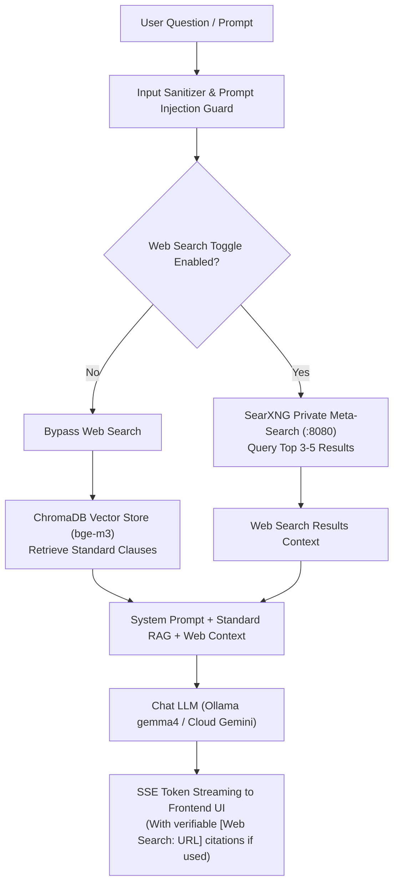

# Chatbot & Web Search Architecture Specification

## 1. Overview & Separation of Concerns

The CyberAI Platform features an interactive cybersecurity assistant designed for standard exploration, clause clarification, and threat intelligence inquiries.

> [!IMPORTANT]
> **Strict Assessment Isolation**:
> 1. **Web Search is exclusively a Chatbot feature**. It is **never** invoked or accessible within the Assessment evaluation pipeline.
> 2. Web Search is powered by an internal, private **SearXNG** instance (`http://searxng:8080`). No search telemetry is sent to commercial tracking networks.
> 3. Web Search is **disabled by default** and only triggers when the user explicitly enables the Web Search toggle in the Chatbot interface.

---

## 2. Technical Components

### 2.1. Vector RAG Retrieval
- **Vector Database**: ChromaDB (`/data/vector_store`).
- **Embedding Model**: `bge-m3` (1024 dimensions, multilingual dense + sparse embeddings).
- **Knowledge Base Scope**:
  - `ISO/IEC 27001:2022` full standard specification & Annex A controls.
  - `TCVN 11930:2017` criteria and Decree 85/2016/ND-CP guidelines.
  - `Decree 13/2023/ND-CP` on personal data protection.
- When an inquiry involves standard interpretation, `VectorStore.query_similar()` retrieves top-$k$ relevant clauses and prepends them as `REFERENCE DOCUMENTATION` in the chat context.

### 2.2. SearXNG Web Search Integration
- **Engine**: Self-hosted SearXNG container (`cyberai-searxng`).
- **Endpoint**: `http://searxng:8080/search?q={query}&format=json`.
- **Query Strategy**:
  - Activated only if `web_search=true` in the request payload.
  - Retrieves technical threat advisories (CVEs, NIST NVD updates, patch announcements).
  - Raw snippets are sanitized and capped to prevent prompt injection from untrusted web pages.
- **Citation Attribution**:
  - When web search is used, responses cite the exact source URLs in footnote blocks.
  - If web search is disabled, the system **never** fabricates web citations.

---

## 3. Security & Anti-Prompt-Injection Safeguards

The chat service enforces multi-layer input sanitization (`services/chat_service.py`):
1. **Prompt Injection Regex Filter**:
   Blocks known adversarial patterns:
   - `ignore previous instructions`
   - `disregard all prior`
   - `you are now`
   - `act as`
   - `<|im_start|>`, `<|im_end|>`
   - Requests prefixed with `system:`
2. **Session Memory Isolation**:
   - Conversations are isolated by `session_id` and user authentication token.
   - Stored securely in `sessions.db` with automated message history trimming (last 10 turns) to prevent context buffer overflow.
3. **No Executive Assessment Powers**:
   - The chatbot is purely advisory.
   - The chatbot has no access to modify assessment scores, alter control verdicts, or mutate persistent audit records.
