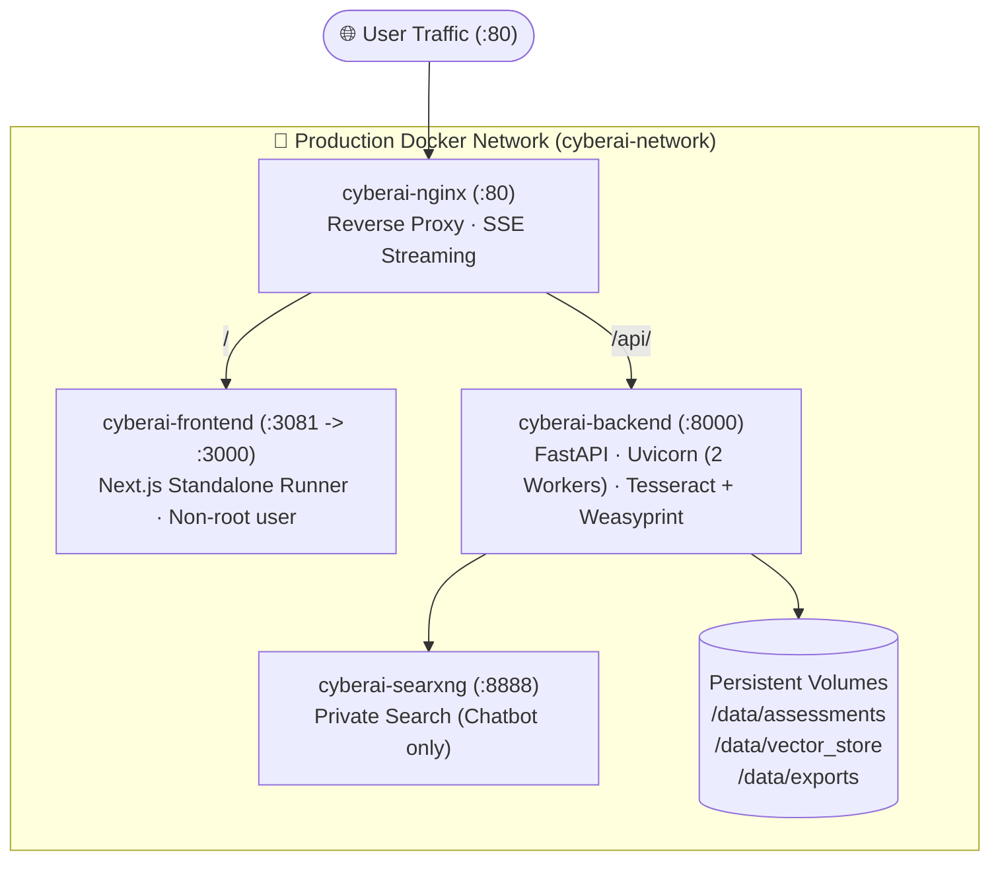

# Deployment Guide: Development & Production

## 1. System Requirements & Hardware Sizing

### 1.1. Minimum Hardware Sizing
| Resource | Minimum (Cloud/Hybrid Mode) | Recommended (100% Offline Local AI) |
|:---|:---|:---|
| **CPU** | 4 Cores (x86_64) | 8 Cores (AVX2 supported) |
| **RAM** | 8 GB | 16–32 GB |
| **Storage** | 20 GB SSD | 50 GB NVMe SSD |
| **GPU / VRAM** | Not required | NVIDIA GPU (8GB+ VRAM) or Apple Silicon / AMD ROCm |
| **Operating System** | Linux (Ubuntu 22.04+), Windows 11 (WSL2), macOS 13+ | Linux (Ubuntu 22.04+) or Windows 11 WSL2 |

> [!NOTE]
> **Local Inference Performance**:
> - Running `gemma4:latest` (approx. 9.6GB) and `qwen2.5-coder:7b` (approx. 4.7GB) on CPU is supported but requires high execution times (2–5 minutes per chunk).
> - Set `INFERENCE_TIMEOUT=1800` (30 minutes) in `.env` for CPU deployments.
> - GPU acceleration is achieved by passing through host GPU devices (e.g. `/dev/dxg` for WSL2 or NVIDIA Container Toolkit).

---

## 2. Development Setup (`docker-compose.dev.yml`)

The development environment enables instant code changes via bind-mounts and hot-reloading for both FastAPI and Next.js.

### 2.1. Start Services
```bash
# 1. Ensure environment variables are configured
cp .env.example .env

# 2. Launch Development Stack
docker compose -f docker-compose.dev.yml up -d

# 3. Validate running containers
docker compose -f docker-compose.dev.yml ps
```

### 2.2. Development Features
- **Backend**: `./backend` is mounted into `/app`. Uvicorn runs with `--reload` on port `8000`.
- **Frontend**: `./frontend-next` is mounted into `/app`. Next.js runs in development mode (`npm run dev`) on port `3081` with file polling enabled (`CHOKIDAR_USEPOLLING=true`).
- **SearXNG**: Runs on port `8888` (internal port `8080`) with `./searxng` bound to `/etc/searxng`.

### 2.3. Useful Development Commands
```bash
# View aggregated or service logs
docker compose -f docker-compose.dev.yml logs -f backend
docker compose -f docker-compose.dev.yml logs -f frontend

# Execute test suite inside backend container
docker exec cyberai-backend pytest tests/

# Execute weighted compliance test suite inside frontend container
docker exec cyberai-frontend npm test

# Stop Development Stack
docker compose -f docker-compose.dev.yml down
```

---

## 3. Production Deployment (`docker-compose.prod.yml`)

The production configuration hardens the stack for multi-user reliability, security, and resource isolation.



### 3.1. Production Architecture Standards
1. **No Source Code Bind Mounts**: Containers run strictly from pre-built image layers (`COPY . .`), ensuring immutable runtime code.
2. **Multi-Stage Frontend Build**: `frontend-next/Dockerfile` builds a lightweight Next.js `standalone` bundle executed by a non-root `node` user.
3. **Multi-Worker Backend**: FastAPI runs under Uvicorn with `--workers 2` without `--reload` for high concurrency.
4. **Ingress Reverse Proxy**: An Alpine-based Nginx instance proxies external HTTP port `80` traffic to backend (`/api/`) and frontend (`/`), with unbuffered Server-Sent Events (SSE) streaming.
5. **Healthcheck Chains**: Nginx waits for both frontend and backend to pass their respective healthchecks before routing traffic.

### 3.2. Launching Production
```bash
# 1. Setup production environment
cp .env.example .env

# Generate secure 32+ character JWT secret:
# python -c "import secrets; print(secrets.token_hex(32))"
# Edit .env:
# JWT_SECRET=<generated_secret>
# CORS_ORIGINS=http://yourdomain.com,http://localhost

# 2. Build and run production containers
docker compose -f docker-compose.prod.yml up -d --build

# 3. Verify health status
docker compose -f docker-compose.prod.yml ps
```

### 3.3. Persistent Storage Volumes
Production state is preserved across container restarts through named and host-bound volumes:
- `/data/assessments`: SQLite database for completed assessments and raw JSON bodies.
- `/data/sessions`: SQLite database for user chat histories.
- `/data/vector_store`: Persistent ChromaDB embeddings index.
- `/data/evidence`: Ingested technical files and evidence manifests.
- `/data/exports`: Output DOCX reports, Excel SoA matrices, and PDF documents.

---

## 4. Document & Report Generation Stack

The backend includes verified native export generators:
- **DOCX**: Generated via `python-docx` (`services/report_docx_generator.py`) with formal administrative A4 styling.
- **XLSX SoA & Risk Register**: Generated via `openpyxl` (`services/soa_exporter.py`, `services/risk_register_exporter.py`).
- **PDF Export**: Generated via `weasyprint` (`/api/iso27001/assessments/{id}/export-pdf`). The backend image contains all required system dependencies (`poppler-utils`, `tesseract-ocr`, `libpango`, `libcairo`). If Weasyprint is absent in custom environments, the endpoint falls back gracefully to formatted HTML.
