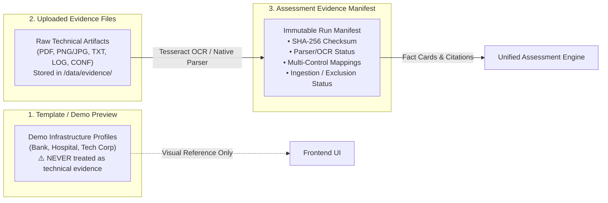
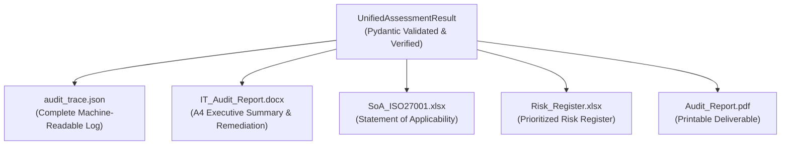

# Evidence Management & Audit Trace Specification

## 1. The Three Evidence Tiers

To ensure rigorous audit compliance, the platform cleanly differentiates between three distinct evidence concepts:



### Tier 1: Template / Demo Preview
- Pre-packaged organizational profiles used for testing, demonstration, and onboarding.
- **Rule**: Even if a template pre-checks controls in Step 3, **zero technical evidence is associated**. A template run with no attached files yields a Weighted Compliance score of exactly **0.0%**.
- A prominent amber banner (`📋 Dữ liệu mẫu từ template`) is rendered across the UI to prevent mistaking demo data for audited deliverables.

### Tier 2: Uploaded Evidence Files
- Physical files uploaded by the user to `/data/evidence/{assessment_id}/`.
- Supports plain text (`.txt`, `.log`, `.conf`, `.ini`), document formats (`.pdf`), and image formats (`.png`, `.jpg`, `.jpeg`).
- Each file is assigned a unique `file_id` (e.g. `ev_9a1f4b2c_001`).

### Tier 3: Assessment Evidence Manifest
- An immutable manifest compiled specifically for an assessment execution run (`EvidenceManifest`).
- Cryptographically binds the uploaded files to the evaluated controls.

---

## 2. Evidence Manifest Schema & Multi-Mapping

### 2.1. Manifest Item Structure (`EvidenceManifestItem`)
Every record in the manifest contains:
```python
class EvidenceManifestItem(BaseModel):
    file_id: str                      # Unique file ID in system
    masked_filename: str              # Anonymized / sanitized filename
    extension: str                    # e.g., '.pdf', '.log', '.conf'
    size_bytes: int                   # Exact file size in bytes
    sha256: str                       # 64-character SHA-256 hexadecimal hash
    parser_or_ocr: str                # 'native_parser' or 'tesseract_ocr'
    timestamp: str                    # Ingestion ISO-8601 timestamp
    fact_card_id: Optional[str]       # Associated structured Security Fact Card
    control_mapping: List[str]        # Control IDs mapped to this file (e.g. ['A.8.20', 'A.8.22'])
    mapping_type: str                 # 'direct_attachment' or 'auto_matched'
    ingestion_status: str             # 'ingested' or 'excluded'
    exclusion_reason: Optional[str]   # Reason if excluded (e.g., corrupted file, unreadable OCR)
```

### 2.2. Multi-Control Mapping Semantics
A single technical artifact often satisfies multiple security controls simultaneously:
- **Example**: `firewall_ruleset.conf` contains network zoning (DMZ, internal VLANs) and packet filtering rules.
- **Mapping**: Mapped to both `A.8.20 (Network Security)` and `A.8.22 (Segregation in Networks)`.
- **Physical Invariant**: Only **one physical file** is stored on disk and hashed. The Evidence Manifest references the single `file_id` across multiple `control_mapping` entries.
- The manifest level invariant guarantees that `total_files == len(unique_sha256_or_file_ids)`.

### 2.3. Cryptographic Hash Invariant
> [!IMPORTANT]
> The **SHA-256** checksum guarantees **data integrity** and non-repudiation between the uploaded file and the audit record.
> It proves that the evidence evaluated during the audit is byte-for-byte identical to what was uploaded.
> **It does NOT prove that the content of the file is factually accurate or compliant.** That determination is strictly made by the Compliance Auditor model and human expert review.

---

## 3. Evidence Citations in Verdicts

For any control assigned a `satisfied` or `partial` verdict, the schema requires verified evidence citations:

```json
{
  "control_id": "A.8.20",
  "assessment_verdict": "satisfied",
  "verdict_factor": 1.0,
  "weighted_score_contribution": 10.0,
  "verdict_source": "llm",
  "verdict_rationale": "Cấu hình tường lửa xác nhận quy tắc default-deny trên toàn bộ các interface vùng biên.",
  "evidence_citations": [
    {
      "evidence_id": "ev_8a2b3c_001",
      "file_name": "firewall_core.conf",
      "sha256": "e3b0c44298fc1c149afbf4c8996fb92427ae41e4649b934ca495991b7852b855",
      "excerpt": "set default-action drop; config firewall policy; edit 1; set srcintf wan"
    }
  ]
}
```

### 3.1. Rule C: Manifest Citation Reconciliation
- Every cited `file_name` and `evidence_id` in `evidence_citations` MUST resolve to an entry in the active `EvidenceManifest`.
- If an AI proposed `satisfied` or `partial` but has **no verified citations** matching manifest files:
  - **Declared Implemented with Uploaded Files**: Overridden to **`needs_expert_review`** ($v_f = 0.0$). Rationale: Files were uploaded, but could not be verified to substantiate the control requirements.
  - **Declared Implemented with Zero Files**: Overridden to **`not_evidenced`** ($v_f = 0.0$). Rationale: Control self-declared implemented, but zero evidence files exist in the manifest.
  - **Not Declared Implemented**: Overridden to **`missing`** ($v_f = 0.0$).

---

## 4. Conflict Handling & `needs_expert_review`

A control is assigned `needs_expert_review` ($v_f = 0.0$) through the following deterministic safety mechanisms:

1. **Rule A (Negative Signals & Defect Detection)**:
   - **Backup Failure Check (`DAT.01`, `A.8.13`)**: Scans analysis text and citations for failure signatures: `"archive is corrupted"`, `"0x80070070"`, `"there is not enough space on the disk"`, `"job aborted"`, or `"fatal error in backup"`.
   - **Unpatched CVE / EOL Software (`A.8.8`, `SV.07`, `MNG.05`)**: Scans for negative vulnerability signals (`"cve-"`, `"unpatched"`, `"critical vulnerability"`, `"chưa vá lỗ hổng"`, `"eol"`, `"end-of-life"`).
   - If detected on a control the user declared implemented, `conflict_detected` is set to `True`, the verdict is overridden to `needs_expert_review` (`verdict_source: safe_fallback_conflict`), and points are zeroed ($v_f = 0.0$).
2. **General Contradiction Detected**: User declared implemented, but technical evidence explicitly indicates `not_satisfied` or missing implementation.
3. **Rule C Fallback**: AI claims compliance but manifest lacks verified citations.
4. **Unreadable / Corrupt Evidence**: Attached files could not be parsed by either native text extraction or Tesseract OCR (`verdict_source: safe_fallback_no_evidence`, $v_f = 0.0$).

---

## 5. Single Source of Truth Across Exporters

All export formats are derived strictly from a single validated `UnifiedAssessmentResult` object:



| Export Deliverable | Source Fields in Unified Result | Mathematical Guarantee |
|:---|:---|:---|
| **`audit_trace.json`** | Full serialization of `UnifiedAssessmentResult` + `EvidenceManifest` | Exact byte representation of the audit state |
| **`SoA_ISO27001.xlsx`** | `controls[]`, `weighted_compliance`, `control_coverage` | All 93 controls listed; verdicts match JSON exactly |
| **`Risk_Register.xlsx`** | `controls[]` with $R \ge 4$, `risk_summary`, `top_gaps` | Risk scores equal $L \times I \le 16$; prioritized into P0/P1/P2 |
| **`IT_Audit_Report.docx`** | `weighted_compliance`, `controls[]`, `risk_summary` | Percentage and breakdown numbers agree to 1 decimal place |
| **`Audit_Report.pdf`** | Rendered view of `UnifiedAssessmentResult` | Identical scores and badges as the interactive web UI |

### 5.1. Pre-Export Invariant Validation Gate (HTTP 422)
Before generating any deliverable (`SoA_ISO27001.xlsx`, `Risk_Register.xlsx`, `IT_Audit_Report.docx`, `Audit_Report.pdf`), the backend executes `validate_assessment_invariants()`:
- Verifies that all citations exist in the `EvidenceManifest` with matching SHA-256 hashes.
- Forbids mock/hallucinated filenames.
- Enforces strict 5 authoritative verdicts and exact catalogue control counts (93 for ISO, 34 for TCVN).
- Verifies that `satisfied` verdicts in evidence runs have at least one verified citation.
- **On failure**: The export endpoint rejects the request with **HTTP 422 Unprocessable Entity** (`INVARIANT_VALIDATION_FAILED`), preventing unverified or corrupt deliverables from being produced.

### 5.2. Audit Trace Correlation
Every event in the technical audit trace and every generated deliverable is cryptographically and logically correlated using:
- **`assessment_id`**: Identifier of the assessment entity.
- **`run_id`**: Identifier of the specific pipeline execution run.
- **`code_version`**: Commit hash of the running software release.
