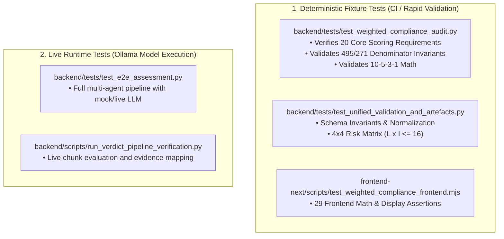

# Testing & Reproduction Specification

## 1. Verified Environment Baseline

The verification results and test suites in this document were executed and validated against the following active containerized environment:

| Component | Verified Specification |
|:---|:---|
| **Git Commit SHA** | `c79037e` |
| **Code Version** | `v1.2.0-verdict` |
| **Host Operating System** | Windows 11 Enterprise (Build 26100) / WSL2 |
| **Docker Engine** | `29.7.2, build a7dcaa6` |
| **Docker Compose** | `v5.4.0` |
| **Backend Container** | `cyberai-backend:latest` (Debian GNU/Linux 12 bookworm) |
| **Backend Python Runtime** | `Python 3.11.16` |
| **Backend Test Runner** | `pytest 9.1.1` |
| **Frontend Container** | `cyberai-frontend:latest` (Alpine Linux v3.20) |
| **Frontend Node Runtime** | `Node.js v20.20.2` |
| **Frontend Package Manager**| `npm 10.8.2` |
| **Primary Auditor Model** | `gemma4:latest` (via Ollama) |
| **Fact Extractor Model** | `qwen2.5-coder:7b` (via Ollama) |
| **Embedding Model** | `bge-m3` (ChromaDB Vector Store) |

---

## 2. Test Suite Categorization

The platform maintains a strict boundary between **Deterministic Fixture Tests** and **Live LLM Inference Tests**:



> [!WARNING]
> **Performance Disclaimers**:
> Benchmark metrics derived from **Deterministic Fixtures** execute in sub-second times and test mathematical logic and schema contracts. They must **never** be cited as production latency metrics for live Ollama inference. Live local inference latency depends entirely on host GPU/CPU hardware.

---

## 3. Reproduction Commands

### 3.1. Backend Unit & Invariant Test Suite
Run the full backend test suite inside the running container:
```bash
docker exec cyberai-backend pytest -q
# Expected outcome: 325 passed in ~67s
```

Run only the authoritative Weighted Compliance audit tests:
```bash
docker exec cyberai-backend pytest tests/test_weighted_compliance_audit.py -v
# Expected outcome: 20 passed
```

### 3.2. Frontend Invariant & Component Tests
Run the frontend weighted compliance verification:
```bash
docker exec cyberai-frontend npm test
# Expected outcome: All 29 assertions pass
```

Run frontend HTTP route and static component smoke tests:
```bash
docker exec cyberai-frontend npm run test:smoke
# Expected outcome: Static smoke test PASS, HTTP route smoke test PASS
```

### 3.3. Production Build Validation
Verify that the Next.js production build succeeds cleanly:
```bash
docker exec -e NODE_ENV=production cyberai-frontend sh -c "NODE_ENV=production npx next build"
# Expected outcome: All 21 static and dynamic routes compiled successfully with exit code 0
```

### 3.4. Docker Compose Configurations Validation
Validate Dev and Prod Compose files:
```bash
docker compose -f docker-compose.dev.yml config
docker compose -f docker-compose.prod.yml config
# Expected outcome: Both exit with code 0 without syntax errors
```

---

## 4. Output Artefacts & Hash Verification

### 4.1. Artefact Locations
- **Assessment Results JSON**: `/data/assessments/{assessment_id}.json`
- **Audit Trace**: Embedded within `result.audit_trace` or persisted at `/data/assessments/{assessment_id}_trace.json`
- **DOCX Executive Summary**: `/data/exports/IT_Audit_Report_{id_short}.docx`
- **SoA Matrix Excel**: `/data/exports/SoA_ISO27001_{id_short}.xlsx`
- **Risk Register Excel**: `/data/exports/Risk_Register_{id_short}.xlsx`
- **PDF Report**: `/data/exports/Audit_Report_{id_short}.pdf`

### 4.2. How to Verify SHA-256 Checksums
On Windows (PowerShell):
```powershell
Get-FileHash -Algorithm SHA256 <path_to_file>
```

On Linux / macOS / Docker Container:
```bash
sha256sum <path_to_file>
```
