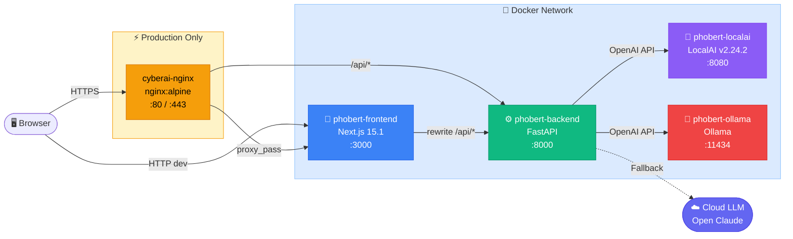
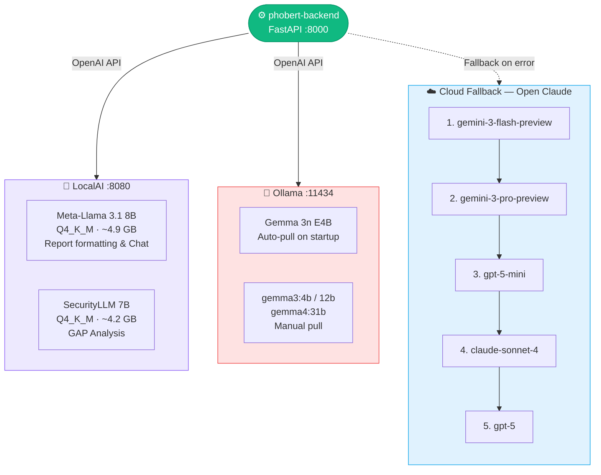
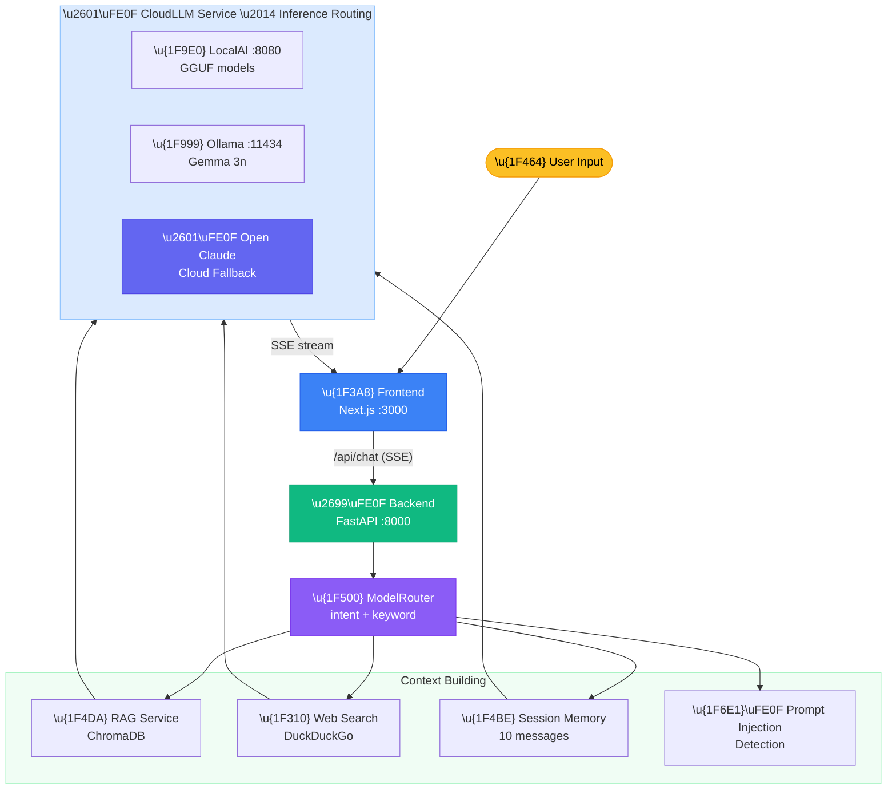
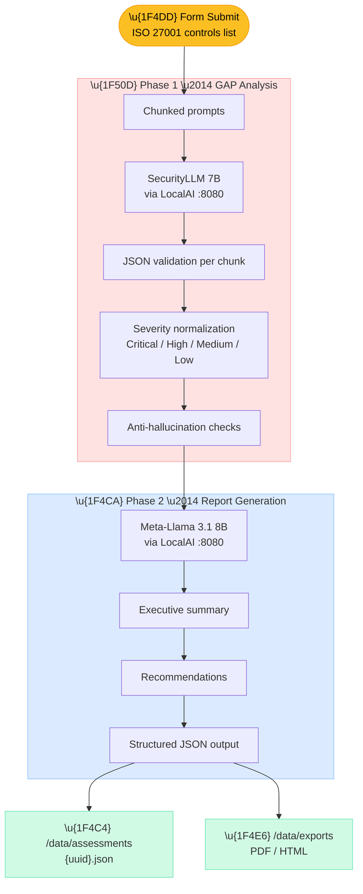
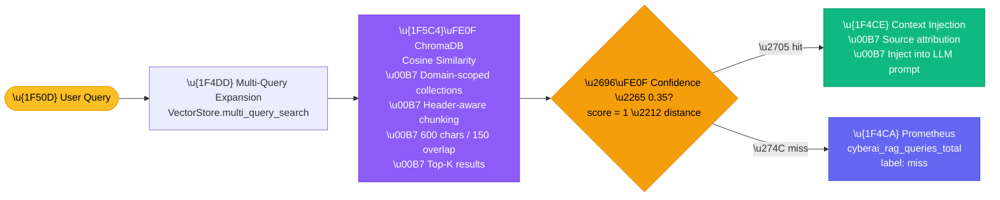

# CyberAI Assessment Platform — System Architecture

## 1. Overview

The CyberAI Assessment Platform is an AI-powered cybersecurity assessment system built on a **4-container Docker architecture** (5 in production). It provides ISO 27001 compliance chatbot, GAP analysis, automated report generation, and multi-standard assessment through dual local inference engines (LocalAI + Ollama) with cloud LLM fallback.

**Core capabilities:**
- AI-powered chat with RAG (Retrieval-Augmented Generation) over 21+ security knowledge base documents
- Automated GAP analysis and structured assessment reports
- Multi-standard support (ISO 27001, NIST CSF, PCI DSS, GDPR, SOC 2, Vietnamese regulations)
- Hybrid local/cloud inference with intelligent model routing
- Prometheus observability and structured logging

---

## 2. Container Architecture

### System Topology

| Container | Image | Port | Memory Limit | Memory Reserved | Health Check |
|-----------|-------|------|-------------|-----------------|-------------|
| `phobert-backend` | Python 3.10-slim (FastAPI) | 8000 | 6 GB | 2 GB | `curl -f http://localhost:8000/health` every 30s |
| `phobert-frontend` | Node 20-alpine (Next.js 15.1) | 3000 | 2 GB (dev) / 1 GB (prod) | — | none |
| `phobert-localai` | `localai/localai:v2.24.2` | 8080 | 12 GB (dev) / 16 GB (prod) | 4 GB (dev) / 8 GB (prod) | `curl -f http://localhost:8080/readyz` every 30s, start\_period 120s |
| `phobert-ollama` | `ollama/ollama:latest` | 11434 | 12 GB | 2 GB | `curl -sf http://localhost:11434/api/tags` every 30s |
| `cyberai-nginx` *(prod only)* | `nginx:alpine` | 80, 443 | — | — | — |

**Network:**
- Development: [`phobert-network`](docker-compose.yml:156) (bridge driver)
- Production: [`cyberai-network`](docker-compose.prod.yml:129) (bridge driver)

**Volumes:**
- Development: bind mounts for hot reload (`./backend:/app`, `./frontend-next/src:/app/src`, etc.)
- Production: named volume `cyberai-data` for `/data`, `ollama_data` for Ollama model storage

---

## 3. Dual Local Inference Architecture

The platform runs **two independent local inference engines** to maximize model compatibility and avoid single-point-of-failure:

### LocalAI (port 8080)

OpenAI-compatible API serving GGUF model files from [`models/llm/weights/`](models/llm/weights):

| Model | Quant | Size | Role |
|-------|-------|------|------|
| Meta-Llama 3.1 8B Instruct | Q4\_K\_M | ~4.9 GB | Report formatting, general chat |
| SecurityLLM 7B | Q4\_K\_M | ~4.2 GB | GAP analysis, security audit |

Configuration: [`THREADS`](.env.example:16)=6, [`CONTEXT_SIZE`](.env.example:17)=8192, `PARALLEL_REQUESTS=false`, `MMAP=true`.

### Ollama (port 11434)

OpenAI-compatible API with automatic model pulling on startup:

| Model | Pull Method |
|-------|-------------|
| Gemma 3n E4B | Auto-pulled via [entrypoint](docker-compose.yml:127): `ollama pull gemma3n:e4b` |
| gemma3:4b, gemma3:12b, gemma4:31b | Optional — manually pull or via download script |

The Ollama entrypoint starts `ollama serve`, waits 5 seconds, then pulls `gemma3n:e4b` before entering the ready state.

### Cloud Fallback

Open Claude API gateway at `https://open-claude.com/v1`:

**Fallback chain** (defined in [`FALLBACK_CHAIN`](backend/services/cloud_llm_service.py:22)):
1. `gemini-3-flash-preview`
2. `gemini-3-pro-preview`
3. `gpt-5-mini`
4. `claude-sonnet-4`
5. `gpt-5`

**Key rotation:** Round-robin across comma-separated [`CLOUD_API_KEYS`](.env.example:22) with 30-second cooldown per key on HTTP 429 rate-limit responses.

---

## 4. Model Routing Flow

The [`ModelRouter`](backend/services/model_router.py:173) uses **hybrid intent classification** — semantic first, keyword fallback:

### Step 1: Semantic Classification

ChromaDB in-memory [`intent_classifier`](backend/services/model_router.py:127) collection seeded with bilingual (Vietnamese + English) intent templates. Query returns top-3 nearest neighbors; votes are aggregated by intent with **confidence threshold 0.6**.

### Step 2: Keyword Fallback

If semantic confidence ≤ 0.6, regex matching runs against three keyword lists:
- [`ISO_KEYWORDS`](backend/services/model_router.py:61) — broad ISO/compliance terms (≥1 match → ISO candidate)
- [`ISO_STRICT_KEYWORDS`](backend/services/model_router.py:96) — strict security terms (≥2 matches → strong security signal)
- [`SEARCH_KEYWORDS`](backend/services/model_router.py:81) — real-time search intent markers

### Step 3: Route Decision

| Route | `use_rag` | `use_search` | Model | Trigger |
|-------|-----------|-------------|-------|---------|
| `security` | `true` | `false` | SecurityLLM | Semantic security intent OR ISO strict keyword match |
| `search` | `false` | `true` | General LLM | Semantic search intent OR search keywords present |
| `general` | `false` | `false` | General LLM | Default fallback |

### Inference Priority

Controlled by environment variables in [`CloudLLMService.chat_completion()`](backend/services/cloud_llm_service.py:302):

| Setting | Behavior |
|---------|----------|
| [`PREFER_LOCAL=true`](.env.example:4) | LocalAI/Ollama first → Cloud fallback on failure |
| `PREFER_LOCAL=false` | Cloud first → LocalAI fallback |
| [`LOCAL_ONLY_MODE=true`](backend/core/config.py:53) | No cloud API calls; fails if local models unavailable |

**Ollama detection:** Models starting with any of these prefixes are routed to Ollama instead of LocalAI (defined in [`OLLAMA_MODEL_PREFIXES`](backend/services/cloud_llm_service.py:310)):
`gemma3:`, `gemma3n:`, `gemma4:`, `phi4:`, `llama3:`, `mistral:`, `qwen3:`

Additionally, LocalAI Gemma IDs (`gemma-3-4b-it`, `gemma-3-12b-it`, `gemma-4-31b-it`) are mapped to their Ollama equivalents via [`_LOCALAI_TO_OLLAMA`](backend/services/cloud_llm_service.py:32).

---

## 5. Backend Architecture

### Framework

[FastAPI 0.115+](backend/requirements.txt) with Pydantic v2, async lifespan management, and versioned API routes.

**API versioning:** Dual-mounted routers at `/api/v1/...` (versioned) and `/api/...` (legacy backward-compatible), defined in [`main.py`](backend/main.py:254).

### Middleware Stack

Order matters — outermost middleware executes first:

| # | Middleware | Location | Purpose |
|---|-----------|----------|---------|
| 1 | Request body size guard | [`limit_request_size()`](backend/main.py:159) | 2 MB limit; exempt: upload/validate/evidence endpoints |
| 2 | Request ID | [`add_request_id()`](backend/main.py:141) | Propagates `X-Request-ID` header or generates UUID4 |
| 3 | Prometheus metrics | [`record_metrics()`](backend/main.py:113) | `cyberai_requests_total`, `cyberai_request_duration_seconds` |
| 4 | CORS | [`CORSMiddleware`](backend/main.py:103) | Configurable origins via [`CORS_ORIGINS`](.env.example:33) |
| 5 | Rate limiting | [`slowapi`](backend/core/limiter.py) | Per-endpoint limits (chat: 10/min, assess: 3/min, benchmark: 5/min) |

### Service Layer

| Service | File | Responsibility |
|---------|------|---------------|
| **ChatService** | [`chat_service.py`](backend/services/chat_service.py) | Singleton VectorStore/SessionStore, prompt injection detection, session memory (10 messages for LLM context), SSE streaming |
| **CloudLLMService** | [`cloud_llm_service.py`](backend/services/cloud_llm_service.py) | Round-robin API keys, rate-limit cooldown (30s), model fallback chain, LocalAI/Ollama/Cloud routing |
| **RAGService** | [`rag_service.py`](backend/services/rag_service.py) | Multi-query search, confidence threshold 0.35, Prometheus counter (`hit`/`miss`) |
| **ModelRouter** | [`model_router.py`](backend/services/model_router.py) | Hybrid semantic + keyword intent classification |
| **AssessmentHelpers** | [`assessment_helpers.py`](backend/services/assessment_helpers.py) | Chunked prompts, JSON validation (anti-hallucination), severity normalization |
| **StandardService** | [`standard_service.py`](backend/services/standard_service.py) | JSON/YAML upload, validation (max 500 controls), ChromaDB domain-scoped indexing |
| **WebSearch** | [`web_search.py`](backend/services/web_search.py) | DuckDuckGo via `ddgs`, retry logic, Vietnamese region |
| **ModelGuard** | [`model_guard.py`](backend/services/model_guard.py) | GGUF file presence check at startup |

### Repository Layer

| Repository | File | Responsibility |
|-----------|------|---------------|
| **VectorStore** | [`vector_store.py`](backend/repositories/vector_store.py) | ChromaDB `PersistentClient`, domain-scoped collections, header-aware chunking (600 chars, 150 overlap), cosine similarity |
| **SessionStore** | [`session_store.py`](backend/repositories/session_store.py) | File-based JSON in `/data/sessions/`, TTL 24h (86400s), max 20 messages per session |

---

## 6. Frontend Architecture

- **Framework:** Next.js 15.1 (App Router), React 19, [`standalone`](frontend-next/next.config.js:3) output mode
- **API proxy:** [`next.config.js`](frontend-next/next.config.js:4) rewrites `/api/:path*` → `http://backend:8000/api/:path*`
- **Dev Dockerfile:** [`Dockerfile.dev`](frontend-next/Dockerfile.dev) with `WATCHPACK_POLLING=true` for hot reload

### Pages

| Page | Route | Purpose |
|------|-------|---------|
| Dashboard | [`/`](frontend-next/src/app/page.js) | Platform overview and system status |
| AI Chat | [`/chatbot`](frontend-next/src/app/chatbot/page.js) | RAG-powered cybersecurity chatbot |
| Assessment | [`/form-iso`](frontend-next/src/app/form-iso/page.js) | ISO 27001 GAP analysis form |
| Standards | [`/standards`](frontend-next/src/app/standards/page.js) | Custom standard management |
| Analytics | [`/analytics`](frontend-next/src/app/analytics/page.js) | Assessment analytics and metrics |

### Components

| Component | File | Purpose |
|-----------|------|---------|
| Navbar | [`Navbar.js`](frontend-next/src/components/Navbar.js) | Theme toggle, multi-timezone clock, backend status dot |
| SystemStats | [`SystemStats.js`](frontend-next/src/components/SystemStats.js) | Real-time system metrics display |
| StepProgress | [`StepProgress.js`](frontend-next/src/components/StepProgress.js) | Multi-step form progress indicator |
| Skeleton | [`Skeleton.js`](frontend-next/src/components/Skeleton.js) | Loading placeholder animations |
| ThemeProvider | [`ThemeProvider.js`](frontend-next/src/components/ThemeProvider.js) | Dark/light theme context |
| Toast | [`Toast.js`](frontend-next/src/components/Toast.js) | Notification system |

---

## 7. Data Flow Diagrams

### Chat Request Flow

### Assessment Pipeline

### RAG Retrieval Flow

---

## 8. Data Storage

| Path | Purpose |
|------|---------|
| `/data/iso_documents/` | 21+ markdown knowledge base files (ISO 27001, NIST, PCI DSS, Vietnamese regulations, etc.) |
| `/data/vector_store/` | ChromaDB persistent storage (cosine similarity index) |
| `/data/assessments/` | Assessment JSON records (`{uuid}.json`) |
| `/data/evidence/` | Uploaded evidence files |
| `/data/exports/` | PDF/HTML exports |
| `/data/sessions/` | Chat session JSON files (TTL 24h, auto-cleanup on startup) |
| `/data/standards/` | Custom uploaded standards (JSON/YAML) |
| `/data/knowledge_base/` | Benchmark + controls JSON (`benchmark_iso27001.json`, `controls.json`, etc.) |
| `/data/uploads/` | Document uploads |
| `ollama_data` *(named volume)* | Ollama model storage (`/root/.ollama`) |

---

## 9. Security Architecture

### Authentication & Authorization
- JWT authentication with configurable secret ([`JWT_SECRET`](.env.example:38), minimum 32 characters)
- 60-minute token expiry ([`JWT_EXPIRE_MINUTES`](.env.example:39))
- Weak secret detection: startup refuses in production (`DEBUG=false`), warns in development

### Rate Limiting
Per-endpoint rate limiting via [`slowapi`](backend/core/limiter.py):

| Endpoint | Limit |
|----------|-------|
| Chat | [`10/minute`](.env.example:42) |
| Assessment | [`3/minute`](.env.example:43) |
| Benchmark | [`5/minute`](.env.example:44) |

### Request Protection
- Request body size limit: **2 MB** default, exempt for upload/validate/evidence endpoints
- Evidence upload: **10 MB** via endpoint-specific exemption
- CORS with configurable origins ([`CORS_ORIGINS`](.env.example:33))
- `X-Request-ID` propagation for traceability
- Prompt injection detection in [`ChatService`](backend/services/chat_service.py)

### Nginx (Production)
Defined in [`nginx.conf`](nginx/nginx.conf):
- TLS 1.2 / TLS 1.3 with modern cipher suites, OCSP stapling
- HSTS: `max-age=63072000; includeSubDomains; preload`
- Content-Security-Policy: `default-src 'self'`, `frame-ancestors 'none'`
- `X-Frame-Options: DENY`
- `X-Content-Type-Options: nosniff`
- `X-XSS-Protection: 1; mode=block`
- Hidden file denial (`location ~ /\.` → `deny all`)
- Rate limiting: 30 req/s per IP on `/api/` (burst 20), 100 req/s global (burst 50)

---

## 10. Prometheus Metrics

All metrics are defined in [`metrics.py`](backend/api/routes/metrics.py) and exposed at `GET /metrics`:

| Metric | Type | Labels | Description |
|--------|------|--------|-------------|
| `cyberai_requests_total` | Counter | `method`, `endpoint`, `status` | Total HTTP requests processed |
| `cyberai_request_duration_seconds` | Histogram | `endpoint` | Request processing duration (buckets: 5ms–10s) |
| `cyberai_active_sessions` | Gauge | — | Number of active chat sessions |
| `cyberai_rag_queries_total` | Counter | `result` (`hit` / `miss`) | RAG vector-store query outcomes |
| `cyberai_assessments_total` | Gauge | — | Total assessment records on disk |

Metrics middleware in [`main.py`](backend/main.py:113) instruments every HTTP request except `/metrics` itself to avoid self-referential cardinality.
