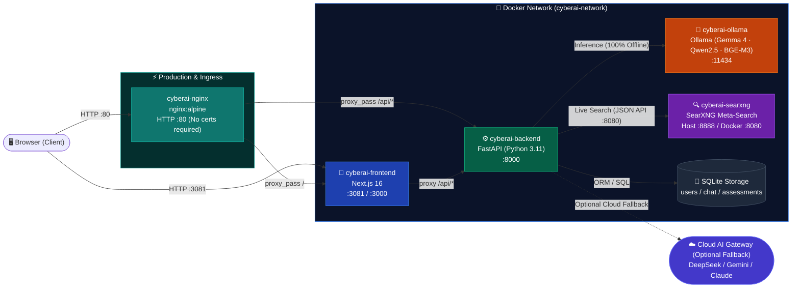
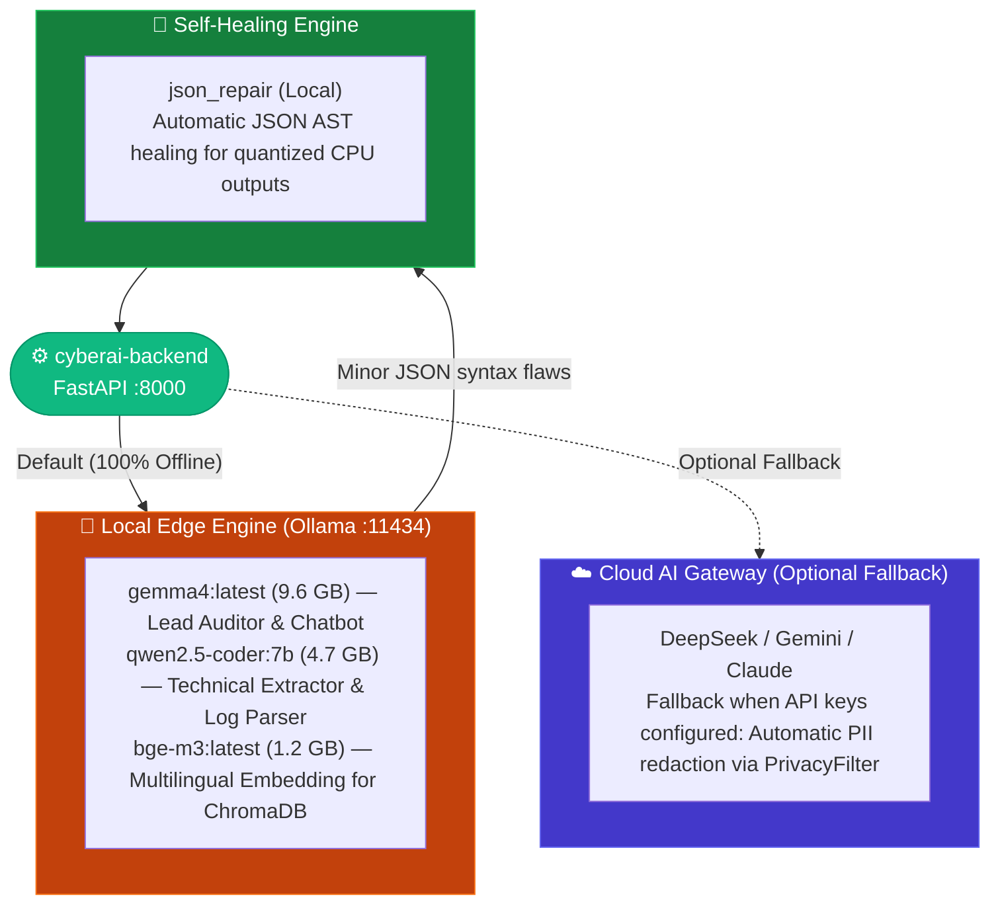
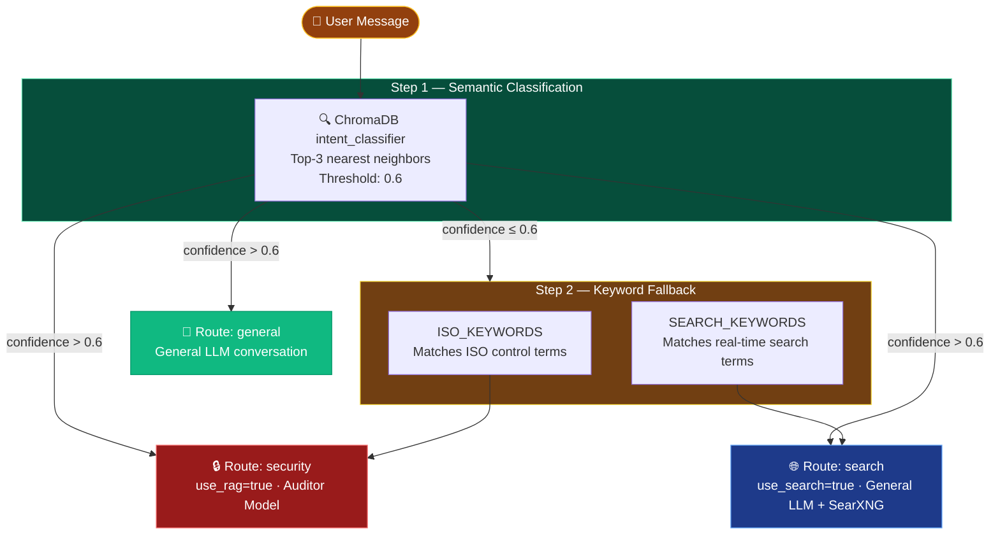
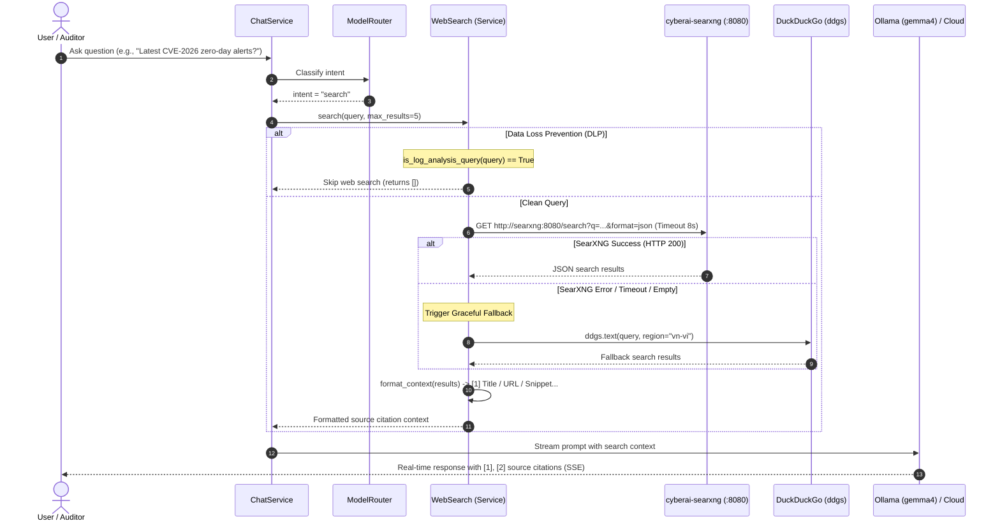

# CyberAI Assessment Platform — System Architecture

---

## 1. Overview

The CyberAI Assessment Platform is an AI-powered cybersecurity audit and compliance automation platform built on a **Docker multi-container architecture** (cyberai-frontend, cyberai-backend, cyberai-ollama, cyberai-searxng, and cyberai-nginx). It provides ISO 27001 / TCVN 11930 compliance assistance, control-by-control assessment, automated evidence extraction via Tesseract OCR, and comprehensive multi-format audit report generation (DOCX, XLSX, PDF, Markdown, JSON).

The platform operates on **100% On-Premise Local AI Offline** inference via **Ollama (`gemma4:latest`, `qwen2.5-coder:7b`, `bge-m3`)** to guarantee absolute data privacy, while supporting an optional Cloud AI Gateway (DeepSeek, Gemini, Claude) with an automated PII Privacy Filter for hybrid workflows.

**Core capabilities:**
- 🤖 **AI Security Chatbot:** SSE streaming, ISO 27001:2022 & TCVN 11930:2017 Q&A, real-time threat intelligence search via SearXNG.
- 📋 **Information Security Assessment:** 4-step assessment wizard covering ISO 27001 (93 controls) and TCVN 11930 (45 controls).
- 📁 **Smart Evidence Processing:** Tesseract OCR (PDF/images/system logs) and multi-label Evidence-to-Control mapping.
- 🔐 **Authentication & Persistent Storage:** Role-based access control (Admin/Auditor) and multi-threaded SQLite persistence (`users.db`, `chat_sessions.db`, `assessments.db`).
- 📈 **Observability:** Prometheus metrics, structured audit traces, and health check monitoring.

---

## 2. Container Architecture

### System Topology

```mermaid
flowchart LR
    Browser(["🖥️ Browser (Client)"])

    subgraph PROD["⚡ Production & Ingress"]
        Nginx["cyberai-nginx\nnginx:alpine\nHTTP :80 (No certs required)"]
    end

    subgraph DOCKER["🐳 Docker Network (cyberai-network)"]
        Frontend["🎨 cyberai-frontend\nNext.js 16\n:3081 / :3000"]
        Backend["⚙️ cyberai-backend\nFastAPI (Python 3.11)\n:8000"]
        Ollama["🦙 cyberai-ollama\nOllama (Gemma 4 · Qwen2.5 · BGE-M3)\n:11434"]
        SearX["🔍 cyberai-searxng\nSearXNG Meta-Search\nHost :8888 / Docker :8080"]
        DB[(📁 SQLite Storage\nusers / chat / assessments)]
    end

    Cloud(["☁️ Cloud AI Gateway (Optional Fallback)\nDeepSeek / Gemini / Claude"])

    Browser -- "HTTP :80" --> Nginx
    Browser -- "HTTP :3081" --> Frontend
    Nginx -- "proxy_pass /" --> Frontend
    Nginx -- "proxy_pass /api/*" --> Backend
    Frontend -- "proxy /api/*" --> Backend
    Backend -- "Inference (100% Offline)" --> Ollama
    Backend -- "Live Search (JSON API :8080)" --> SearX
    Backend -- "ORM / SQL" --> DB
    Backend -. "Optional Cloud Fallback" .-> Cloud

    style Nginx fill:#0f766e,stroke:#14b8a6,color:#fff
    style Frontend fill:#1e40af,stroke:#3b82f6,color:#fff
    style Backend fill:#065f46,stroke:#10b981,color:#fff
    style Ollama fill:#c2410c,stroke:#f97316,color:#fff
    style SearX fill:#6b21a8,stroke:#a855f7,color:#fff
    style DB fill:#1e293b,stroke:#475569,color:#fff
    style Cloud fill:#4338ca,stroke:#6366f1,color:#fff
    style PROD fill:#042f2e,stroke:#0d9488,color:#fff
    style DOCKER fill:#0b1329,stroke:#3b82f6,color:#fff
```

### Container Specifications

| Container | Image / Base | Exposed Port | Resource Limits (WSL2 / Host) | Purpose & Role |
|---|---|---|---|---|
| `cyberai-frontend` | Node 20-alpine (Next.js 16) | 3081 (prod) / 3000 (dev) | 2 GB RAM, 2 vCPUs | Web User Interface (Dark Cyber Theme, i18n EN/VI, AuthGuard) |
| `cyberai-backend` | Python 3.11-slim (FastAPI) | 8000 | 4 GB RAM, 4 vCPUs | Core audit engine, Tesseract OCR, Evidence Mapper, SQLite stores |
| `cyberai-ollama` | `ollama/ollama:latest` | 11434 | 14 GB RAM, 12 vCPUs | 100% Offline Local AI inference (`gemma4:latest`, `qwen2.5-coder:7b`, `bge-m3`) |
| `cyberai-searxng` | `searxng/searxng:latest` | 8888 (host) / 8080 (docker) | 1 GB RAM, 1 vCPU | Privacy-preserving local threat intelligence search engine, JSON API, mounts `searxng/settings.yml` |
| `cyberai-nginx` *(prod)* | `nginx:alpine` | 80 | — | Pure HTTP reverse proxy (no SSL/certs needed), rate limiting, SSE unbuffered |

---

## 3. Local Inference & Orchestration Architecture

The system prioritizes 100% on-premise operation for data privacy and compliance assurance:

```mermaid
flowchart TB
    BE(["⚙️ cyberai-backend\nFastAPI :8000"])

    subgraph LOCAL["🦙 Local Edge Engine (Ollama :11434)"]
        O1["gemma4:latest (9.6 GB) — Lead Auditor & Chatbot\nqwen2.5-coder:7b (4.7 GB) — Technical Extractor & Log Parser\nbge-m3:latest (1.2 GB) — Multilingual Embedding for ChromaDB"]
    end

    subgraph REPAIR["🔧 Self-Healing Engine"]
        R1["json_repair (Local)\nAutomatic JSON AST healing for quantized CPU outputs"]
    end

    subgraph CLOUD["☁️ Cloud AI Gateway (Optional Fallback)"]
        C1["DeepSeek / Gemini / Claude\nFallback when API keys configured: Automatic PII redaction via PrivacyFilter"]
    end

    BE -- "Default (100% Offline)" --> LOCAL
    LOCAL -->|"Minor JSON syntax flaws"| REPAIR
    REPAIR --> BE
    BE -. "Optional Fallback" .-> CLOUD

    style BE fill:#10b981,stroke:#059669,color:#fff
    style LOCAL fill:#c2410c,stroke:#f97316,color:#fff
    style REPAIR fill:#15803d,stroke:#22c55e,color:#fff
    style CLOUD fill:#4338ca,stroke:#6366f1,color:#fff
```

### 1. Ollama Inference Engine (100% Offline Local - Port 11434)
- **Primary Auditor (`gemma4:latest`, 9.6 GB):** Lead auditor reasoning, ISO 27001 / TCVN 11930 compliance gap analysis, executive summary generation, and interactive chatbot Q&A.
- **Technical Extractor (`qwen2.5-coder:7b`, 4.7 GB):** Specializes in parsing technical server configuration dumps (`systeminfo`, `Get-Hotfix`, firewall rule sets) and event log triage.
- **Multilingual Embedding (`bge-m3:latest`, 1.2 GB):** Generates dense and sparse semantic vector representations for ChromaDB vector search.
- **Self-Healing Output:** Employs `json_repair` to automatically fix malformed JSON AST responses (missing brackets, trailing commas) without triggering expensive re-inferences.

### 2. Cloud AI Gateway & Privacy Guard (Optional)
- When cloud mode is configured, data is pre-processed by `PrivacyFilter` to redact IP addresses, emails, phone numbers, passwords, and organizational identifiers before network transmission.

---

## 4. Model Routing & Intent Classification

The `ModelRouter` employs a hybrid classification pipeline:

```mermaid
flowchart TD
    Input(["📝 User Message"])
    Input --> Semantic

    subgraph STEP1["Step 1 — Semantic Classification"]
        Semantic["🔍 ChromaDB intent_classifier\nTop-3 nearest neighbors\nThreshold: 0.6"]
    end

    Semantic -- "confidence > 0.6" --> Security
    Semantic -- "confidence > 0.6" --> Search
    Semantic -- "confidence > 0.6" --> General
    Semantic -- "confidence ≤ 0.6" --> STEP2

    subgraph STEP2["Step 2 — Keyword Fallback"]
        KW_ISO["ISO_KEYWORDS\nMatches ISO control terms"]
        KW_SEARCH["SEARCH_KEYWORDS\nMatches real-time search terms"]
    end

    KW_ISO --> Security
    KW_SEARCH --> Search

    Security["🔒 Route: security\nuse_rag=true · Auditor Model"]
    Search["🌐 Route: search\nuse_search=true · General LLM + SearXNG"]
    General["💬 Route: general\nGeneral LLM conversation"]

    style Input fill:#92400e,stroke:#fbbf24,color:#fff
    style STEP1 fill:#064e3b,stroke:#6ee7b7,color:#fff
    style STEP2 fill:#713f12,stroke:#fde047,color:#fff
    style Security fill:#991b1b,stroke:#f87171,color:#fff
    style Search fill:#1e3a8a,stroke:#60a5fa,color:#fff
    style General fill:#10b981,stroke:#059669,color:#fff
```

---

## 5. Web Search & Threat Intelligence Architecture

The web search subsystem implements a dual-layer, fault-tolerant pattern:

```mermaid
sequenceDiagram
    autonumber
    actor User as User / Auditor
    participant Chat as ChatService
    participant Router as ModelRouter
    participant Search as WebSearch (Service)
    participant SearX as cyberai-searxng (:8080)
    participant DDGS as DuckDuckGo (ddgs)
    participant LLM as Ollama (gemma4) / Cloud

    User->>Chat: Ask question (e.g., "Latest CVE-2026 zero-day alerts?")
    Chat->>Router: Classify intent
    Router-->>Chat: intent = "search"
    Chat->>Search: search(query, max_results=5)
    
    alt Data Loss Prevention (DLP)
        Note over Search: is_log_analysis_query(query) == True
        Search-->>Chat: Skip web search (returns [])
    else Clean Query
        Search->>SearX: GET http://searxng:8080/search?q=...&format=json (Timeout 8s)
        alt SearXNG Success (HTTP 200)
            SearX-->>Search: JSON search results
        else SearXNG Error / Timeout / Empty
            Note over Search: Trigger Graceful Fallback
            Search->>DDGS: ddgs.text(query, region="vn-vi")
            DDGS-->>Search: Fallback search results
        end
        Search->>Search: format_context(results) -> [1] Title / URL / Snippet...
        Search-->>Chat: Formatted source citation context
    end

    Chat->>LLM: Stream prompt with search context
    LLM-->>User: Real-time response with [1], [2] source citations (SSE)
```

---

## 6. Data Persistence & Security

The platform stores stateful data across dedicated SQLite databases and ChromaDB collections:
- **`data/users.db`:** User credentials hashed using PBKDF2/SHA-256 with cryptographic salt.
- **`data/chat_sessions.db`:** User-scoped chat message logs and conversation threads.
- **`data/assessments/`:** Persistent JSON assessment records and audit deliverables.
- **`data/vector_store/`:** ChromaDB vector indices for ISO 27001 & TCVN 11930 knowledge base.
- **`ollama_data`:** Named volume storing offline LLM weights.

