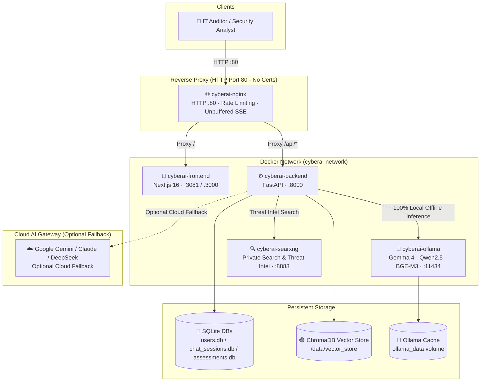

# 🚀 CyberAI Assessment Platform — Installation & Deployment Guide

<div align="center">

[](deployment.md)
[](../vi/deployment.md)

</div>

---

## 📑 Table of Contents

1. [System Prerequisites](#-1-system-prerequisites)
2. [Quick Start (Development)](#-2-quick-start-development)
3. [AI Model Suite (Ollama Local Offline Inference)](#-3-ai-model-suite-ollama-local-offline-inference)
4. [Environment Variables](#-4-environment-variables)
5. [Production Deployment](#-5-production-deployment)
6. [Nginx Configuration (Pure HTTP Port 80 - No Certs Required)](#-6-nginx-configuration-pure-http-port-80---no-certs-required)
7. [Health Checks & Verification](#-7-health-checks--verification)
8. [Data Persistence](#-8-data-persistence)
9. [Backup & Restore](#-9-backup--restore)
10. [Troubleshooting](#-10-troubleshooting)

---

## 🏗️ Production System Architecture

The CyberAI Assessment Platform is architected for **100% On-Premise Local AI Offline operation** to satisfy stringent enterprise data privacy and national compliance standards. Nginx operates as a high-performance reverse proxy running strictly on HTTP (Port 80), eliminating SSL/TLS certificate requirements for air-gapped or internal deployments.



---

## 📋 1. System Prerequisites

| Component | Minimum Requirement | Recommended Production |
|---|---|---|
| **Operating System** | Linux (Ubuntu 22.04+), Windows 11 (WSL2), macOS | Ubuntu Server 22.04 LTS / 24.04 LTS |
| **Docker Engine** | Docker Engine 24.0+ | Latest stable release |
| **Docker Compose** | Docker Compose v2.20+ | Docker Compose v2.27+ |
| **RAM** | 16 GB RAM (CPU offload mode) | 32 GB RAM or more |
| **Storage** | 30 GB free space (SSD) | 60 GB+ NVMe SSD (Models + Vector DB) |
| **GPU (Optional)** | Multi-core x86_64 CPU (8+ cores) | NVIDIA GPU (RTX 3060/4060+, VRAM ≥ 12GB) for accelerated inference |

---

## ⚡ 2. Quick Start (Development)

Deploy the system in development mode:

```bash
# 1. Clone the repository
git clone https://github.com/NghiaDinh03/CyberAI-Assessment-project.git
cd CyberAI-Assessment-project

# 2. Configure environment
cp .env.example .env

# 3. Launch all containers using Docker Compose
docker compose up -d --build

# 4. Verify running containers
docker compose ps
```

### 🌐 Service Endpoints

| Service | URL | Description |
|---|---|---|
| **Nginx Reverse Proxy** | `http://localhost:80` | Primary gateway (pure HTTP, no certificates required) |
| **Frontend UI/UX** | `http://localhost:3081` | Next.js 16 Web Application (Dark Cyber Theme, Bilingual) |
| **Backend API Docs** | `http://localhost:8000/docs` | Interactive OpenAPI Swagger UI |
| **Backend Health Check** | `http://localhost:8000/health` | Service status endpoint (`{"status": "healthy"}`) |
| **Ollama Local Engine** | `http://localhost:11434` | 100% Offline Local LLM Inference Engine |
| **SearXNG Search** | `http://localhost:8888` | Local private search & threat intelligence engine |

---

## 🧠 3. AI Model Suite (Ollama Local Offline Inference)

System audit and acceptance runs on 3 specialized local offline models:

| Role | Model ID | Size | Description |
|---|---|---|---|
| **Lead Auditor / Primary LLM** | `gemma4:latest` | ~9.6 GB | Compliance reasoning (ISO 27001 / TCVN 11930), audit reporting, chatbot assistant |
| **Technical Extractor** | `qwen2.5-coder:7b` | ~4.7 GB | Server configuration extraction, Windows hotfix parsing, network log audit |
| **Multilingual Embedding** | `bge-m3:latest` | ~1.2 GB | Dense/sparse vector representations for ChromaDB RAG and Semantic Search |

### Pulling Models into Ollama Container:

```bash
# Pull primary Auditor model
docker exec -it cyberai-ollama ollama pull gemma4:latest

# Pull technical Extractor model
docker exec -it cyberai-ollama ollama pull qwen2.5-coder:7b

# Pull multilingual Embedding model
docker exec -it cyberai-ollama ollama pull bge-m3
```

Verify installed models:
```bash
docker exec -it cyberai-ollama ollama list
```

---

## ⚙️ 4. Environment Variables

All configurations are controlled via `.env` (copied from `.env.example`):

### 🦙 Local AI Configuration (Required)
```ini
OLLAMA_URL=http://ollama:11434
MODEL_NAME=gemma4:latest
SECURITY_MODEL_NAME=gemma4:latest
EMBEDDING_MODEL_NAME=bge-m3
MODEL_1_EXTRACTOR=qwen2.5-coder:7b
MODEL_2_AUDITOR=gemma4:latest
MODEL_3_EMBEDDING=bge-m3
REQUIRED_MODEL_IDS=gemma4:latest,qwen2.5-coder:7b,bge-m3:latest
PREFER_LOCAL=true
INFERENCE_TIMEOUT=1200
```

### ✨ Cloud AI Configuration (Optional Fallback Channel)
> **Note:** The platform runs 100% offline. Cloud features are optional fallbacks when API keys are configured:
```ini
# Google AI Studio (Gemini 2.0 Flash / Pro) — Optional Cloud Fallback
GOOGLE_AI_STUDIO_API_KEY=your_google_ai_studio_key_here
GOOGLE_AI_STUDIO_MODEL=gemini-2.0-flash
GOOGLE_AI_STUDIO_URL=https://generativelanguage.googleapis.com/v1beta

# Claude / DeepSeek General Cloud Fallback (Optional)
CLOUD_LLM_API_URL=https://api.anthropic.com/v1
CLOUD_MODEL_NAME=claude-3-5-sonnet-latest
CLOUD_API_KEYS=your_cloud_key_here
```

### 🔒 Security & Tokens
```ini
# JWT Signing Secret (Minimum 32 random characters)
JWT_SECRET=super-secret-jwt-key-minimum-32-chars-long
JWT_EXPIRE_MINUTES=60
CORS_ORIGINS=http://localhost:3000,http://localhost:3081,http://127.0.0.1:3000,http://127.0.0.1:3081
```

---

## 🏭 5. Production Deployment

Production uses [`docker-compose.prod.yml`](docker-compose.prod.yml) which is aligned directly with the development architecture:

### Key Architectural Highlights:
1. **Pure HTTP Nginx**: Listens strictly on port **80**, completely removing SSL/TLS certificates and Let's Encrypt volume mounts.
2. **Direct Port Binding**: Direct exposure of ports (`80:80`, `8000:8000`, `3081:3000`, `11434:11434`, `8888:8080`) for local network access and firewall rules.
3. **Host Gateway Access**: Configured with `extra_hosts: ["host.docker.internal:host-gateway"]` to connect with host services.
4. **Unified CORS**: Permits connections from both `:3081` and `:3000`.

### Production Commands:
```bash
# Launch production cluster
docker compose -f docker-compose.prod.yml up -d --build

# Validate compose configuration
docker compose -f docker-compose.prod.yml config --quiet
```

### Production Port Map:
| Container Name | Service | Port Binding | Notes |
|---|---|---|---|
| `cyberai-nginx` | Pure HTTP Reverse Proxy | `80:80` | Primary entrypoint for users |
| `cyberai-backend` | FastAPI Core Engine | `8000:8000` | API engine & ISO27001 pipeline |
| `cyberai-frontend` | Next.js Frontend | `3081:3000` | Next.js standalone application |
| `cyberai-searxng` | Private Search Engine | `8888:8080` | Local private search engine |
| `cyberai-ollama` *(optional)* | Local LLM Inference | `11435:11434` | Profile `ollama-container` (default uses Host Ollama `11434`) |

---

## 🌐 6. Nginx Configuration (Pure HTTP Port 80 - No Certs Required)

The Nginx configuration [`nginx/nginx.conf`](nginx/nginx.conf) is mounted to `/etc/nginx/nginx.conf:ro`:

- **No SSL/TLS Certificates**: Listens on port 80 only (`listen 80 default_server;`).
- **Unbuffered SSE Streaming**: Configures `proxy_buffering off;` and `proxy_read_timeout 600s;` for `/api/` to ensure immediate token delivery for LLM chat responses.
- **Rate Limiting**: Applies `30r/s` limit for `/api/` (burst 20) and `100r/s` globally to prevent DoS attacks.
- **WebSocket Upgrade**: Supports HTTP upgrade connections via `map $http_upgrade $connection_upgrade`.
- **Gzip Compression**: Compresses JSON, HTML, JavaScript, CSS, and SVG assets on the fly.

---

## 🩺 7. Health Checks & Verification

Verify platform operational status:

```bash
# 1. Check Backend API status
curl -s http://localhost:8000/health
# Expected output: {"status":"healthy"}

# 2. Check installed Ollama models
curl -s http://localhost:11434/api/tags

# 3. Check via Nginx Reverse Proxy
curl -s http://localhost/health

# 4. Check SearXNG Meta-Search JSON API
curl -s "http://localhost:8888/search?q=ransomware&format=json" | grep -o '"results"'
```

---

## 💾 8. Data Persistence

All stateful data is persisted across container rebuilds:

| Directory / Volume | Type | Content |
|---|---|---|
| `./data/users.db` | SQLite file | User credentials hashed with PBKDF2/SHA-256 |
| `./data/chat_sessions.db` | SQLite file | User chat histories and sessions |
| `./data/assessments/` | JSON files | ISO 27001 & TCVN 11930 assessment reports |
| `./data/vector_store/` | ChromaDB dir | Vector embeddings for standards and knowledge base |
| `./data/uploads/` | Host dir | Uploaded audit evidence and server scan dumps |
| `./searxng/` | Host dir | SearXNG configuration (`settings.yml`: JSON format enabled, limiter disabled) |
| `ollama_data` | Named volume | Downloaded Ollama model weights (`/root/.ollama`) |

---

## 💿 9. Backup & Restore

### Automated Backup:
```bash
bash scripts/backup.sh --dest ./backups --retention-days 30
```

### Data Restore:
```bash
# Extract backup archive
tar -xzf ./backups/cyberai_backup_<TIMESTAMP>.tar.gz -C ./

# Restart backend to load restored files
docker compose restart backend
```

---

## 🔧 10. Troubleshooting

### 1. Model Not Found in Ollama (404 Error)
- **Symptom:** Chat returns `"model 'gemma4:latest' not found"`.
- **Solution:** Pull the model inside the running container:
  ```bash
  docker exec -it cyberai-ollama ollama pull gemma4:latest
  ```

### 2. Browser CORS Error
- **Symptom:** Console displays `Access-Control-Allow-Origin` error.
- **Solution:** Verify `CORS_ORIGINS` in `.env` includes both ports:
  ```ini
  CORS_ORIGINS=http://localhost:3000,http://localhost:3081,http://127.0.0.1:3000,http://127.0.0.1:3081
  ```
  Then restart backend: `docker compose restart backend`.

### 3. Backend Refuses to Start (Insecure JWT Secret)
- **Symptom:** Logs show `ValueError: JWT_SECRET is insecure...`.
- **Solution:** Generate a secure 32+ character key:
  ```bash
  python -c "import secrets; print(secrets.token_hex(32))"
  ```
  Set this key into `JWT_SECRET=` in `.env`.

### 4. Compliance Percentage Exceeding 100%
- **Status:** Resolved in `controls_catalog.py` and `standards.js`. Control IDs are strictly filtered against the assessed standard's catalog and clamped within $[0.0, 100.0]\%$.

### 5. `cyberai-searxng` Container Consumes 0% CPU
- **Symptom:** `docker stats` shows `0.00% CPU` for `cyberai-searxng` during chatbot conversations.
- **Root Cause:**
  1. **SearXNG is an On-Demand Service:** It only consumes CPU/RAM when actively processing HTTP search requests forwarded from the backend. During normal chat or offline RAG queries, it remains idle.
  2. **Legacy Local Model Fast-Path Bypass:** Previously, local model streaming hardcoded `use_search = False`.
- **Solution:**
  - Web search is now fully supported for both Local Models and Cloud Models in `chat_service.py`.
  - Added unaccented Vietnamese keyword recognition for threat intelligence queries (`tin tuc`, `moi nhat`, `cve moi`).
  - Added a manual toggle directly on the Chatbot UI: **🌐 Web Search: Auto / ON / OFF**.
  - Validate search independently via:
    ```bash
    curl -s "http://localhost:8888/search?q=ransomware&format=json" | grep -o '"results"'
    ```

### 6. Port 11434 Collision with Host Ollama on Windows
- **Symptom:** Docker fails with `bind: Only one usage of each socket address is normally permitted` on port 11434.
- **Root Cause:** Windows host already runs native Ollama on port 11434 to utilize local GPU acceleration.
- **Solution:**
  - Isolated the containerized Ollama under the `ollama-container` Docker profile and assigned fallback port `11435:11434`.
  - Backend defaults to host Ollama via `OLLAMA_URL=http://host.docker.internal:11434`.
  - Running `docker compose up -d` now starts cleanly without port conflicts.

