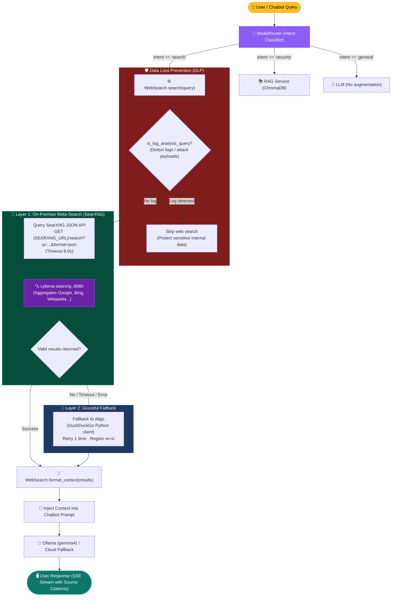

# Web Search Service — SearXNG & Web Search Integration

> **Module:** [`backend/services/web_search.py`](../../backend/services/web_search.py)  
> **API Route:** [`backend/api/routes/web_search.py`](../../backend/api/routes/web_search.py) (`POST /api/v1/web-search`, `POST /api/web-search`)  
> **Trigger:** Hybrid intent classifier in [`backend/services/model_router.py`](../../backend/services/model_router.py) routes queries with `intent="search"` → `ChatService` invokes `WebSearch.search()` and injects `WebSearch.format_context()` into the LLM prompt.

---

## 1. Role of Web Search & SearXNG in the System

While CyberAI operates primarily on an offline knowledge base of cybersecurity standards (RAG corpus in `data/iso_documents/` embedded via `BAAI/bge-m3`), real-world threat analysis requires current internet intelligence (Live Threat Intelligence):
- Newly disclosed vulnerability identifiers (Zero-day CVEs, NVD/CISA advisories).
- Active ransomware campaigns and threat actor operations.
- Security warnings and advisories from national CSIRTs/CERTs.

To uphold **Data Privacy** and **On-Premise independence**, the system deploys a dedicated **SearXNG** container (`cyberai-searxng`) as an on-premise privacy-preserving meta-search aggregator, paired with an automated **Graceful Fallback** to the `ddgs` library.

---

## 2. Dual-Layer Search Architecture



---

## 3. SearXNG Container Configuration (`searxng/settings.yml`)

The `cyberai-searxng` service runs off the `searxng/searxng:latest` image and is configured via `searxng/settings.yml` (mounted to `/etc/searxng:rw`):

```yaml
use_default_settings: true

general:
  debug: false
  instance_name: "CyberAI Private Search"

search:
  safe_search: 0
  autocomplete: ""
  default_lang: "vi"
  formats:
    - html
    - json   # MANDATORY: Enables JSON output format for backend integration

server:
  port: 8080
  bind_address: "0.0.0.0"
  secret_key: "cyberai-searxng-insecure-secret-key-for-local-use"
  limiter: false  # Disable internal limiter to prevent backend request throttling
```

### Docker Compose Configuration:
- **Internal Docker Network:** Backend queries SearXNG directly via `http://searxng:8080`.
- **Host Port:** Mapped to external port `8888:8080` for diagnostics or direct host queries.
- **Backend Environment Variable:** `SEARXNG_URL=http://searxng:8080`.

---

## 4. Public API & Data Structures

### Class `WebSearch` ([`backend/services/web_search.py`](../../backend/services/web_search.py))

```python
class WebSearch:
    @staticmethod
    def _search_searxng(query: str, max_results: int = 5) -> List[Dict[str, str]]:
        """Query on-premise SearXNG Meta-Search Engine via JSON API."""
        ...

    @classmethod
    def search(cls, query: str, max_results: int = 5, retries: int = 1) -> List[Dict[str, str]]:
        """Search the web prioritizing local SearXNG with automatic fallback to ddgs."""
        ...

    @staticmethod
    def format_context(results: List[Dict[str, str]]) -> str:
        """Format result list into numbered citation blocks for the LLM prompt."""
        ...
```

### Output Schema

```json
[
  {
    "title": "ISO/IEC 27001 Information Security Management Standard",
    "url": "https://example.vn/iso-27001",
    "snippet": "ISO/IEC 27001:2022 is the international standard for information security..."
  }
]
```

---

## 5. Processing Flow & Fallback Mechanics

Execution stages within `WebSearch.search()`:

1. **Data Loss Prevention (DLP) Check:**
   - Evaluates `is_log_analysis_query(query)`.
   - If technical logs or attack payloads are detected, **the query is never sent to the internet**; returns `[]` immediately to safeguard corporate data.
2. **Query Preprocessing:**
   - Normalizes whitespace and clamps length to 150 characters to maximize search relevance.
   - If length is `< 3` characters: returns `[]`.
3. **Priority 1 — On-Premise SearXNG Query (`_search_searxng`):**
   - Sends HTTP GET request via `httpx` client to `f"{SEARXNG_URL}/search"` with parameters:
     - `q`: preprocessed query string.
     - `format`: `"json"`.
     - `categories`: `"general"`.
     - `language`: `"vi-VN"`.
   - Timeout configured to `8.0s`.
   - Extracts `results[].title`, `results[].url`, `results[].content`.
   - If valid results are returned: returns immediately, skipping Layer 2.
4. **Priority 2 — Automated Graceful Fallback (`ddgs`):**
   - Triggered when SearXNG is unreachable, times out, or returns 0 results.
   - Loads `ddgs` (or `duckduckgo_search`).
   - Executes search using Chrome desktop User-Agent and `region="vn-vi"`.
   - Retries up to `retries` times with linear backoff (0.5s – 1.0s).
5. **Context Formatting (`format_context`):**
   - Numbers sources `[1]`, `[2]`... along with URLs and content snippets so the LLM can generate auditable source citations.

---

## 6. REST API Endpoints

The backend provides HTTP endpoints for external tools or health verification:

- **Endpoint:** `POST /api/v1/web-search` or `POST /api/web-search`
- **Request Body:**
  ```json
  {
    "query": "Critical cybersecurity vulnerabilities in 2026",
    "max_results": 5
  }
  ```
- **Response (200 OK):**
  ```json
  {
    "status": "ok",
    "query": "Critical cybersecurity vulnerabilities in 2026",
    "results": [
      {
        "title": "New Critical Vulnerability Advisory...",
        "url": "https://...",
        "snippet": "..."
      }
    ],
    "total": 5
  }
  ```

---

## 7. Routing & Trigger Conditions

Routing decisions are governed by the **Hybrid Model Router** ([`backend/services/model_router.py`](../../backend/services/model_router.py)) combined with explicit UI override flags:

1. **Explicit Chatbot UI Override (`use_search`):**
   - Users can manually set the search mode via the **🌐 Web Search** toggle button on the Chatbot page:
     - **Auto (`use_search = None`):** Automatically classified by the hybrid ModelRouter.
     - **ON (`use_search = True`):** Forces web search execution via SearXNG (unless DLP detects raw log payloads).
     - **OFF (`use_search = False`):** Completely disables web search; relies strictly on offline RAG or parametric LLM weights.
2. **Semantic & Keyword Classification:**
   - **Accent-Insensitive Matching:** Preprocessing normalizes Vietnamese diacritics (`_strip_vietnamese_accents`) to ensure queries like *"tin tuc an ninh mang moi nhat"*, *"cve moi"*, and *"lo hong moi"* match search rules.
   - **Threat Intel Prioritization:** Security questions containing temporal triggers (*"news"*, *"latest"*, *"recent advisory"*) automatically activate `use_search = True`.
3. **Full Local Model & Cloud Model Support:**
   - Both local offline models (`gemma4:latest`, `qwen2.5-coder:7b`) and cloud models (`gemini-2.0-flash`, `claude-3.5-sonnet`) receive formatted `search_context` injected into the prompt.

---

## 8. Operational Notes & Troubleshooting

| Symptom | Probable Cause | Resolution |
|---|---|---|
| Container `cyberai-searxng` has 0% CPU | SearXNG is an On-Demand service (only active during incoming search queries); or Chatbot is processing offline RAG | Normal idle behavior. When a web search query is executed, CPU and Network I/O will show active usage. |
| SearXNG returns `403 Forbidden` | Missing `search.formats: [html, json]` in configuration | Ensure `searxng/settings.yml` is mounted to `/etc/searxng:rw` with `formats: [html, json]`. |
| SearXNG response latency / timeout | Upstream search engines responding slowly | Automatic fallback to `ddgs` occurs after 8.0s timeout; engine selection can be customized in `settings.yml`. |
| SearXNG container stopped | Docker daemon issue or OOM | Check `docker logs cyberai-searxng` and restart with `docker compose up -d searxng`. The system maintains uninterrupted search via `ddgs` fallback. |
| Empty results from both layers | Network connectivity loss or malformed query | System safely returns `[]`; Chatbot answers from LLM baseline parametric knowledge. |

