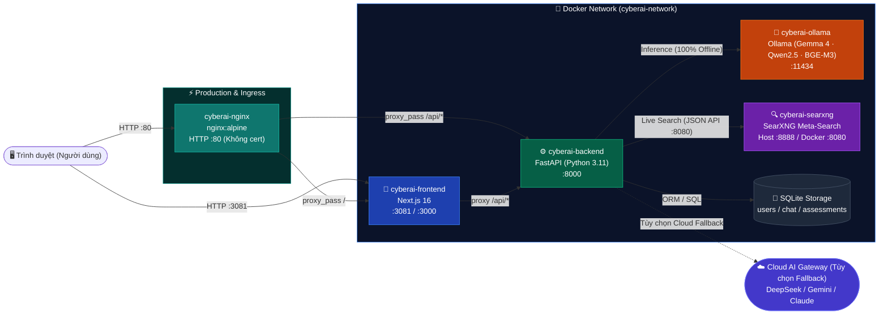
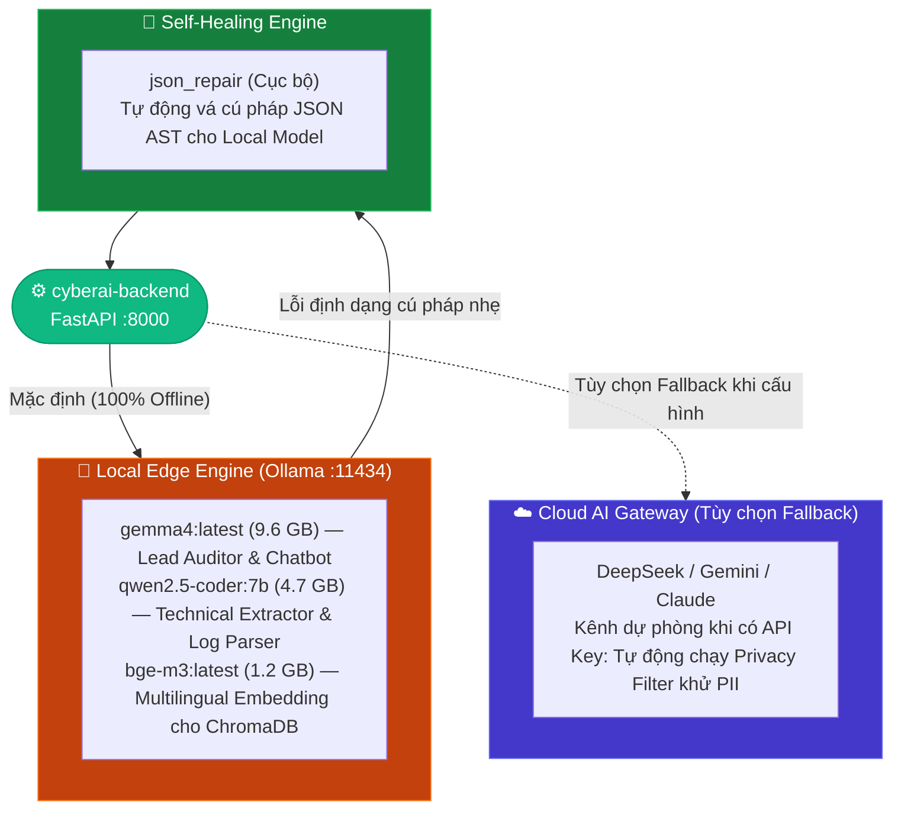
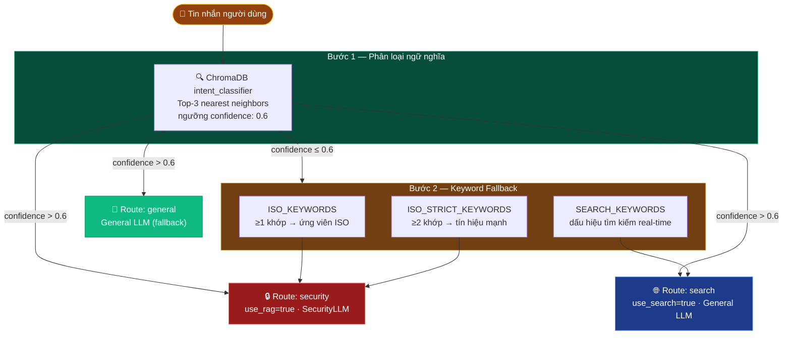
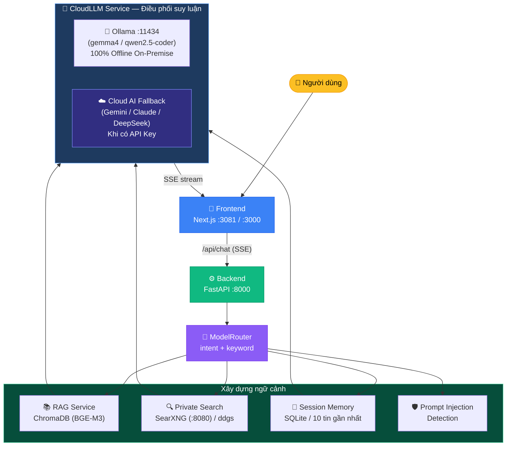
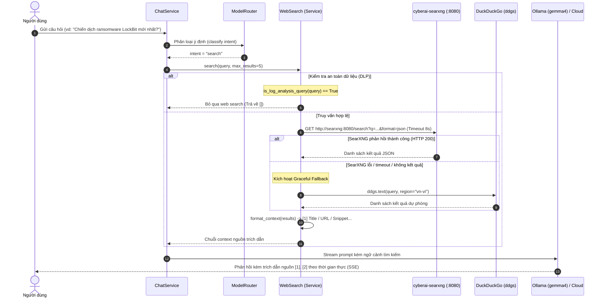
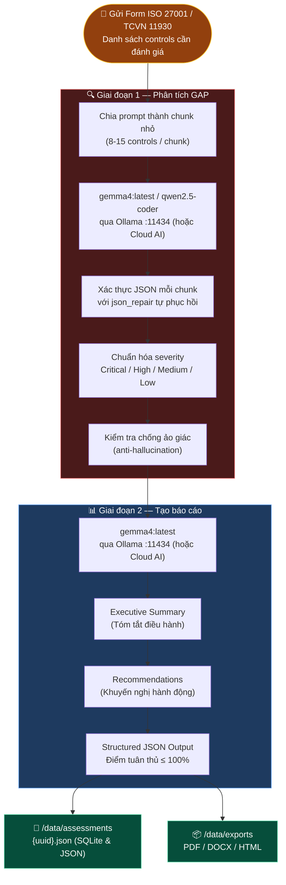
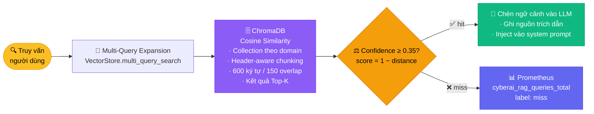
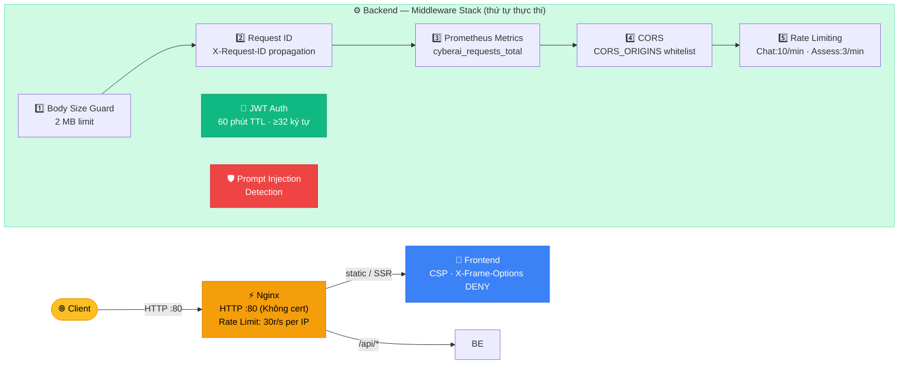

# 🏗️ CyberAI Assessment Platform — Kiến Trúc Hệ Thống

<div align="center">

[](../en/architecture.md)
[](architecture.md)

</div>

---

## 📑 Mục Lục

1. [Tổng Quan](#1--tổng-quan)
2. [Kiến Trúc Container (Vùng chứa)](#2--kiến-trúc-container-vùng-chứa)
3. [Kiến Trúc Dual Local Inference (Suy luận cục bộ kép)](#3--kiến-trúc-dual-local-inference-suy-luận-cục-bộ-kép)
4. [Luồng Định Tuyến Model (Model Routing)](#4--luồng-định-tuyến-model-model-routing)
5. [Kiến Trúc Backend](#5--kiến-trúc-backend)
6. [Kiến Trúc Frontend](#6--kiến-trúc-frontend)
7. [Sơ Đồ Luồng Dữ Liệu (Data Flow)](#7--sơ-đồ-luồng-dữ-liệu-data-flow)
8. [Lưu Trữ Dữ Liệu (Data Storage)](#8--lưu-trữ-dữ-liệu-data-storage)
9. [Kiến Trúc Bảo Mật (Security Architecture)](#9--kiến-trúc-bảo-mật-security-architecture)
10. [Prometheus Metrics (Chỉ số giám sát)](#10--prometheus-metrics-chỉ-số-giám-sát)

---

## 1. 🔭 Tổng Quan

CyberAI Assessment Platform là hệ thống tự động hóa đánh giá an ninh mạng và kiểm toán công nghệ thông tin (IT Audit), được xây dựng trên **kiến trúc Docker 4 Container** (mở rộng với Nginx trong môi trường production). Nền tảng cung cấp bộ công cụ toàn diện: Chatbot chuyên sâu ISO 27001 / TCVN 11930, Form đánh giá hạ tầng per-control, pipeline trích xuất bằng chứng qua OCR và bộ sinh báo cáo tự động (DOCX, XLSX, Markdown, JSON, PDF).

Hệ thống hỗ trợ cơ chế suy luận cục bộ độc lập (**100% Offline / On-Premise**) qua **Ollama (`gemma4:latest`)** nhằm bảo mật tuyệt đối dữ liệu kiểm toán, đồng thời tích hợp cổng **Cloud AI Gateway (DeepSeek-V4, Gemini 2.0)** kèm bộ lọc khử định danh PII (Privacy Filter) cho các tác vụ cần tốc độ cao.

**Khả năng cốt lõi:**
- 🤖 **AI Security Chatbot:** Streaming SSE, tra cứu tiêu chuẩn an toàn thông tin, tích hợp tìm kiếm mối đe dọa trực tiếp (Live Threat Intelligence) qua SearXNG.
- 📋 **Information Security Assessment:** Wizard đánh giá 4 bước hỗ trợ ISO 27001:2022 (93 controls) và TCVN 11930:2017 (45 controls).
- 📁 **Smart Evidence Processing:** Tự động trích xuất nội dung bằng chứng (PDF/Ảnh/Log) qua Tesseract OCR và ánh xạ đa nhãn vào các biện pháp kiểm soát tương ứng (Evidence Mapper).
- 🔐 **Xác thực & Lưu trữ Bền vững:** Quản trị người dùng phân quyền theo vai trò (Admin/Auditor), lưu trữ dữ liệu bền vững đa luồng qua SQLite (`users.db`, `sessions.db`, `assessments.db`).
- 📈 **Khả năng quan sát:** Prometheus metrics, ghi log có cấu trúc và health check tự động 24/7.

---

## 2. 🐳 Kiến Trúc Container (Vùng chứa)

### Sơ đồ topo hệ thống



### Bảng cấu hình Container

| Container | Image / Base | Port | Giới hạn tài nguyên (WSL2 / Host) | Mục đích & Vai trò |
|-----------|--------------|------|-----------------------------------|-------------------|
| `cyberai-frontend` | Node 20-alpine (Next.js 16) | 3081 (prod) / 3000 (dev) | 2 GB RAM, 2 vCPUs | Giao diện người dùng Web (Dark Cyber Theme, i18n EN/VI, AuthGuard) |
| `cyberai-backend` | Python 3.11-slim (FastAPI) | 8000 | 4 GB RAM, 4 vCPUs | Xử lý nghiệp vụ đánh giá, OCR Tesseract, Evidence Mapper, SQLite Stores |
| `cyberai-ollama` | `ollama/ollama:latest` | 11434 | 14 GB RAM, 12 vCPUs | Động cơ suy luận AI cục bộ 100% Offline (`gemma4:latest`, `qwen2.5-coder:7b`, `bge-m3`) |
| `cyberai-searxng` | `searxng/searxng:latest` | 8888 (host) / 8080 (docker) | 1 GB RAM, 1 vCPU | Meta-search engine riêng tư on-premise, JSON API nội bộ, mount `searxng/settings.yml` |
| `cyberai-nginx` *(chỉ prod)* | `nginx:alpine` | 80 | — | Reverse Proxy HTTP thuần (Port 80, không cần cert), Rate Limit, SSE unbuffered |

---

## 3. 🧠 Kiến Trúc Suy Luận Cục Bộ & Cơ Chế Điều Phối Lai (Hybrid Orchestration)

Hệ thống được thiết kế với cơ chế ưu tiên hàng đầu cho việc bảo mật dữ liệu On-Premise:



### 1. Ollama Inference Engine (Cục bộ 100% Offline - Port 11434)
- **Bộ 3 mô hình cốt lõi:**
  - `gemma4:latest` (~9.6 GB): Mô hình chính đảm nhiệm vai trò Lead Auditor, suy luận tuân thủ ISO 27001/TCVN 11930 và trợ lý Chatbot.
  - `qwen2.5-coder:7b` (~4.7 GB): Bóc tách cấu hình máy chủ, phân tích log an ninh, trích xuất sự kiện kiểm toán.
  - `bge-m3:latest` (~1.2 GB): Trích xuất vector embeddings đa ngữ chất lượng cao phục vụ tìm kiếm ngữ nghĩa ChromaDB.
- **Tối ưu phần cứng:** Cấu hình `num_thread: 12` và `num_ctx: 4096` cho cả streaming SSE và batch inference, tối ưu hóa trên CPU AMD Ryzen AI / Intel đa nhân và 32GB RAM.
- **Tự động vá lỗi:** Tích hợp bộ giải mã `json_repair` xử lý triệt để các lỗi cú pháp (trailing commas, thiếu ngoặc, single quotes) sinh ra từ quá trình lượng tử hóa trên CPU.

### 2. Cloud AI Gateway & Privacy Guard (Tùy chọn Dự Phòng)
- Khi người dùng chủ động cấu hình Cloud API Key và chọn chế độ **Cloud** hoặc **Hybrid**, dữ liệu trước khi rời khỏi máy chủ sẽ được lọc qua **`PrivacyFilter`** (`backend/services/privacy_filter.py`) để che giấu toàn bộ địa chỉ IP nội bộ, email, số điện thoại, mật khẩu, và mã định danh tổ chức.

---

## 4. 🔀 Luồng Định Tuyến Model (Model Routing)

[`ModelRouter`](../../backend/services/model_router.py:173) sử dụng **phân loại intent hybrid** — ngữ nghĩa trước, keyword fallback sau:

### Sơ đồ luồng định tuyến



### Bước 1: Phân loại ngữ nghĩa (Semantic Classification)

Collection ChromaDB in-memory [`intent_classifier`](../../backend/services/model_router.py:127) được khởi tạo với các template intent song ngữ (Tiếng Việt + Tiếng Anh). Truy vấn trả về top-3 nearest neighbors; phiếu bầu được tổng hợp theo intent với **ngưỡng confidence 0.6**.

### Bước 2: Keyword Fallback (Dự phòng từ khóa)

Nếu confidence ngữ nghĩa ≤ 0.6, regex matching chạy trên ba danh sách từ khóa:
- [`ISO_KEYWORDS`](../../backend/services/model_router.py:61) — thuật ngữ ISO/tuân thủ rộng (≥1 khớp → ứng viên ISO)
- [`ISO_STRICT_KEYWORDS`](../../backend/services/model_router.py:96) — thuật ngữ bảo mật nghiêm ngặt (≥2 khớp → tín hiệu bảo mật mạnh)
- [`SEARCH_KEYWORDS`](../../backend/services/model_router.py:81) — dấu hiệu intent tìm kiếm thời gian thực

### Bước 3: Quyết định Route

| Route | `use_rag` | `use_search` | Model | Điều kiện kích hoạt |
|-------|-----------|-------------|-------|---------|
| `security` | `true` | `false` | SecurityLLM | Intent bảo mật ngữ nghĩa HOẶC khớp keyword ISO nghiêm ngặt |
| `search` | `false` | `true` | General LLM | Intent tìm kiếm ngữ nghĩa HOẶC có keyword tìm kiếm |
| `general` | `false` | `false` | General LLM | Fallback (Dự phòng) mặc định |

### Ưu tiên suy luận (Inference Priority)

Được kiểm soát bởi biến môi trường trong [`CloudLLMService.chat_completion()`](../../backend/services/cloud_llm_service.py):

| Cài đặt | Hành vi |
|---------|----------|
| [`PREFER_LOCAL=true`](../../.env.example) | Ollama trước (100% Offline) → Cloud Fallback (Gemini / Claude / DeepSeek) khi có API Key và gặp lỗi |
| `PREFER_LOCAL=false` | Cloud trước → Ollama Fallback khi lỗi |
| [`LOCAL_ONLY_MODE=true`](../../backend/core/config.py) | Hoàn toàn Offline; không gọi API cloud; lỗi nếu mô hình Ollama không khả dụng |

**Định tuyến suy luận Ollama:** Toàn bộ các yêu cầu cục bộ được định tuyến trực tiếp qua Ollama daemon cổng 11434, tự động nhận diện và sử dụng các model `gemma4:latest`, `qwen2.5-coder:7b`, và `bge-m3:latest`.

---

## 5. ⚙️ Kiến Trúc Backend

### Framework

[FastAPI 0.115+](../../backend/requirements.txt) với Pydantic v2, quản lý async lifespan, và API routes có phiên bản.

**API versioning (Quản lý phiên bản API):** Router được mount kép tại `/api/v1/...` (có phiên bản) và `/api/...` (tương thích ngược legacy), định nghĩa trong [`main.py`](../../backend/main.py:254).

### Middleware Stack (Ngăn xếp Middleware)

Thứ tự quan trọng — middleware ngoài cùng thực thi trước:

| # | Middleware | Vị trí | Mục đích |
|---|-----------|----------|---------|
| 1 | Giám sát kích thước request body | [`limit_request_size()`](../../backend/main.py:159) | Giới hạn 2 MB; miễn trừ: endpoint upload/validate/evidence |
| 2 | Request ID | [`add_request_id()`](../../backend/main.py:141) | Truyền tiếp header `X-Request-ID` hoặc tạo UUID4 |
| 3 | Prometheus metrics | [`record_metrics()`](../../backend/main.py:113) | `cyberai_requests_total`, `cyberai_request_duration_seconds` |
| 4 | CORS | [`CORSMiddleware`](../../backend/main.py:103) | Origins cấu hình qua [`CORS_ORIGINS`](../../.env.example) |
| 5 | Rate Limiting (Giới hạn tốc độ) | [`slowapi`](../../backend/core/limiter.py) | Giới hạn theo endpoint (chat: 10/phút, assess: 3/phút, benchmark: 5/phút) |

### Service Layer (Tầng dịch vụ)

| Dịch vụ | File | Trách nhiệm |
|---------|------|---------------|
| **ChatService** | [`chat_service.py`](../../backend/services/chat_service.py) | Singleton VectorStore/SessionStore, phát hiện prompt injection, bộ nhớ session (10 tin nhắn cho ngữ cảnh LLM), SSE streaming |
| **CloudLLMService** | [`cloud_llm_service.py`](../../backend/services/cloud_llm_service.py) | Round-robin API keys, làm nguội Rate Limiting (30s), Fallback Chain model, định tuyến Ollama (cục bộ) / Cloud Fallback |
| **RAGService** | [`rag_service.py`](../../backend/services/rag_service.py) | Tìm kiếm multi-query, ngưỡng confidence 0.35, Prometheus counter (`hit`/`miss`) |
| **ModelRouter** | [`model_router.py`](../../backend/services/model_router.py) | Phân loại intent hybrid ngữ nghĩa (ChromaDB) + keyword |
| **AssessmentHelpers** | [`assessment_helpers.py`](../../backend/services/assessment_helpers.py) | Prompt chia chunk, xác thực JSON (chống ảo giác với `json_repair`), chuẩn hóa mức độ nghiêm trọng |
| **StandardService** | [`standard_service.py`](../../backend/services/standard_service.py) | Upload JSON/YAML, xác thực (tối đa 500 controls), ChromaDB indexing theo domain |
| **WebSearch** | [`web_search.py`](../../backend/services/web_search.py) | Tìm kiếm 2 tầng: SearXNG cục bộ (`http://searxng:8080`), fallback sang `ddgs`, cơ chế DLP chặn rò rỉ log |
| **ModelGuard** | [`model_guard.py`](../../backend/services/model_guard.py) | Kiểm tra tình trạng kết nối Ollama daemon và models sẵn sàng |

### Repository Layer (Tầng kho dữ liệu)

| Repository (Kho dữ liệu) | File | Trách nhiệm |
|-----------|------|---------------|
| **VectorStore** | [`vector_store.py`](../../backend/repositories/vector_store.py) | ChromaDB `PersistentClient`, collection theo domain, chunking nhận biết header (600 ký tự, 150 overlap), cosine similarity |
| **SessionStore** | [`session_store.py`](../../backend/repositories/session_store.py) | Quản lý lịch sử chat và session lưu trữ bền vững bằng cơ sở dữ liệu SQLite local (chat_history.db) với cơ chế tự động dọn dẹp TTL 24h, tối đa 20 tin nhắn mỗi session |

---

## 6. 🎨 Kiến Trúc Frontend

- **Framework:** Next.js 15.1 (App Router), React 19, chế độ output [`standalone`](../../frontend-next/next.config.js:3)
- **API proxy:** [`next.config.js`](../../frontend-next/next.config.js:4) rewrite `/api/:path*` → `http://backend:8000/api/:path*`
- **Dev Dockerfile:** [`Dockerfile.dev`](../../frontend-next/Dockerfile.dev) với `WATCHPACK_POLLING=true` cho hot reload

### Các trang (Pages)

| Trang | Route | Mục đích |
|------|-------|---------|
| Dashboard | [`/`](../../frontend-next/src/app/page.js) | Tổng quan nền tảng và trạng thái hệ thống |
| AI Chat | [`/chatbot`](../../frontend-next/src/app/chatbot/page.js) | Chatbot an ninh mạng hỗ trợ RAG |
| Assessment (Đánh giá) | [`/form-iso`](../../frontend-next/src/app/form-iso/page.js) | Form phân tích GAP ISO 27001 |
| Standards (Tiêu chuẩn) | [`/standards`](../../frontend-next/src/app/standards/page.js) | Quản lý tiêu chuẩn tùy chỉnh |
| Analytics (Phân tích) | [`/analytics`](../../frontend-next/src/app/analytics/page.js) | Phân tích đánh giá và chỉ số |

### Thành phần (Components)

| Thành phần | File | Mục đích |
|-----------|------|---------|
| Navbar | [`Navbar.js`](../../frontend-next/src/components/Navbar.js) | Chuyển đổi theme, đồng hồ đa múi giờ, chấm trạng thái backend |
| SystemStats | [`SystemStats.js`](../../frontend-next/src/components/SystemStats.js) | Hiển thị chỉ số hệ thống thời gian thực |
| StepProgress | [`StepProgress.js`](../../frontend-next/src/components/StepProgress.js) | Chỉ báo tiến trình form nhiều bước |
| Skeleton | [`Skeleton.js`](../../frontend-next/src/components/Skeleton.js) | Hiệu ứng loading placeholder |
| ThemeProvider | [`ThemeProvider.js`](../../frontend-next/src/components/ThemeProvider.js) | Context theme tối/sáng |
| Toast | [`Toast.js`](../../frontend-next/src/components/Toast.js) | Hệ thống thông báo |

---

## 7. 📊 Sơ Đồ Luồng Dữ Liệu (Data Flow)

### Luồng yêu cầu Chat



<details>
<summary>📋 Luồng Chat dạng text (bấm để mở)</summary>

```
User Input
    │
    ▼
┌─────────────┐    /api/chat     ┌──────────────┐
│   Frontend   │ ─────────────── │   Backend    │
│  (Next.js)   │   SSE stream    │  (FastAPI)   │
└─────────────┘  ◄────────────── └──────┬───────┘
                                        │
                                 ┌──────▼───────┐
                                 │ ModelRouter   │
                                 │ (intent +     │
                                 │  keyword)     │
                                 └──────┬───────┘
                                        │
                    ┌───────────┬───────┴───────┬───────────┐
                    ▼           ▼               ▼           ▼
              ┌──────────┐ ┌──────────┐ ┌──────────┐ ┌──────────┐
              │ RAG      │ │SearXNG / │ │ Session  │ │ Prompt   │
              │ Service  │ │   ddgs   │ │ Memory   │ │ Injection│
              │(ChromaDB)│ │ (:8080)  │ │ (SQLite) │ │ Detection│
              └────┬─────┘ └────┬─────┘ └────┬─────┘ └──────────┘
                   └────────────┴────────────┘
                                │
                         ┌──────▼───────┐
                         │ CloudLLM     │
                         │ Service      │
                         └──────┬───────┘
                                │
              ┌─────────────────┴─────────────────┐
              ▼                                   ▼
        ┌──────────┐                        ┌──────────┐
        │  Ollama  │                        │  Cloud   │
        │  :11434  │                        │ Fallback │
        │(gemma4/  │                        │ (Gemini/ │
        │ qwen2.5) │                        │ Claude)  │
        └──────────┘                        └──────────┘
```
</details>

### Luồng Tìm Kiếm Web & Tình Báo Mối Đe Dọa (Web Search Data Flow)

Cơ chế tìm kiếm web được thiết kế 2 tầng ưu tiên bảo mật nội bộ và chịu lỗi cao:



### Pipeline đánh giá (Assessment Pipeline)



<details>
<summary>📋 Pipeline đánh giá dạng text (bấm để mở)</summary>

```
Form Submit (ISO 27001 / TCVN 11930 controls)
    │
    ▼
┌───────────────────────────────────────┐
│  Giai đoạn 1: Phân tích GAP           │
│  - Prompt chia chunk (8-15 controls)  │
│  - gemma4 / qwen2.5 qua Ollama        │
│  - json_repair tự vá lỗi AST          │
│  - Chuẩn hóa mức độ nghiêm trọng      │
│  - Kiểm tra chống ảo giác             │
└───────────────────┬───────────────────┘
                    │
                    ▼
┌───────────────────────────────────────┐
│  Giai đoạn 2: Tạo báo cáo             │
│  - gemma4:latest qua Ollama           │
│  - Tóm tắt điều hành                  │
│  - Khuyến nghị hành động              │
│  - JSON có cấu trúc (Điểm ≤ 100%)     │
└───────────────────┬───────────────────┘
                    │
                    ▼
┌───────────────────────────────────────┐
│  Đầu ra                               │
│  - JSON lưu vào /data/                │
│    assessments/{uuid}.json            │
│  - Xuất PDF/DOCX/HTML vào             │
│    /data/exports/                     │
└───────────────────────────────────────┘
```

</details>

### Luồng truy xuất RAG (RAG Retrieval Flow)



<details>
<summary>📋 Luồng RAG dạng text (bấm để mở)</summary>

```
User Query
    │
    ▼
┌──────────────────────────────────┐
│  Mở rộng Multi-Query             │
│  (VectorStore.multi_query_search)│
└──────────────┬───────────────────┘
               │
               ▼
┌──────────────────────────────────┐
│  ChromaDB Cosine Similarity      │
│  - Collection theo domain        │
│  - Chunk nhận biết header        │
│  - Kết quả Top-K                 │
└──────────────┬───────────────────┘
               │
               ▼
┌──────────────────────────────────┐
│  Bộ lọc Confidence (≥ 0.35)      │
│  - score = 1 - cosine_distance   │
│  - Prometheus: hit / miss        │
└──────────────┬───────────────────┘
               │
               ▼
┌──────────────────────────────────┐
│  Chèn ngữ cảnh                   │
│  - Ghi nguồn trích dẫn           │
│  - Chèn vào prompt LLM           │
└──────────────────────────────────┘
```

</details>

---

## 8. 💾 Lưu Trữ Dữ Liệu (Data Storage)

| Đường dẫn | Mục đích |
|------|---------|
| `/data/iso_documents/` | 21+ file markdown cơ sở kiến thức bảo mật (ISO 27001, NIST, PCI DSS, quy định Việt Nam, v.v.) |
| `/data/vector_store/` | Lưu trữ bền vững ChromaDB (index cosine similarity) |
| `/data/assessments/` | Bản ghi JSON đánh giá (`{uuid}.json`) |
| `/data/evidence/` | File bằng chứng tải lên |
| `/data/exports/` | Xuất PDF/HTML |
| `/data/sessions/` | File JSON session chat (TTL 24h, tự động dọn dẹp khi khởi động) |
| `/data/standards/` | Tiêu chuẩn tùy chỉnh tải lên (JSON/YAML) |
| `/data/knowledge_base/` | JSON benchmark + controls (`benchmark_iso27001.json`, `controls.json`, v.v.) |
| `/data/uploads/` | Upload tài liệu |
| `ollama_data` *(named volume)* | Lưu trữ model Ollama (`/root/.ollama`) |

---

## 9. 🔒 Kiến Trúc Bảo Mật (Security Architecture)

### Xác thực & Phân quyền (Authentication & Authorization)
- Xác thực JWT với secret cấu hình được ([`JWT_SECRET`](../../.env.example:38), tối thiểu 32 ký tự)
- Hết hạn token 60 phút ([`JWT_EXPIRE_MINUTES`](../../.env.example:39))
- Phát hiện secret yếu: từ chối khởi động ở production (`DEBUG=false`), cảnh báo ở development

### Rate Limiting (Giới hạn tốc độ)
Giới hạn tốc độ theo endpoint qua [`slowapi`](../../backend/core/limiter.py):

| Endpoint | Giới hạn |
|----------|-------|
| Chat | [`10/phút`](../../.env.example:42) |
| Assessment (Đánh giá) | [`3/phút`](../../.env.example:43) |
| Benchmark | [`5/phút`](../../.env.example:44) |

### Bảo vệ Request (Request Protection)
- Giới hạn kích thước request body: **2 MB** mặc định, miễn trừ cho endpoint upload/validate/evidence
- Upload bằng chứng: **10 MB** qua miễn trừ endpoint cụ thể
- CORS với origins cấu hình được ([`CORS_ORIGINS`](../../.env.example:33))
- Truyền tiếp `X-Request-ID` để truy vết
- Phát hiện prompt injection trong [`ChatService`](../../backend/services/chat_service.py)

### Nginx (Production)

<details>
<summary>🔧 Cấu hình bảo mật Nginx chi tiết (bấm để mở)</summary>

Định nghĩa trong [`nginx.conf`](../../nginx/nginx.conf):

| Cấu hình | Chi tiết |
|-----------|---------|
| TLS | TLS 1.2 / TLS 1.3 với cipher suites hiện đại, OCSP stapling |
| HSTS | `max-age=63072000; includeSubDomains; preload` |
| CSP | `default-src 'self'`, `frame-ancestors 'none'` |
| X-Frame-Options | `DENY` |
| X-Content-Type-Options | `nosniff` |
| X-XSS-Protection | `1; mode=block` |
| File ẩn | Từ chối (`location ~ /\.` → `deny all`) |
| Rate Limiting (Giới hạn tốc độ) | 30 req/s mỗi IP trên `/api/` (burst 20), 100 req/s toàn cục (burst 50) |

</details>

### Tổng quan bảo mật nhiều tầng



---

## 10. 📈 Prometheus Metrics (Chỉ số giám sát)

Tất cả metrics được định nghĩa trong [`metrics.py`](../../backend/api/routes/metrics.py) và expose tại `GET /metrics`:

| Metric (Chỉ số) | Loại | Labels (Nhãn) | Mô tả |
|--------|------|--------|-------------|
| `cyberai_requests_total` | Counter | `method`, `endpoint`, `status` | Tổng số HTTP requests đã xử lý |
| `cyberai_request_duration_seconds` | Histogram | `endpoint` | Thời gian xử lý request (buckets: 5ms–10s) |
| `cyberai_active_sessions` | Gauge | — | Số session chat đang hoạt động |
| `cyberai_rag_queries_total` | Counter | `result` (`hit` / `miss`) | Kết quả truy vấn RAG vector-store |
| `cyberai_assessments_total` | Gauge | — | Tổng bản ghi đánh giá trên đĩa |

Middleware metrics trong [`main.py`](../../backend/main.py:113) theo dõi mọi HTTP request ngoại trừ `/metrics` để tránh cardinality tự tham chiếu.

---

<div align="center">

📖 **Tài liệu liên quan:** [API Reference](api.md) · [Deployment](deployment.md) · [ChromaDB Guide](chromadb_guide.md) · [Chatbot RAG](chatbot_rag.md) · [Benchmark](benchmark.md)

</div>
