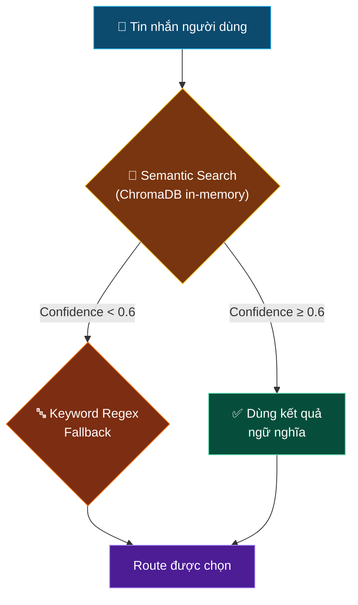
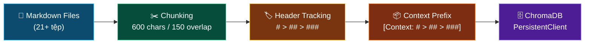
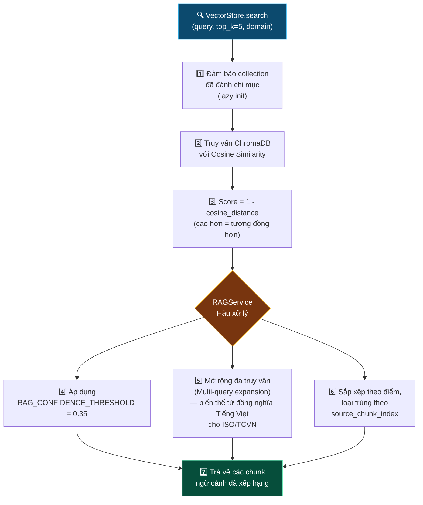
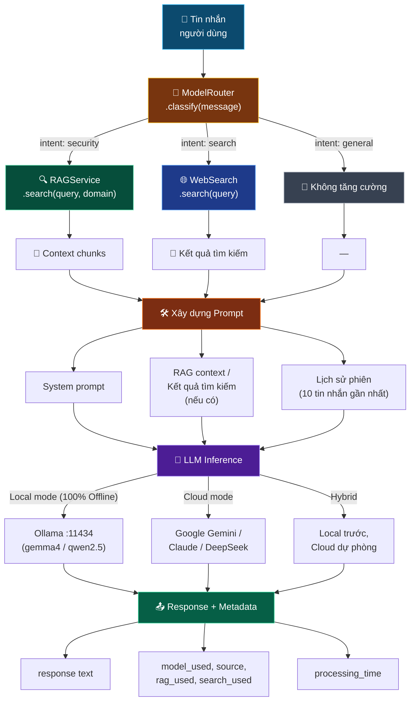
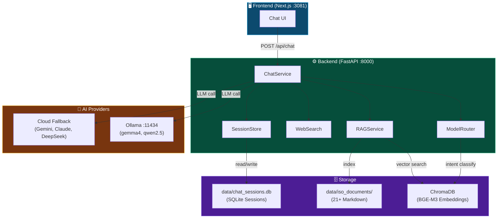

# 🤖 CyberAI Platform — Chatbot & RAG Pipeline (Tìm kiếm tăng cường sinh)

<div align="center">

[](../en/chatbot_rag.md)
[](chatbot_rag.md)

</div>

---

## 📑 Mục Lục

1. [🏗️ Kiến Trúc Chatbot](#1--kiến-trúc-chatbot)
   - [Hỗ Trợ Đa Mô Hình](#hỗ-trợ-đa-mô-hình)
   - [Quản Lý Phiên](#quản-lý-phiên)
   - [Bảo Mật](#bảo-mật)
   - [Streaming](#streaming)
2. [🧭 Định Tuyến Mô Hình (Model Routing)](#2--định-tuyến-mô-hình-model-routing)
   - [Pipeline Phân Loại](#pipeline-phân-loại)
   - [Bảng Định Tuyến Intent](#bảng-định-tuyến-intent)
3. [🔍 RAG Pipeline (Tìm kiếm tăng cường sinh)](#3--rag-pipeline-tìm-kiếm-tăng-cường-sinh)
   - [Nạp Tài Liệu (Document Ingestion)](#nạp-tài-liệu-document-ingestion)
   - [Bộ Sưu Tập Theo Phạm Vi (Domain-Scoped Collections)](#bộ-sưu-tập-theo-phạm-vi-domain-scoped-collections)
   - [Luồng Truy Xuất (Retrieval Flow)](#luồng-truy-xuất-retrieval-flow)
   - [Embedding (Nhúng vector)](#embedding-nhúng-vector)
4. [🌐 Tích Hợp Tìm Kiếm Web](#4--tích-hợp-tìm-kiếm-web)
5. [💬 Luồng Chat (Chat Flow)](#5--luồng-chat-chat-flow)

## 🎯 Giới Thiệu Nhanh — Project Này Làm Gì?

> **Bạn chưa quen với AI/Chatbot?** Hãy đọc phần này trước.

### Chatbot CyberAI hoạt động giống như một chuyên gia an ninh mạng ảo

Hãy tưởng tượng bạn có một **chuyên gia tư vấn ISO 27001** ngồi cạnh 24/7. Bạn hỏi bất kỳ câu hỏi nào về bảo mật thông tin, chuyên gia đó sẽ:

1. **Tra cứu** 21+ tài liệu tiêu chuẩn bảo mật (ISO, NIST, PCI DSS, luật Việt Nam...) để tìm thông tin liên quan
2. **Tổng hợp** thông tin từ nhiều nguồn
3. **Trả lời** bằng ngôn ngữ dễ hiểu, kèm trích dẫn nguồn tài liệu

Đó chính là **RAG (Retrieval-Augmented Generation)** — dịch nôm na là "AI có thư viện tra cứu".

### Ví dụ thực tế — 3 chế độ chat

| Bạn hỏi | Chatbot tự động chọn chế độ | Chatbot làm gì phía sau |
|----------|----------------------------|------------------------|
| *"ISO 27001 A.9 nói gì về kiểm soát truy cập?"* | 🔒 **Security** — Hỏi về bảo mật | Tìm trong 21+ tài liệu ISO → lấy 5 đoạn liên quan nhất → AI tổng hợp thành câu trả lời |
| *"Tin tức ransomware mới nhất?"* | 🌐 **Search** — Tìm trên internet | Tìm kiếm tin tức ATTT qua SearXNG / Web Search → lấy 5 kết quả → AI tổng hợp thành câu trả lời |
| *"Xin chào, bạn giúp gì được?"* | 💬 **General** — Chat thường | Không cần tra cứu → AI trả lời trực tiếp |

> 💡 **Chatbot tự động nhận diện loại câu hỏi** — bạn không cần chọn chế độ thủ công.

### RAG là gì? — Giải thích đơn giản bằng ví dụ

Hãy nghĩ về sự khác biệt giữa 2 loại AI:

| | AI thông thường (ví dụ: ChatGPT thuần) | AI + RAG (CyberAI Chatbot) |
|---|---|---|
| **Ví dụ đời thực** | Một chuyên gia nhớ kiến thức tổng quát nhưng **không mang theo sách** | Một chuyên gia **có cả thư viện 21+ cuốn sách chuyên ngành** — tra cứu trước khi trả lời |
| **Khi hỏi về ISO 27001** | Trả lời chung chung theo trí nhớ, có thể sai lệch hoặc lỗi thời | Mở đúng sách ISO 27001 ra xem, trích dẫn chính xác từng điều khoản, tiêu chuẩn |
| **Độ chính xác** | ~70-80% (dễ bị "ảo giác" — tự bịa thông tin) | ~95%+ (thông tin có căn cứ từ tài liệu chính thức) |

---

## 1. 🏗️ Kiến Trúc Chatbot

### Hỗ Trợ Đa Mô Hình (Multi-Model Support)

Hệ thống ưu tiên **100% Local AI Offline** qua Ollama, đồng thời hỗ trợ chọn model linh hoạt qua trường `model` hoặc dropdown trên giao diện:

| Nhà cung cấp | Mô hình chính | Vai trò |
|---|---|---|
| **Ollama (Local Offline)** | `gemma4:latest` (9.6GB) | Auditor chính, phân tích tiêu chuẩn & Chatbot |
| **Ollama (Local Offline)** | `qwen2.5-coder:7b` (4.7GB) | Bóc tách kỹ thuật, phân tích log an ninh |
| **Ollama (Local Offline)** | `bge-m3:latest` (1.2GB) | Vector Embedding cho RAG & ChromaDB |
| **Google AI Studio (Cloud Fallback)** | `gemini-2.0-flash` | Kênh dự phòng Cloud khi cấu hình API Key |
| **OpenClaude / DeepSeek (Cloud Fallback)** | `claude-3.5-sonnet`, `deepseek-chat` | Kênh dự phòng Cloud tổng quan |

### Quản Lý Phiên

Được xử lý bởi [`SessionStore`](../../backend/repositories/session_store.py) — lưu trữ file-based JSON dưới thư mục `data/sessions/`.

| Tham số | Giá trị |
|---------|---------|
| Định dạng lưu trữ | File JSON cho mỗi phiên |
| TTL (Thời gian sống) | 24 giờ |
| Số tin nhắn lưu tối đa | 20 tin nhắn mỗi phiên |
| Context Window (Cửa sổ ngữ cảnh) gửi tới LLM | 10 tin nhắn gần nhất |
| Session ID (Mã phiên) | Tự động tạo `uuid4` nếu không cung cấp |

### Bảo Mật

- **Phát hiện Prompt Injection (Tiêm prompt)** được thực hiện bên trong [`ChatService`](../../backend/services/chat_service.py) trước khi chuyển tiếp tới LLM
- [`ModelGuard`](../../backend/services/model_guard.py) công khai trạng thái sức khỏe qua `/api/chat/health`

### Streaming

SSE streaming được triển khai qua `sse-starlette`. Endpoint `/api/chat/stream` phát ra Token (Đơn vị từ) dạng `text/event-stream`:

```
data: {"token": "partial ", "done": false}
data: {"token": "", "done": true, "metadata": {...}}
```

---

## 2. 🧭 Định Tuyến Mô Hình (Model Routing)

[`ModelRouter`](../../backend/services/model_router.py) phân loại mỗi tin nhắn đầu vào thành một trong ba intent bằng phương pháp **kết hợp ngữ nghĩa + từ khóa (hybrid semantic + keyword)**.

### Pipeline Phân Loại



<details>
<summary>📖 Chi tiết Classification Pipeline (Pipeline phân loại)</summary>

Collection ChromaDB in-memory tên `intent_classifier` lưu các tin nhắn mẫu đã được gán nhãn cho mỗi route. Bộ phân loại nhúng (Embedding) tin nhắn đầu vào và tìm mẫu gần nhất bằng **Cosine Similarity (Độ tương đồng cosine)**:

```python
# Tạo/lấy collection in-memory cho phân loại intent
collection = client.get_or_create_collection(
    name="intent_classifier",
    metadata={"hnsw:space": "cosine"}
)

# Truy vấn tin nhắn đầu vào
result = collection.query(
    query_texts=[message],
    n_results=1
)
distance   = result["distances"][0][0]
confidence = 1 - distance    # cosine → 0=giống hệt, 1=trực giao
```

Nếu `confidence ≥ 0.6` → dùng kết quả Semantic Search (Tìm kiếm ngữ nghĩa).

Nếu `confidence < 0.6` → fallback sang khớp từ khóa regex.

</details>

### Bảng Định Tuyến Intent

| Intent | Hành động | Cờ |
|--------|-----------|-----|
| `security` | RAG (Retrieval-Augmented Generation - Tìm kiếm tăng cường sinh) truy vấn tài liệu ISO/an ninh mạng | `use_rag=true` |
| `search` | Tìm kiếm tin tức ATTT qua SearXNG (hỗ trợ DuckDuckGo fallback) | `use_search=true` |
| `general` | Phản hồi trực tiếp từ LLM (không tăng cường) | — |

<details>
<summary>💡 Ví dụ phân loại intent</summary>

```
Input: "ISO 27001 Annex A.9 nói gì về kiểm soát truy cập?"
  → Confidence ngữ nghĩa: 0.91  →  route: security  ✅

Input: "Tin tức ransomware mới nhất hôm nay"
  → Confidence ngữ nghĩa: 0.44  →  keyword fallback
  → "latest", "today" khớp search_keywords  →  route: search  ✅

Input: "Làm thế nào để viết hàm Python?"
  → Confidence ngữ nghĩa: 0.28  →  keyword fallback
  → Không khớp từ khóa  →  route: general  ✅
```

</details>

---

## 3. 🔍 RAG Pipeline (Tìm kiếm tăng cường sinh)

> 💡 **Hiểu đơn giản:** RAG Pipeline giống như quá trình bạn đi thư viện: (1) cắt sách thành từng trang nhỏ cho dễ tìm, (2) dùng mục lục để tìm trang liên quan, (3) lọc bỏ trang không liên quan, (4) đưa cho chuyên gia đọc và tổng hợp câu trả lời.

### Nạp Tài Liệu (Document Ingestion)

> 🤔 **Tại sao phải "cắt" tài liệu?** Vì AI chỉ có thể đọc một lượng text giới hạn mỗi lần (gọi là "context window"). Một tài liệu ISO 27001 dài 50 trang không thể nhét hết vào AI. Nên ta phải cắt ra thành nhiều "đoạn nhỏ" (chunk), rồi chỉ gửi những đoạn liên quan nhất cho AI.

**Nguồn:** 21+ file markdown trong [`/data/iso_documents/`](../../data/iso_documents/).

**Các tiêu chuẩn được bao phủ:**

| Nhóm tiêu chuẩn | Tên tiêu chuẩn |
|------------------|-----------------|
| 🏛️ ISO | ISO 27001:2022, ISO 27002:2022 |
| 🇻🇳 Việt Nam | TCVN 11930:2017, Luật An ninh Mạng 2018, Nghị định 13/2023 (BVDLCN), Nghị định 85/2016 |
| 🇺🇸 NIST | NIST CSF 2.0, NIST SP 800-53 |
| 💳 PCI | PCI DSS 4.0 |
| 🏥 Y tế | HIPAA Security Rule |
| 🇪🇺 EU | GDPR, NIS2 Directive |
| 🔒 Khác | SOC 2 Trust Criteria, CIS Controls v8, OWASP Top 10 2021 |

**Chiến lược Chunking (Phân đoạn văn bản)** — triển khai trong [`VectorStore`](../../backend/repositories/vector_store.py):

| Tham số | Giá trị |
|---------|---------|
| Kích thước chunk | 600 ký tự |
| Overlap (Chồng lấn) | 150 ký tự |
| Theo dõi tiêu đề | `#`, `##`, `###` theo hệ thống phân cấp |
| Tiền tố ngữ cảnh | `[Context: # > ## > ###]` gắn trước mỗi chunk |



### Bộ Sưu Tập Theo Phạm Vi (Domain-Scoped Collections)

Mỗi nhóm tiêu chuẩn được đánh chỉ mục vào collection ChromaDB riêng để truy xuất theo phạm vi:

| Domain | File nguồn |
|--------|-----------|
| `iso_documents` | Tất cả file markdown (collection mặc định) |
| `iso27001` | `iso27001_annex_a.md`, `iso27002_2022.md` |
| `tcvn11930` | `tcvn_11930_2017.md`, `nd85_2016_cap_do_httt.md` |
| `nd13` | `nghi_dinh_13_2023_bvdlcn.md`, `luat_an_ninh_mang_2018.md` |
| `nist_csf` | `nist_csf_2.md`, `nist_sp800_53.md` |
| `pci_dss` | `pci_dss_4.md` |
| `hipaa` | `hipaa_security_rule.md` |
| `gdpr` | `gdpr_compliance.md` |
| `soc2` | `soc2_trust_criteria.md` |
| Custom | Tự động đánh chỉ mục khi upload vào collection `{standard_id}` |

### Luồng Truy Xuất (Retrieval Flow)



> 📌 Triển khai trong [`RAGService`](../../backend/services/rag_service.py) và [`VectorStore`](../../backend/repositories/vector_store.py).

<details>
<summary>💡 Ví dụ RAG Query & Response</summary>

**Query:** "ISO 27001 Annex A.9 quy định gì về kiểm soát truy cập?"

**Luồng xử lý:**
1. `ModelRouter` phân loại → `security` (confidence: 0.91)
2. `VectorStore.search(query, top_k=5, domain="iso27001")`
3. Trả về 5 chunk liên quan với context prefix:

```
[Context: # ISO 27001:2022 > ## Annex A > ### A.9 Access Control]
A.9.1.1 Chính sách kiểm soát truy cập — Cần thiết lập, lập tài liệu,
được phê duyệt bởi ban quản lý, công bố và truyền đạt tới nhân viên
và các bên liên quan bên ngoài...
```

4. Các chunk được gộp thành context cho Prompt Engineering (Kỹ thuật prompt)
5. LLM sinh phản hồi dựa trên context được cung cấp

</details>

### Embedding (Nhúng vector)

Sử dụng hàm Embedding (Nhúng vector) mặc định tích hợp của ChromaDB — **không yêu cầu** dependency `sentence-transformers` riêng.

**Lưu trữ:** ChromaDB `PersistentClient` tại `data/vector_store/`.

---

## 4. 🌐 Tích Hợp Tìm Kiếm Web & Tình Báo An Ninh Mạng

Triển khai trong [`web_search.py`](../../backend/services/web_search.py).

| Tham số | Giá trị |
|---------|---------|
| **Công cụ chính (Tầng 1)** | SearXNG on-premise nội bộ (`http://searxng:8080`, port host 8888) qua JSON API |
| **Dự phòng (Tầng 2)** | Thư viện `ddgs` (DuckDuckGo Python client) tự động kích hoạt khi SearXNG lỗi/timeout |
| **Bảo vệ rò rỉ dữ liệu** | `is_log_analysis_query` — phát hiện log/payload kỹ thuật thì chặn tìm kiếm ra ngoài |
| **Thời gian chờ (Timeout)** | 8.0s cho SearXNG; 5.0s cho `ddgs` |
| **Khu vực & Ngôn ngữ** | `language="vi-VN"`, `region="vn-vi"` (Ưu tiên tiếng Việt) |
| **Điều kiện kích hoạt** | Tự động qua `ModelRouter` (nhận diện cả từ khóa tiếng Việt không dấu) hoặc chủ động qua nút toggle UI |
| **Ghi đè thủ công** | Nút bấm **🌐 Tìm kiếm Web** trên Chatbot UI: Tự động / BẬT / TẮT (`use_search`) |
| **Mô hình hỗ trợ** | Cả Local Models (`gemma4`, `qwen2.5-coder`) và Cloud Models (`gemini`, `claude`) |

> Kết quả tìm kiếm được chuẩn hóa thành trích dẫn nguồn có đánh số `[1]`, `[2]`... và tiêm trực tiếp vào prompt dưới dạng ngữ cảnh `search_context` cho cả mô hình cục bộ và mô hình đám mây.

<details>
<summary>📖 Chi tiết luồng thực thi WebSearch</summary>

```python
# Trích từ backend/services/web_search.py
class WebSearch:
    @staticmethod
    def _search_searxng(query: str, max_results: int = 5) -> List[Dict[str, str]]:
        """Truy vấn trực tiếp SearXNG qua endpoint GET /search?format=json (Timeout 8.0s)"""
        searxng_base = getattr(settings, "SEARXNG_URL", "http://searxng:8080").rstrip("/")
        # Gọi JSON API...
        ...

    @classmethod
    def search(cls, query: str, max_results: int = 5, retries: int = 1) -> List[Dict[str, str]]:
        # 1. DLP: Chặn rò rỉ log
        if is_log_analysis_query(query):
            return []
        
        # 2. Ưu tiên 1: SearXNG Cục bộ (JSON API)
        searx_results = cls._search_searxng(query, max_results=max_results)
        if searx_results:
            return searx_results

        # 3. Ưu tiên 2: Fallback tự động sang ddgs
        # Thực hiện tìm kiếm dự phòng...
```

Kết quả được format thành context cho prompt với đánh số trích dẫn:

```python
@staticmethod
def format_context(results: List[Dict[str, str]]) -> str:
    parts = []
    for i, r in enumerate(results, 1):
        parts.append(
            f"[{i}] {r['title']}\n"
            f"URL: {r['url']}\n"
            f"{r['snippet']}"
        )
    return "\n\n---\n\n".join(parts)
```

</details>

---

## 5. 💬 Luồng Chat (Chat Flow)



<details>
<summary>📖 Mô tả chi tiết luồng Chat</summary>

| Bước | Mô tả | Thành phần |
|------|--------|------------|
| 1 | Người dùng gửi tin nhắn | Frontend → `POST /api/chat` (hoặc `/api/chat/stream`) |
| 2 | Phân loại intent | [`ModelRouter`](../../backend/services/model_router.py) |
| 3a | Truy xuất tài liệu ISO (nếu `security`) | [`RAGService`](../../backend/services/rag_service.py) (ChromaDB BGE-M3) |
| 3b | Tìm kiếm web riêng tư (nếu `search`) | [`WebSearch`](../../backend/services/web_search.py) (SearXNG :8888) |
| 3c | Không tăng cường (nếu `general`) | — |
| 4 | Xây dựng prompt với context | [`ChatService`](../../backend/services/chat_service.py) |
| 5 | Gọi LLM (local/cloud/hybrid) | [`CloudLLMService`](../../backend/services/cloud_llm_service.py) |
| 6 | Trả về response + metadata | `response`, `model_used`, `processing_time` |

</details>

---

## 📊 Tổng Quan Kiến Trúc



---

> 📖 **Tham khảo thêm:**
> - [Kiến trúc hệ thống](architecture.md) — Tổng quan kiến trúc toàn bộ platform
> - [API Reference](api.md) — Tài liệu chi tiết các endpoint
> - [Hướng dẫn ChromaDB](chromadb_guide.md) — Cấu hình và quản lý Vector Store (Kho vector)
> - [Triển khai](deployment.md) — Hướng dẫn deploy production
