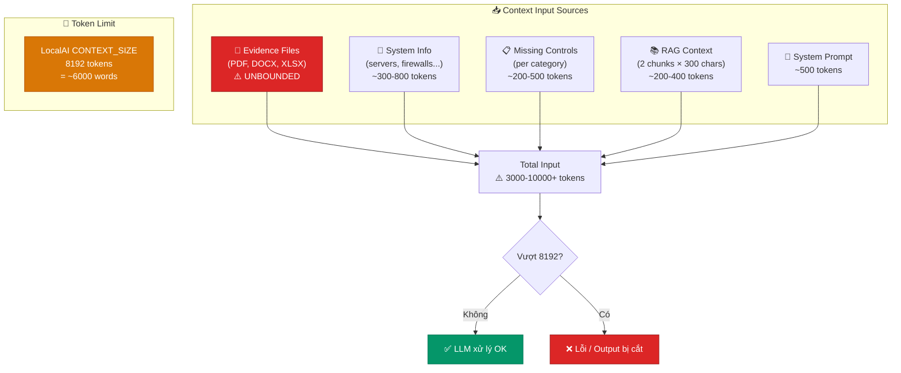
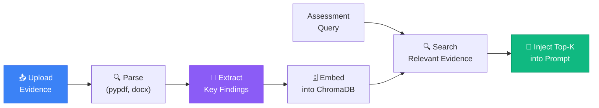

# 🧩 Phân Tích & Giải Pháp: Context Input Quá Lớn Cho Local Model

## 1. Vấn Đề Hiện Tại

### Mô tả
Khi chạy **Assessment (đánh giá ISO 27001)** ở chế độ **Local** hoặc **Hybrid**, local model (SecurityLLM 7B chạy trên LocalAI, CONTEXT_SIZE=8192 tokens) thường bị lỗi vì **context input quá lớn**.

### Nguyên nhân gốc

Assessment pipeline cần gửi cho LLM **tất cả** thông tin sau trong **một prompt duy nhất**:

| Thành phần | Ước tính kích thước | Mô tả |
|------------|-------------------|-------|
| System prompt | ~500 tokens | Hướng dẫn AI phân tích |
| System info (hạ tầng) | ~300-800 tokens | Servers, firewalls, VPN, SIEM, cloud… |
| Controls list (missing) | **500-2000 tokens** | Danh sách controls chưa triển khai |
| RAG context | ~600-1200 tokens | Trích đoạn tài liệu ISO từ ChromaDB |
| Evidence content | **1000-5000+ tokens** | Nội dung file bằng chứng (PDF, DOCX, text) |
| History | ~200 tokens | Ngữ cảnh trước đó |
| **TỔNG** | **~3000-10000+ tokens** | Thường vượt 8192 token limit |

> ⚠️ **Vấn đề chính:** Khi tổ chức tải lên nhiều evidence files (PDF chính sách, XLSX inventory, logs…), tổng context dễ dàng vượt 8192 tokens → LocalAI trả lỗi hoặc bị cắt output.

### Code hiện tại đã có biện pháp (nhưng chưa đủ)

1. **Chunked mode** (`chat_service.py:541-612`): Chia 93 controls thành 4 categories, mỗi category gửi prompt riêng
2. **RAG top_k=2** cho assessment (không phải 5 như chat)
3. **RAG context truncated** tại 300 chars mỗi chunk (`cat_rag_ctx = r["text"][:300]`)
4. **Phase 2 compression** (`compress_for_phase2()`): Nén risk register xuống 2500 chars max

### Vấn đề CHƯA được giải quyết

1. **Evidence content** chưa có giới hạn kích thước — file PDF 50 trang = hàng chục nghìn tokens
2. **System info** chưa được tóm tắt — gửi nguyên văn
3. **Không có token counting** — không biết prompt bao nhiêu tokens trước khi gửi
4. **Không có dynamic context budgeting** — không tự động cắt khi gần limit

---

## 2. Phân Tích Chi Tiết Luồng Dữ Liệu



---

## 3. Giải Pháp Đề Xuất

### 3.1 Giải pháp ngắn hạn (0-2 tuần) — Quick Wins

#### A. Token Counting trước khi gửi
```python
# Thêm hàm estimate token count
def estimate_tokens(text: str) -> int:
    """Ước tính số tokens (~4 chars/token cho tiếng Việt)"""
    return len(text) // 3  # Conservative estimate

# Trước khi gửi cho LLM
total_tokens = estimate_tokens(prompt)
if total_tokens > MAX_CONTEXT * 0.8:  # 80% safety margin
    # Trigger context reduction
    prompt = reduce_context(prompt, target_tokens=MAX_CONTEXT * 0.7)
```

#### B. Evidence Summarization (Tóm tắt bằng chứng)
```python
MAX_EVIDENCE_CHARS = 1500  # ~375 tokens per evidence file

def summarize_evidence(content: str, max_chars: int = MAX_EVIDENCE_CHARS) -> str:
    """Tóm tắt evidence dài thành đoạn ngắn"""
    if len(content) <= max_chars:
        return content
    # Lấy phần đầu + phần cuối
    head = content[:max_chars // 2]
    tail = content[-(max_chars // 2):]
    return f"{head}\n[... đã lược bỏ {len(content) - max_chars} ký tự ...]\n{tail}"
```

#### C. Dynamic Context Budget
```python
CONTEXT_BUDGET = 6500  # Dành ~1500 tokens cho output

def allocate_context_budget(system_prompt, controls, evidence, rag):
    budget = CONTEXT_BUDGET
    
    # Priority 1: System prompt (bắt buộc)
    budget -= estimate_tokens(system_prompt)
    
    # Priority 2: Controls list (bắt buộc) 
    budget -= estimate_tokens(controls)
    
    # Priority 3: Top evidence (quan trọng)
    evidence_budget = min(budget * 0.5, 2000)
    truncated_evidence = truncate_to_budget(evidence, evidence_budget)
    budget -= estimate_tokens(truncated_evidence)
    
    # Priority 4: RAG context (nice-to-have)
    rag_budget = budget
    truncated_rag = truncate_to_budget(rag, rag_budget)
    
    return system_prompt, controls, truncated_evidence, truncated_rag
```

### 3.2 Giải pháp trung hạn (2-4 tuần)

#### D. Two-Pass Evidence Processing
```
Pass 1: Summarization (Cloud LLM — context lớn hơn)
- Gửi evidence content cho Cloud model (128K context)
- Yêu cầu tóm tắt thành 500 chars
- Cache kết quả tóm tắt

Pass 2: Assessment (Local LLM — context nhỏ)
- Sử dụng evidence summary thay vì evidence gốc
- Đảm bảo tổng context < 6500 tokens
```

#### E. Tăng CONTEXT_SIZE cho LocalAI
```yaml
# docker-compose.yml — tăng context window
- CONTEXT_SIZE=16384  # 16K thay vì 8K

# Trade-off:
# - Cần thêm ~2-4 GB RAM
# - Suy luận chậm hơn ~20-30%
# - Nhưng giải quyết 80% trường hợp overflow
```

#### F. Chuyển sang model hỗ trợ context lớn hơn
| Model | Context | RAM cần | Tốc độ |
|-------|---------|---------|--------|
| SecurityLLM 7B (hiện tại) | 8K | ~6 GB | Nhanh |
| Gemma 3n E4B (Ollama) | 32K | ~4 GB | Trung bình |
| Llama 3.1 8B (nếu GGUF mới) | 128K | ~8 GB | Chậm |

### 3.3 Giải pháp dài hạn (1-3 tháng)

#### G. Hierarchical Assessment Pipeline
```
Level 1: Category-level GAP scan (nhỏ, nhanh)
- Chỉ gửi control list + system summary
- Không gửi evidence
- Output: priority list of gaps

Level 2: Per-control deep analysis (chi tiết)
- Chỉ cho controls có GAP từ Level 1
- Gửi evidence + RAG context cho control cụ thể
- Output: detailed risk per control
```

#### H. Evidence Pre-Processing Pipeline


---

## 4. Ưu Tiên Thực Hiện

| Priority | Giải pháp | Effort | Impact |
|----------|-----------|--------|--------|
| 🔴 P0 | B. Evidence Summarization | 1 ngày | Cao — ngăn overflow ngay |
| 🔴 P0 | C. Dynamic Context Budget | 1 ngày | Cao — ngăn overflow tự động |
| 🟠 P1 | A. Token Counting | 0.5 ngày | TB — monitoring/alerting |
| 🟡 P2 | E. Tăng CONTEXT_SIZE=16K | 0.5 ngày | TB — cần thêm RAM |
| 🟡 P2 | D. Two-Pass Evidence | 3 ngày | Cao — giải quyết triệt để |
| ⚪ P3 | G. Hierarchical Pipeline | 1 tuần | Rất cao — tối ưu toàn diện |
| ⚪ P3 | H. Evidence ChromaDB | 1 tuần | Rất cao — scalable |

---

## 5. Files Cần Sửa

| File | Thay đổi |
|------|----------|
| `backend/services/assessment_helpers.py` | Thêm `summarize_evidence()`, `estimate_tokens()` |
| `backend/services/chat_service.py` | Thêm dynamic budget allocation vào `assess_system()` |
| `backend/api/routes/iso27001.py` | Tích hợp evidence summarization trước khi gửi assessment |
| `docker-compose.yml` | Tùy chọn tăng CONTEXT_SIZE |
| `backend/core/config.py` | Thêm MAX_EVIDENCE_CHARS, CONTEXT_BUDGET settings |
