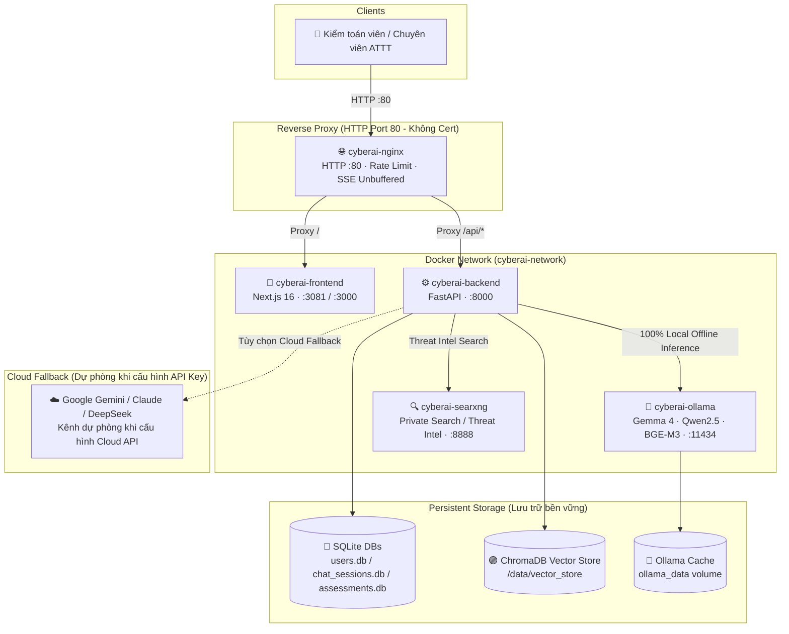

# 🚀 CyberAI Assessment Platform — Hướng Dẫn Cài Đặt & Triển Khai (Deployment Guide)

<div align="center">

[](../en/deployment.md)
[](deployment.md)

</div>

---

## 📑 Mục Lục

1. [Yêu Cầu Hệ Thống (Prerequisites)](#-1-yêu-cầu-hệ-thống-prerequisites)
2. [Khởi Động Nhanh (Development)](#-2-khởi-động-nhanh-development)
3. [Mô Hình AI & Tải Model (Ollama Local Offline Suite)](#-3-mô-hình-ai--tải-model-ollama-local-offline-suite)
4. [Biến Môi Trường (Environment Variables)](#-4-biến-môi-trường-environment-variables)
5. [Triển Khai Production (Production Deployment)](#-5-triển-khai-production-production-deployment)
6. [Cấu Hình Nginx (HTTP Thuần Port 80 - Không Cần Cert)](#-6-cấu-hình-nginx-http-thuần-port-80---không-cần-cert)
7. [Health Check (Kiểm Tra Sức Khỏe)](#-7-health-check-kiểm-tra-sức-khỏe)
8. [Lưu Trữ Dữ Liệu (Data Persistence)](#-8-lưu-trữ-dữ-liệu-data-persistence)
9. [Backup & Restore (Sao Lưu & Khôi Phục)](#-9-backup--restore-sao-lưu--khôi-phục)
10. [Xử Lý Sự Cố (Troubleshooting)](#-10-xử-lý-sự-cố-troubleshooting)

---

## 🏗️ Kiến Trúc Triển Khai Thực Tế

Hệ thống được thiết kế theo tiêu chí **100% Local AI Offline On-Premise** phục vụ nghiệm thu thực tế, bảo vệ tuyệt đối dữ liệu cấu hình và nhật ký an ninh mạng của doanh nghiệp. Nginx đóng vai trò Reverse Proxy chạy thuần HTTP (Port 80), không yêu cầu chứng chỉ SSL/TLS phức tạp.



---

## 📋 1. Yêu Cầu Hệ Thống (Prerequisites)

| Thành phần | Yêu cầu tối thiểu | Khuyến nghị sản xuất |
|---|---|---|
| **Hệ điều hành** | Linux (Ubuntu 22.04+), Windows 11 (WSL2), macOS | Ubuntu Server 22.04 LTS / 24.04 LTS |
| **Docker Engine** | Docker Engine 24.0+ | Phiên bản ổn định mới nhất |
| **Docker Compose** | Docker Compose v2.20+ | Docker Compose v2.27+ |
| **RAM** | 16 GB RAM (chạy CPU offload) | 32 GB RAM trở lên |
| **Dung lượng ổ cứng** | 30 GB trống (SSD) | 60 GB+ NVMe SSD (chứa Ollama models + Vector Store) |
| **GPU (Tùy chọn)** | CPU x86_64 đa nhân (8+ cores) | NVIDIA RTX 3060/4060 trở lên (VRAM ≥ 12GB) để tăng tốc suy luận |

---

## ⚡ 2. Khởi Động Nhanh (Development)

Chạy hệ thống trong môi trường phát triển (Development):

```bash
# 1. Clone repository
git clone https://github.com/NghiaDinh03/CyberAI-Assessment-project.git
cd CyberAI-Assessment-project

# 2. Khởi tạo file cấu hình môi trường
cp .env.example .env

# 3. Khởi chạy toàn bộ hệ thống bằng Docker Compose
docker compose up -d --build

# 4. Kiểm tra trạng thái các container
docker compose ps
```

### 🌐 Danh Sách Endpoint Mặc Định

| Dịch vụ | URL | Chức năng |
|---|---|---|
| **Nginx Reverse Proxy** | `http://localhost:80` | Điểm vào chính, HTTP thuần, không cần chứng chỉ |
| **Frontend UI/UX** | `http://localhost:3081` | Giao diện người dùng Next.js 16 (Bilingual EN/VI) |
| **Backend API Docs** | `http://localhost:8000/docs` | Swagger UI tương tác với 40+ RESTful APIs |
| **Backend Health Check** | `http://localhost:8000/health` | Kiểm tra trạng thái Backend (`{"status": "healthy"}`) |
| **Ollama Local Engine** | `http://localhost:11434` | Động cơ suy luận AI cục bộ 100% Offline |
| **SearXNG Search** | `http://localhost:8888` | Công cụ tìm kiếm nội bộ, thu thập tin tức ATTT |

---

## 🧠 3. Mô Hình AI & Tải Model (Ollama Local Offline Suite)

Hệ thống vận hành nghiệm thu dựa trên bộ 3 mô hình cục bộ chuyên biệt, đảm bảo đáp ứng đầy đủ tiêu chuẩn bảo mật dữ liệu cấp nhà nước và doanh nghiệp:

| Vai trò | Model ID | Dung lượng | Mục đích sử dụng |
|---|---|---|---|
| **Auditor / Primary LLM** | `gemma4:latest` | ~9.6 GB | Chuyên gia kiểm toán, lập luận tuân thủ ISO 27001/TCVN 11930, trả lời Chatbot |
| **Extractor / Security LLM** | `qwen2.5-coder:7b` | ~4.7 GB | Bóc tách cấu hình kỹ thuật, phân tích Windows Server hotfix, parse log an ninh |
| **Embedding Model** | `bge-m3:latest` | ~1.2 GB | Trích xuất vector embedding đa ngữ phục vụ RAG và Semantic Search trên ChromaDB |

### Lệnh Tải Model Vào Container Ollama:

```bash
# Kéo mô hình Auditor chính
docker exec -it cyberai-ollama ollama pull gemma4:latest

# Kéo mô hình Extractor kỹ thuật
docker exec -it cyberai-ollama ollama pull qwen2.5-coder:7b

# Kéo mô hình Embedding
docker exec -it cyberai-ollama ollama pull bge-m3
```

Kiểm tra danh sách model đã tải:
```bash
docker exec -it cyberai-ollama ollama list
```

---

## ⚙️ 4. Biến Môi Trường (Environment Variables)

Các thông số cấu hình được đặt trong file `.env` (tạo từ `.env.example`):

### 🦙 Cấu Hình Mô Hình Cục Bộ (Local AI - Bắt buộc)
```ini
OLLAMA_URL=http://ollama:11434
MODEL_NAME=gemma4:latest
SECURITY_MODEL_NAME=gemma4:latest
EMBEDDING_MODEL_NAME=bge-m3
MODEL_1_EXTRACTOR=qwen2.5-coder:7b
MODEL_2_AUDITOR=gemma4:latest
MODEL_3_EMBEDDING=bge-m3
REQUIRED_MODEL_IDS=gemma4:latest,qwen2.5-coder:7b,bge-m3:latest
PREFER_LOCAL=true
INFERENCE_TIMEOUT=1200
```

### ✨ Cấu Hình Cloud AI (Kênh Dự Phòng Fallback Khi Cần)
> **Lưu ý:** Hệ thống nghiệm thu trên 100% Local AI Offline. Mô hình Cloud chỉ kích hoạt làm kênh dự phòng khi người dùng chủ động cấu hình API Key:
```ini
# Google AI Studio (Gemini 2.0 Flash / Pro) — Tùy chọn dự phòng Cloud
GOOGLE_AI_STUDIO_API_KEY=your_google_ai_studio_key_here
GOOGLE_AI_STUDIO_MODEL=gemini-2.0-flash
GOOGLE_AI_STUDIO_URL=https://generativelanguage.googleapis.com/v1beta

# Claude / DeepSeek Cloud Fallback chung (Tùy chọn)
CLOUD_LLM_API_URL=https://api.anthropic.com/v1
CLOUD_MODEL_NAME=claude-3-5-sonnet-latest
CLOUD_API_KEYS=your_cloud_key_here
```

### 🔒 Bảo Mật & Xác Thực
```ini
# Khóa JWT Secret (Bắt buộc tối thiểu 32 ký tự ngẫu nhiên)
JWT_SECRET=super-secret-jwt-key-minimum-32-chars-long
JWT_EXPIRE_MINUTES=60
CORS_ORIGINS=http://localhost:3000,http://localhost:3081,http://127.0.0.1:3000,http://127.0.0.1:3081
```

---

## 🏭 5. Triển Khai Production (Production Deployment)

Trong môi trường Production, hệ thống sử dụng file [`docker-compose.prod.yml`](docker-compose.prod.yml) đã được căn chỉnh đồng nhất theo kiến trúc Development:

### Điểm Nổi Bật Của Kiến Trúc Production:
1. **Nginx HTTP thuần**: Lắng nghe trực tiếp trên cổng **80**, không đòi hỏi mount chứng chỉ cert hay cấu hình Let's Encrypt.
2. **Mở port trực tiếp (Port Binding)**: Tương thích hoàn toàn với việc kiểm thử nội bộ và tường lửa doanh nghiệp.
3. **DNS Host Gateway**: Backend được cấu hình `extra_hosts: ["host.docker.internal:host-gateway"]` để gọi các dịch vụ chạy trên máy chủ vật lý nếu cần.
4. **CORS mở rộng**: Cho phép cả hai cổng frontend chuẩn (`:3081` và `:3000`).

### Lệnh Khởi Chạy Production:
```bash
# Khởi chạy toàn bộ hệ thống ở chế độ ngầm và rebuild container
docker compose -f docker-compose.prod.yml up -d --build

# Kiểm tra cú pháp file compose
docker compose -f docker-compose.prod.yml config --quiet
```

### Bảng Phân Bổ Cổng Trong Production:
| Container Name | Dịch vụ | Cổng Host : Container | Ghi chú |
|---|---|---|---|
| `cyberai-nginx` | Reverse Proxy HTTP | `80:80` | Điểm truy cập chính cho người dùng |
| `cyberai-backend` | FastAPI Core Engine | `8000:8000` | API engine & pipeline ISO27001 |
| `cyberai-frontend` | Next.js Web Application | `3081:3000` | Giao diện Next.js standalone |
| `cyberai-searxng` | Private Search Engine | `8888:8080` | Tìm kiếm web riêng tư nội bộ |
| `cyberai-ollama` *(tuỳ chọn)* | Local LLM Inference | `11435:11434` | Profile `ollama-container` (mặc định dùng Host Ollama `11434`) |

---

## 🌐 6. Cấu Hình Nginx (HTTP Thuần Port 80 - Không Cần Cert)

File cấu hình [`nginx/nginx.conf`](nginx/nginx.conf) được thiết kế tối ưu, tự chứa và mount trực tiếp vào `/etc/nginx/nginx.conf:ro`:

- **Không cần SSL/TLS**: Chỉ lắng nghe trên cổng 80 (`listen 80 default_server;`).
- **Hỗ trợ SSE Streaming**: Cấu hình `proxy_buffering off;` và `proxy_read_timeout 600s;` tại location `/api/` để đảm bảo Chatbot stream từng token mượt mà đến trình duyệt.
- **Rate Limiting**: Giới hạn tốc độ `30r/s` cho `/api/` và `100r/s` toàn cục để ngăn chặn brute-force và DoS.
- **Tự động chuyển tiếp WebSocket**: Hỗ trợ header `Upgrade` và `Connection` qua cấu trúc `map $http_upgrade $connection_upgrade`.
- **Nén Gzip**: Bật tự động nén cho JSON, JavaScript, CSS và SVG nhằm tối ưu băng thông mạng.

---

## 🩺 7. Health Check (Kiểm Tra Sức Khỏe)

Kiểm tra tính sẵn sàng của hệ thống sau khi triển khai:

```bash
# 1. Kiểm tra Backend API
curl -s http://localhost:8000/health
# Kết quả mong đợi: {"status":"healthy"}

# 2. Kiểm tra danh mục Model Ollama
curl -s http://localhost:11434/api/tags | grep -o '"name":"[^"]*"'

# 3. Kiểm tra qua Nginx Reverse Proxy
curl -s http://localhost/health

# 4. Kiểm tra SearXNG Meta-Search JSON API
curl -s "http://localhost:8888/search?q=ransomware&format=json" | grep -o '"results"'
```

---

## 💾 8. Lưu Trữ Dữ Liệu (Data Persistence)

Toàn bộ dữ liệu của CyberAI Assessment Platform được bảo toàn qua các Docker Volume và mount thư mục:

| Thư mục / Volume | Loại | Nội dung lưu trữ |
|---|---|---|
| `./data/users.db` | SQLite file | Danh mục tài khoản người dùng, mật khẩu hash PBKDF2/SHA-256 |
| `./data/chat_sessions.db` | SQLite file | Lịch sử hội thoại chatbot theo người dùng |
| `./data/assessments/` | Thư mục JSON | Kết quả các phiên đánh giá ISO 27001 / TCVN 11930 |
| `./data/vector_store/` | ChromaDB dir | Chỉ mục vector embeddings đa ngữ của tài liệu quy chuẩn |
| `./data/uploads/` | Thư mục | File minh chứng (evidence), file cấu hình máy chủ tải lên |
| `./searxng/` | Thư mục cấu hình | Cấu hình SearXNG (`settings.yml`: bật JSON format, tắt limiter) |
| `ollama_data` | Named Volume | Bộ trọng số của các mô hình LLM đã tải về (`/root/.ollama`) |

---

## 💿 9. Backup & Restore (Sao Lưu & Khôi Phục)

### Sao lưu nhanh dữ liệu hệ thống:
```bash
# Thực hiện backup bằng script tích hợp
bash scripts/backup.sh --dest ./backups --retention-days 30
```

### Khôi phục dữ liệu:
```bash
# Giải nén bản lưu trữ
tar -xzf ./backups/cyberai_backup_<TIMESTAMP>.tar.gz -C ./

# Khởi động lại backend để nạp lại dữ liệu
docker compose restart backend
```

---

## 🔧 10. Xử Lý Sự Cố (Troubleshooting)

### 1. Mô hình AI chưa sẵn sàng trong Ollama (404 Not Found)
- **Triệu chứng:** Chatbot báo `"model 'gemma4:latest' not found"`.
- **Cách khắc phục:** 
  Chạy lệnh pull mô hình vào container:
  ```bash
  docker exec -it cyberai-ollama ollama pull gemma4:latest
  ```

### 2. Lỗi CORS khi gọi từ trình duyệt
- **Triệu chứng:** Trình duyệt báo đỏ `Access-Control-Allow-Origin`.
- **Cách khắc phục:** 
  Kiểm tra biến `CORS_ORIGINS` trong file `.env` đã có đầy đủ các cổng chưa:
  ```ini
  CORS_ORIGINS=http://localhost:3000,http://localhost:3081,http://127.0.0.1:3000,http://127.0.0.1:3081
  ```
  Sau đó restart backend: `docker compose restart backend`.

### 3. Backend không khởi động được do JWT Secret
- **Triệu chứng:** Log hiển thị `ValueError: JWT_SECRET is insecure...`.
- **Cách khắc phục:** 
  Tạo khóa bí mật mới có độ dài từ 32 ký tự trở lên:
  ```bash
  python -c "import secrets; print(secrets.token_hex(32))"
  ```
  Dán giá trị này vào `JWT_SECRET=` trong `.env`.

### 4. Tỷ lệ tuân thủ hiển thị $> 100\%$
- **Trạng thái:** Đã được khắc phục triệt để trong code lõi `controls_catalog.py` và `standards.js`. Toàn bộ control ID đều được phân loại theo chuẩn và clamp trần $[0.0, 100.0]\%$.

### 5. Container `cyberai-searxng` không thấy tiêu thụ CPU (0% CPU)
- **Triệu chứng:** Khi chạy `docker stats`, container `cyberai-searxng` duy trì mức `0.00% CPU` ngay cả khi đang chat.
- **Nguyên nhân:**
  1. **SearXNG là dịch vụ On-Demand:** Chỉ tiêu thụ CPU/RAM khi nhận được request tìm kiếm HTTP từ Backend. Ở trạng thái rảnh, container gần như 0% CPU.
  2. **Trước đây bị bypass ở Local Model:** Trong code cũ, luồng stream của mô hình local gán cứng `use_search = False` và chưa hỗ trợ từ khóa không dấu.
- **Cách khắc phục:**
  - Đã kích hoạt Web Search cho cả Local Models và Cloud Models trong `chat_service.py`.
  - Bổ sung nhận diện từ khóa an ninh mạng không dấu (`tin tuc`, `moi nhat`, `cve moi`...).
  - Bổ sung nút bấm trực tiếp trên giao diện Chatbot: **🌐 Tìm kiếm Web: Tự động / BẬT / TẮT**.
  - Kiểm tra độc lập bằng lệnh:
    ```bash
    curl -s "http://localhost:8888/search?q=ransomware&format=json" | grep -o '"results"'
    ```

### 6. Xung đột cổng 11434 với Ollama trên máy chủ Windows (Port Collision)
- **Triệu chứng:** Docker báo lỗi `bind: Only one usage of each socket address is normally permitted` trên cổng 11434.
- **Nguyên nhân:** Máy chủ Windows đã chạy Ollama native trên cổng 11434 để tận dụng GPU phần cứng.
- **Cách khắc phục:**
  - Hệ thống đã phân tách container `cyberai-ollama` vào profile `ollama-container` và đổi cổng dự phòng thành `11435:11434`.
  - Backend mặc định kết nối với Ollama của máy chủ qua `OLLAMA_URL=http://host.docker.internal:11434`.
  - Chỉ cần chạy lệnh thông thường `docker compose up -d` mà không lo bị đụng cổng.

