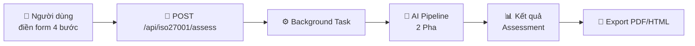
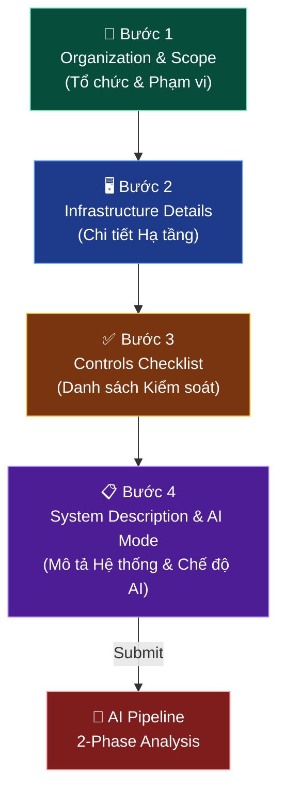
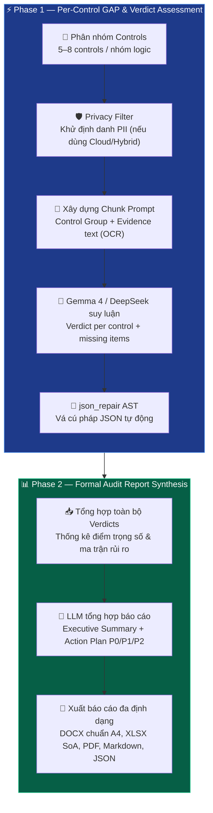
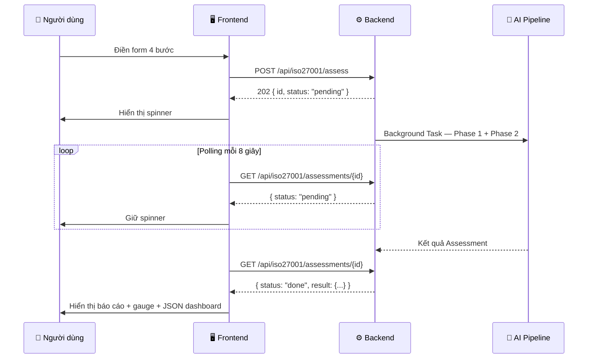

# 🛡️ CyberAI Platform — Tính Năng ISO Assessment (Đánh Giá ISO)

<div align="center">

[](../en/iso_assessment_form.md)
[](iso_assessment_form.md)

</div>

---

## 📑 Mục Lục

1. [Tổng Quan](#-1-tổng-quan)
2. [Assessment Workflow — Quy Trình Đánh Giá (4 Bước)](#-2-assessment-workflow--quy-trình-đánh-giá-4-bước)
3. [2-Phase AI Pipeline (Quy Trình Xử Lý AI 2 Pha)](#-3-2-phase-ai-pipeline-quy-trình-xử-lý-ai-2-pha)
4. [Compliance Scoring (Chấm Điểm Tuân Thủ)](#-4-compliance-scoring-chấm-điểm-tuân-thủ)
5. [Structured JSON Output (Đầu Ra JSON Có Cấu Trúc)](#-5-structured-json-output-đầu-ra-json-có-cấu-trúc)
6. [Supported Standards (Tiêu Chuẩn Hỗ Trợ)](#-6-supported-standards-tiêu-chuẩn-hỗ-trợ)
7. [Evidence System (Hệ Thống Bằng Chứng)](#-7-evidence-system-hệ-thống-bằng-chứng)
8. [Export (Xuất Báo Cáo)](#-8-export-xuất-báo-cáo)
9. [Frontend UI (Giao Diện Người Dùng)](#-9-frontend-ui-giao-diện-người-dùng)

---

## 🔍 1. Tổng Quan

> 💡 **Tính năng này làm gì?** Hệ thống đánh giá ISO giúp bạn kiểm tra xem tổ chức/công ty đang **tuân thủ bao nhiêu phần trăm** các tiêu chuẩn bảo mật quốc tế (ISO 27001, NIST, PCI DSS...). AI sẽ tự động:
> 1. **Tìm khoảng cách (GAP)** — So sánh "những gì bạn đã làm" vs "những gì tiêu chuẩn yêu cầu" → chỉ ra bạn đang thiếu gì
> 2. **Đánh giá rủi ro** — Mỗi thiếu sót được AI phân tích: "Nếu thiếu biện pháp này, rủi ro là gì? Nghiêm trọng cỡ nào?"
> 3. **Tạo báo cáo** — Tự động sinh báo cáo chuyên nghiệp: điểm tuân thủ, sổ đăng ký rủi ro, kế hoạch hành động
>
> **Ví dụ thực tế:** Công ty ACME muốn biết "Chúng tôi tuân thủ ISO 27001 được bao nhiêu % rồi?". Họ điền form 4 bước → AI phân tích → Kết quả: "62.5% tuân thủ, thiếu 2 biện pháp nghiêm trọng về mã hóa và quản lý malware".

### GAP Analysis là gì? — Giải thích đơn giản

> 🎯 **GAP = Khoảng cách.** Hãy tưởng tượng:
> - **Tiêu chuẩn ISO 27001** yêu cầu 93 biện pháp bảo mật (ví dụ: phải có tường lửa, phải mã hóa dữ liệu, phải đào tạo nhân viên...)
> - **Công ty bạn** đã thực hiện được 50 biện pháp
> - **GAP** = 43 biện pháp chưa làm → Đó là "khoảng cách" cần cải thiện
>
> AI sẽ phân tích từng GAP: "Thiếu biện pháp A.8.7 (quản lý malware) → Rủi ro: hacker có thể cài mã độc → Mức nghiêm trọng: Critical → Khuyến nghị: triển khai antivirus trong 30 ngày"

Wizard (Trình hướng dẫn) 4 bước dành cho Assessment (Đánh giá) Compliance (Tuân thủ) an ninh mạng toàn diện. Hỗ trợ **ISO 27001:2022**, **TCVN 11930:2017**, và **tiêu chuẩn tùy chỉnh tải lên**.

Frontend: [`/form-iso`](../../frontend-next/src/app/form-iso/page.js) với điều hướng [`StepProgress`](../../frontend-next/src/components/StepProgress.js).

Backend: [`/api/iso27001/assess`](../../backend/api/routes/iso27001.py) kích hoạt tác vụ nền được xử lý bởi [`assessment_helpers.py`](../../backend/services/assessment_helpers.py).



---

## 📝 2. Assessment Workflow — Quy Trình Đánh Giá (4 Bước)



### 🏢 Bước 1 — Organization & Scope (Tổ chức & Phạm vi)

| Trường | Mô tả |
|--------|--------|
| Organization name (Tên tổ chức) | Tên công ty hoặc tổ chức |
| Industry (Ngành nghề) | Lĩnh vực hoạt động |
| Organization size (Quy mô) | Số nhân viên / quy mô tài sản |
| Standard (Tiêu chuẩn) | ISO 27001 (93 controls, 4 categories) / TCVN 11930 (34 controls, 5 categories) / Custom |
| Scope (Phạm vi) | `full` / `department` / `system` |

### 🖥️ Bước 2 — Infrastructure Details (Chi Tiết Hạ Tầng)

| Trường | Mô tả |
|--------|--------|
| Servers | Danh sách và cấu hình máy chủ |
| Firewalls | Chi tiết triển khai tường lửa |
| VPN | Dịch vụ VPN đang sử dụng |
| Cloud services | Nhà cung cấp và dịch vụ đám mây |
| Antivirus | Giải pháp bảo vệ endpoint |
| SIEM | Hệ thống giám sát an ninh |
| Backup systems | Hạ tầng sao lưu dự phòng |
| Recent incidents | Các sự cố bảo mật gần đây |

### ✅ Bước 3 — Controls Checklist (Danh Sách Biện Pháp Kiểm Soát)

- **Chuyển đổi từng Control (Biện pháp kiểm soát)**: đã triển khai / chưa triển khai
- **Chọn tất cả theo danh mục** để chuyển đổi hàng loạt
- **Evidence (Bằng chứng) upload** cho từng control (kéo-thả, tối đa 10 MB)
- Định dạng file được hỗ trợ: `PDF`, `PNG`, `JPG`, `DOC`, `DOCX`, `XLSX`, `CSV`, `TXT`, `LOG`, `CONF`, `XML`, `JSON`

**Trích xuất nội dung Evidence (Bằng chứng) cho AI context:**

| Loại File | Phương Pháp Trích Xuất |
|-----------|------------------------|
| TXT, LOG, CONF, CSV, XML, JSON | Đọc trực tiếp dạng text |
| PDF | `pypdf` |
| DOCX | `python-docx` |
| XLSX | `openpyxl` |

### 📋 Bước 4 — System Description & AI Mode (Mô Tả Hệ Thống & Chế Độ AI)

| Trường | Mô tả |
|--------|--------|
| Network topology (Kiến trúc mạng) | Mô tả kiến trúc mạng lưới |
| Additional notes (Ghi chú bổ sung) | Thông tin bổ sung dạng tự do |
| AI mode (Chế độ AI) | `Local` / `Hybrid` / `Cloud` |

---

### 🤖 3. Assessment AI Pipeline & Control-Aware Processing

Hệ thống đánh giá vận hành qua pipeline suy luận nhận thức biện pháp kiểm soát (Control-Aware Chunked Assessment):



### ⚡ Phase 1 — Per-Control GAP Analysis & Verdict Determination

- **Mô hình chính:** `gemma4:latest` (Ollama cục bộ) hoặc `deepseek-v4-flash` / `gemini-2.0-flash` (Cloud).
- **Phân nhóm Controls:** Thay vì gửi toàn bộ 93 controls một lần (vượt quá context window), hệ thống phân tách thành các nhóm nhỏ 5–8 controls qua `get_control_groups()`.
- **Nạp bằng chứng qua OCR:** File tài liệu hoặc scan log gắn kèm từng control được trích xuất text qua `Tesseract OCR` (hỗ trợ cả tiếng Việt và tiếng Anh) và đưa vào prompt ngữ cảnh.
- **Xác định kết luận (5 Verdict chuẩn duy nhất):**
  - `satisfied` (Đạt yêu cầu): Có bằng chứng minh chứng đầy đủ (hệ số 1.0).
  - `partial` (Đạt một phần): Có triển khai nhưng thiếu tài liệu/chính sách (hệ số 0.5).
  - `not_evidenced` (Chưa chứng minh): Tự khai báo áp dụng nhưng chưa nạp minh chứng (hệ số 0.0).
  - `missing` (Còn thiếu): Chưa triển khai biện pháp kiểm soát (hệ số 0.0).
  - `needs_expert_review` (Cần chuyên gia rà soát): Có xung đột minh chứng hoặc cần đánh giá thủ công (hệ số 0.0).

### 📊 Phase 2 — Formal Audit Report Synthesis (Tổng Hợp Báo Cáo Kiểm Toán)

Báo cáo hoàn chỉnh được cấu trúc theo 5 phần chuẩn mực IT Audit quốc tế:

| Phần | Nội Dung Chi Tiết |
|------|-------------------|
| **1. TỔNG QUAN HỆ THỐNG** | Thông tin tổ chức, phạm vi đánh giá, chỉ số tuân thủ tổng thể %, phân bổ điểm trọng số |
| **2. SỔ ĐĂNG KÝ RỦI RO (RISK REGISTER)** | Bảng chi tiết: Control ID \| GAP \| Mức độ Nghiêm trọng \| Khả năng xảy ra \| Tác động \| Khuyến nghị |
| **3. PHÂN TÍCH GAP CHI TIẾT** | Đánh giá từng biện pháp kiểm soát, trích dẫn log cấu hình máy chủ thực tế (IP, Hotfix, Firewall) |
| **4. KẾ HOẠCH HÀNH ĐỘNG (ACTION PLAN)** | Phân loại ưu tiên khắc phục theo mốc thời gian: P0 (0–30 ngày), P1 (1–3 tháng), P2 (3–12 tháng) |
| **5. BÁO CÁO TÓM TẮT DÀNH CHO LÃNH ĐẠO (EXECUTIVE SUMMARY)** | Đánh giá rủi ro tổng thể, top 3 nguy cơ đe dọa cao nhất, khuyến nghị chiến lược |

---

## 📐 4. Compliance Scoring (Chấm Điểm Tuân Thủ)

Hệ thống phân định rành mạch hai hệ thống chỉ số:

### 1. Control Coverage (Độ phủ số lượng biện pháp kiểm soát)
- **Công thức:** `(Số control đạt / Tổng số control của chuẩn) × 100%`
- Phản ánh trung thực số lượng control đã được triển khai (ví dụ: `47/93 controls` ~ `50.54%`).
- Được phân chia thành: `self_declared_implemented`, `evidence_supported_implemented`, `not_evidenced_or_missing`.

### 2. Weighted Compliance (Điểm tuân thủ có trọng số)
- **Công thức:** `W = Σ(achieved_weight) / Σ(max_weight) × 100%`
- Các control `Critical` có trọng số **4**, `High` là **3**, `Medium` là **2**, và `Low` là **1**.
- Phản ánh chiều sâu bảo mật tổng thể (ví dụ: `237.5 / 430.0` ~ `55.23%`).

**Trọng số theo Severity:**

| Severity (Mức nghiêm trọng) | Weight (Trọng số) |
|------------------------------|-------------------|
| Critical (Nghiêm trọng) | 4 |
| High (Cao) | 3 |
| Medium (Trung bình) | 2 |
| Low (Thấp) | 1 |

### Compliance Tiers (Mức Độ Tuân Thủ)

| Score (Điểm) | Tier (Mức độ) |
|---------------|---------------|
| ≥ 80% | ✅ High compliance (Tuân thủ cao) |
| ≥ 50% | ⚠️ Medium compliance (Tuân thủ trung bình) |
| ≥ 25% | 🟠 Low compliance (Tuân thủ thấp) |
| < 25% | 🔴 Critical (Nghiêm trọng) |

---

## 📦 5. Hợp Đồng Dữ Liệu Chuẩn (Unified Assessment Result Schema)

Toàn bộ API, giao diện và các bộ xuất báo cáo (DOCX, PDF, SoA XLSX, Risk Register XLSX) đều đồng bộ từ một schema duy nhất [`UnifiedAssessmentResult`](../../backend/schemas/assessment_schema.py):

<details>
<summary>📄 Xem ví dụ Unified Assessment Result Schema</summary>

```json
{
  "assessment_id": "assess-7c81a29f-3d18-4f51-b841-8664b58e76a0",
  "run_id": "run_43bce82f1092",
  "code_version": "6a15651c9d0f",
  "created_at": "2026-09-07T09:20:10.104Z",
  "completed_at": "2026-09-07T09:20:16.120Z",
  "status": "completed",
  "standard": {
    "id": "iso27001",
    "name": "ISO/IEC 27001:2022"
  },
  "control_coverage": {
    "self_declared_implemented": 47,
    "evidence_supported_implemented": 15,
    "not_evidenced_or_missing": 46,
    "total_controls": 93,
    "raw_percentage": 50.54
  },
  "weighted_compliance": {
    "weighted_score": 245.0,
    "weighted_max_score": 495.0,
    "percentage": 49.49,
    "algorithm": "verdict_weighted_v2",
    "weight_scheme": "critical_10_high_5_medium_3_low_1"
  },
  "controls": [
    {
      "control_id": "A.8.8",
      "user_declaration": "implemented",
      "evidence_status": "direct_attachment",
      "evidence_file_ids": ["patch_report_masked.pdf"],
      "fact_card_ids": ["fc_patch_01"],
      "auto_match_confidence": null,
      "assessment_verdict": "satisfied",
      "verdict_basis": ["user_declaration", "direct_evidence"],
      "expert_review_status": "pending"
    }
  ],
  "evidence_manifest_ref": "data/evidence_manifests/assess-7c81a29f.json",
  "audit_trace_ref": "data/audit_traces/assess-7c81a29f.json"
}
```

</details>

**Quy chuẩn trạng thái Control:**
- `user_declaration`: `implemented` | `not_implemented` | `unknown`
- `evidence_status`: `direct_attachment` | `auto_matched` | `no_evidence` | `not_reviewed`
- `assessment_verdict`: `satisfied` | `not_evidenced` | `missing` | `needs_expert_review`
- `verdict_basis`: `user_declaration`, `direct_evidence`, `auto_match`, `ai_inference`
- `expert_review_status`: `pending` | `approved` | `modified` | `rejected`

---

## 📚 6. Supported Standards (Tiêu Chuẩn Hỗ Trợ)

### Built-in Standards (Tiêu Chuẩn Có Sẵn)

| Tiêu Chuẩn | ID | Controls (Biện pháp kiểm soát) | Categories (Danh mục) |
|-------------|-----|------|-----------|
| ISO 27001:2022 | `iso27001` | 93 | 4 — A.5 Organizational, A.6 People, A.7 Physical, A.8 Technological |
| TCVN 11930:2017 | `tcvn11930` | 34 | 5 — Network, Server, Application, Data, Management |
| Custom uploaded (Tải lên tùy chỉnh) | `{custom_id}` | Tối đa 500 | Tùy biến |

Danh mục Control (Biện pháp kiểm soát) được định nghĩa trong [`controls_catalog.py`](../../backend/services/controls_catalog.py).

---

## 📎 7. Evidence Manifest & Khử Nhạy Cảm (Sanitization)

Hệ thống quản lý bằng chứng tự động tạo `evidence_manifest` cho mỗi assessment:
- **Che dấu IP & Secrets:** Tất cả địa chỉ IP cục bộ (`192.168.***.***`) và token bảo mật trong tên tệp đều được che trước khi đưa vào metadata hoặc báo cáo.
- **Băm SHA-256:** Tính toán mã băm SHA-256 cho từng file để bảo đảm tính toàn vẹn mà không lưu trữ log thô hay cấu hình nhạy cảm.
- **Ánh xạ Fact Card:** Lưu vết liên kết giữa Fact Card ID, file ID và mã control tương ứng.
- **Phát biểu khách quan:** Không quy kết "doanh nghiệp không có biện pháp" chỉ vì chưa tải file. Báo cáo luôn ghi rõ: *"chưa ghi nhận đủ minh chứng trong phạm vi dữ liệu đánh giá; cần chuyên gia xác minh"*.

---

## 📤 8. Export (Xuất Báo Cáo Nhất Quán)

Tất cả các định dạng xuất đều sử dụng chung nguồn dữ liệu `UnifiedAssessmentResult`:

| Định Dạng | Tiêu Chuẩn Áp Dụng | Đặc Điểm Kỹ Thuật |
|-----------|--------------------|-------------------|
| **SoA XLSX** | ISO 27001 (93 dòng) / TCVN 11930 (34 dòng) | Header metadata (Assessment ID, Run ID, Code Version, Org Name), cột điểm `Score (0-5)` tại index 7, hiển thị Verdict, Verdict Basis và file minh chứng đã che. |
| **Risk Register XLSX** | ISO 27001 / TCVN 11930 | Ma trận Likelihood (1-4) x Impact (1-4) = Risk Score (1-16), cột `risk_assessment_basis` minh bạch, banner metadata đồng bộ. |
| **DOCX** | A4 Professional Layout | Bảng có `<w:tblHeader/>` lặp ở trang mới, `<w:cantSplit/>` chống cắt dòng, loại bỏ Markdown thô (`#`, `*`, backtick) và emoji lỗi font, có disclaimer kiểm định chuyên gia bắt buộc. |
| **PDF** | WeasyPrint / CSS Paged Media | Header lặp, layout chống trang trắng mồ côi, bảng grid metadata chuẩn hóa, tự động ghi nhận event `report_exported` với SHA-256. |

---

## 🤖 9. Detail Drawer & Trợ Lý CyberAI Từng Biện Pháp

Mỗi biện pháp kiểm soát trong danh sách đều có thể mở hộp thoại chi tiết (**Detail Drawer**) với 3 tab chức năng chuyên sâu:

1. **Tab Tiêu chí (Criteria):**
   - Hiển thị mô tả chi tiết, mục tiêu kiểm toán, tiêu chí nghiệm thu của chuẩn ISO 27001 / TCVN 11930.
   - Hiển thị lệnh kỹ thuật trích xuất thực tế (PowerShell / Linux Bash) và các cạm bẫy kiểm toán thường gặp (Audit Pitfalls).
2. **Tab Bằng chứng (Evidence):**
   - Cho phép kéo thả hoặc duyệt tệp từ máy tính cho riêng biện pháp đó.
   - Tự động lưu trữ vào hệ thống và kích hoạt trạng thái **"✓ ĐÃ TRIỂN KHAI"**.
   - Hỗ trợ xem trước nội dung tệp trực tiếp và xóa tệp an toàn.
3. **Tab CyberAI (Trợ lý Thẩm định & Sinh SOP):**
   - Gọi endpoint `/api/iso27001/controls/{control_id}/ai-assist` hoàn toàn bất đồng bộ (`asyncio.to_thread`) với timeout bảo vệ 15s.
   - **Chế độ "Sinh Quy Trình & Lệnh Mẫu" (`generate_sop`):** Tự động sinh khung SOP 4 bước, kịch bản PowerShell/Bash trích xuất cấu hình thực tế, danh mục bằng chứng kiểm toán (Checklist) và ma trận RACI.
   - **Chế độ "Thẩm Định Bằng Chứng" (`verify_evidence`):** Đối chiếu các tệp đính kèm với tiêu chí nghiệm thu của chuẩn để đưa ra kết luận Đạt/Chưa đạt và các khoảng cách (GAPs) cần hoàn thiện.
   - **Chế độ "Hỏi Đáp Chuyên Sâu" (`custom_query`):** Tư vấn giải pháp kỹ thuật theo ngữ cảnh thực tế của tổ chức.
   - **Enterprise SOP Fallback Engine:** Tự động phản hồi kịch bản kỹ thuật chuẩn xác theo từng nhóm mã (`A.5.*`, `A.6.*`, `A.7.*`, `A.8.*`) ngay cả khi mô hình AI cục bộ đang bận 100% xử lý đánh giá nền.

---

## 🖥️ 9. Frontend UI (Giao Diện Người Dùng)

Được triển khai tại [`/form-iso`](../../frontend-next/src/app/form-iso/page.js).

### Navigation (Điều Hướng)

Wizard (Trình hướng dẫn) 4 bước sử dụng component [`StepProgress`](../../frontend-next/src/components/StepProgress.js).

### Tabs

| Tab | Mục Đích |
|-----|----------|
| Form | Assessment Wizard (Trình hướng dẫn đánh giá) (Bước 1–4) |
| Result (Kết quả) | Báo cáo Markdown đã render + compliance gauge + JSON dashboard |
| History (Lịch sử) | Danh sách phân trang các Assessment (Đánh giá) trước đó |
| Templates (Mẫu) | Các mẫu Assessment (Đánh giá) đã điền sẵn |

### Processing UX (Trải Nghiệm Xử Lý)

- Submit kích hoạt tác vụ nền (background task)
- **Polling interval**: mỗi 8 giây cho đến khi hoàn tất
- Compliance gauge hiển thị trực quan trên trang kết quả
- Structured JSON dashboard cho đầu ra machine-readable



---

<details>
<summary>📄 Ví dụ Assessment Result (Kết Quả Đánh Giá) JSON đầy đủ</summary>

```json
{
  "id": "7e0b008d-34d9-4c5b-bf9a-f3de2d53658e",
  "status": "done",
  "created_at": "2025-03-24T09:00:00",
  "data": {
    "company_name": "ACME Corp",
    "industry": "Finance",
    "standard_id": "iso27001",
    "scope": "full",
    "controls": ["A.5.1", "A.6.1", "A.7.1", "A.8.1"],
    "infrastructure": {
      "servers": "10 Linux servers, 5 Windows servers",
      "firewalls": "Palo Alto PA-3200",
      "vpn": "OpenVPN",
      "cloud_services": "AWS (EC2, S3, RDS)",
      "antivirus": "CrowdStrike Falcon",
      "siem": "Splunk Enterprise",
      "backup_systems": "Veeam Backup",
      "recent_incidents": "None in last 12 months"
    }
  },
  "result": {
    "analysis": "## Đánh Giá Tuân Thủ ISO 27001:2022\n\n**Điểm tổng thể: 62/100**\n...",
    "structured_json": {
      "compliance_tier": "medium",
      "compliance_score": 62.5,
      "weight_breakdown": {
        "critical": {"implemented": 3, "total": 5, "weight": 4},
        "high": {"implemented": 10, "total": 15, "weight": 3}
      },
      "risk_summary": {"critical": 2, "high": 5, "medium": 2, "low": 1},
      "top_gaps": [
        {"id": "A.8.7", "severity": "critical", "gap": "Thiếu quản lý malware protection"},
        {"id": "A.5.23", "severity": "critical", "gap": "Thiếu quy trình information security for cloud services"}
      ]
    },
    "model": "SecurityLLM-7B",
    "provider": "local"
  }
}
```

</details>

---

> **📌 Tóm tắt:** Hệ thống Assessment (Đánh giá) ISO cung cấp quy trình đánh giá Compliance (Tuân thủ) đầy đủ từ thu thập dữ liệu qua Wizard (Trình hướng dẫn) 4 bước, phân tích GAP tự động bằng AI Pipeline (Quy trình xử lý) 2 pha, Scoring (Chấm điểm) bằng Weighted Average (Trung bình có trọng số), đến xuất báo cáo PDF/HTML chuyên nghiệp — tất cả chạy bất đồng bộ với polling UX mượt mà.
