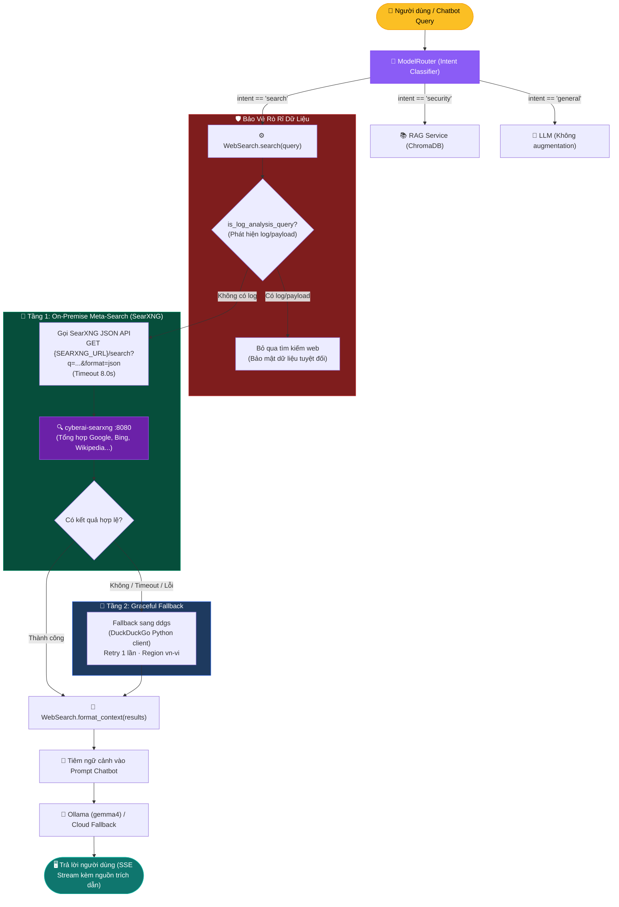

# Web Search Service — Tích hợp SearXNG & Web Search

> **Module:** [`backend/services/web_search.py`](../../backend/services/web_search.py)  
> **Route API:** [`backend/api/routes/web_search.py`](../../backend/api/routes/web_search.py) (`POST /api/v1/web-search`, `POST /api/web-search`)  
> **Kích hoạt:** Hybrid intent classifier trong [`backend/services/model_router.py`](../../backend/services/model_router.py) phân loại câu hỏi vào `intent="search"` → `ChatService` gọi `WebSearch.search()` rồi đưa `WebSearch.format_context()` vào prompt LLM.

---

## 1. Vai trò của Web Search & SearXNG trong Hệ thống

Mặc dù CyberAI vận hành chủ yếu dựa trên cơ sở tri thức tiêu chuẩn an toàn thông tin offline (RAG corpus trong `data/iso_documents/` được nhúng bằng `BAAI/bge-m3`), nhiều tình huống thực tế đòi hỏi thông tin an ninh mạng cập nhật theo thời gian thực (Live Threat Intelligence):
- Mã lỗ hổng bảo mật mới công bố (Zero-day CVE, NVD/CISA advisories).
- Chiến dịch tấn công mạng và mã độc tống tiền (Ransomware campaigns) đang diễn ra.
- Thông báo cảnh báo an toàn từ các cơ quan quản lý (VNCERT, Cục ATTT).

Để đảm bảo **quyền riêng tư dữ liệu (Data Privacy)** và **tính độc lập On-Premise**, hệ thống triển khai container riêng biệt **SearXNG** (`cyberai-searxng`) làm công cụ tìm kiếm tổng hợp meta-search nội bộ, kết hợp cơ chế dự phòng tự động (**Graceful Fallback**) qua thư viện `ddgs`.

---

## 2. Kiến Trúc Tìm Kiếm Hai Tầng (Dual-Layer Search Architecture)



---

## 3. Cấu hình Container SearXNG (`searxng/settings.yml`)

Dịch vụ `cyberai-searxng` sử dụng image `searxng/searxng:latest` và được cấu hình qua tệp `searxng/settings.yml` (mount vào `/etc/searxng:rw`):

```yaml
use_default_settings: true

general:
  debug: false
  instance_name: "CyberAI Private Search"

search:
  safe_search: 0
  autocomplete: ""
  default_lang: "vi"
  formats:
    - html
    - json   # BẮT BUỘC: Cho phép Backend truy xuất định dạng JSON

server:
  port: 8080
  bind_address: "0.0.0.0"
  secret_key: "cyberai-searxng-insecure-secret-key-for-local-use"
  limiter: false  # Tắt limiter nội bộ để Backend không bị rate-limit
```

### Thiết lập Docker Compose:
- **Mạng nội bộ Docker:** Backend kết nối trực tiếp với SearXNG qua `http://searxng:8080`.
- **Port Host:** Ánh xạ ra ngoài cổng `8888:8080` phục vụ kiểm tra hoặc truy cập trực tiếp từ máy chủ.
- **Biến môi trường Backend:** `SEARXNG_URL=http://searxng:8080`.

---

## 4. API Công Khai & Cấu Trúc Dữ Liệu

### Lớp `WebSearch` ([`backend/services/web_search.py`](../../backend/services/web_search.py))

```python
class WebSearch:
    @staticmethod
    def _search_searxng(query: str, max_results: int = 5) -> List[Dict[str, str]]:
        """Truy vấn trực tiếp SearXNG Meta-Search Engine qua JSON API."""
        ...

    @classmethod
    def search(cls, query: str, max_results: int = 5, retries: int = 1) -> List[Dict[str, str]]:
        """Tìm kiếm web ưu tiên SearXNG cục bộ, tự động fallback sang ddgs."""
        ...

    @staticmethod
    def format_context(results: List[Dict[str, str]]) -> str:
        """Định dạng danh sách kết quả thành khối văn bản có đánh số trích dẫn cho LLM."""
        ...
```

### Schema kết quả trả về

```json
[
  {
    "title": "Tiêu chuẩn ISO/IEC 27001 – Hệ thống Quản lý An Toàn Thông Tin",
    "url": "https://example.vn/iso-27001",
    "snippet": "ISO/IEC 27001:2022 là tiêu chuẩn quốc tế về quản lý an toàn thông tin..."
  }
]
```

---

## 5. Thuật Toán Xử Lý & Cơ Chế Dự Phòng

Quy trình thực thi trong `WebSearch.search()`:

1. **Bảo vệ rò rỉ dữ liệu (Data Loss Prevention):**
   - Kiểm tra `is_log_analysis_query(query)`.
   - Nếu phát hiện câu hỏi chứa log kỹ thuật hoặc payload tấn công, **tuyệt đối không gửi ra ngoài internet**; hàm trả về `[]` ngay lập tức để bảo vệ dữ liệu nội bộ.
2. **Tiền xử lý câu truy vấn:**
   - Chuẩn hóa khoảng trắng và cắt ngắn tối đa 150 ký tự để tối ưu độ chính xác của search engine.
   - Nếu độ dài `< 3` ký tự: trả về `[]`.
3. **Ưu tiên 1 — Truy vấn SearXNG Cục bộ (`_search_searxng`):**
   - Gửi yêu cầu HTTP GET bằng thư viện `httpx` tới `f"{SEARXNG_URL}/search"` kèm params:
     - `q`: chuỗi truy vấn đã tiền xử lý.
     - `format`: `"json"`.
     - `categories`: `"general"`.
     - `language`: `"vi-VN"`.
   - Thiết lập thời gian chờ `timeout=8.0s`.
   - Trích xuất trường `results[].title`, `results[].url`, `results[].content`.
   - Nếu thành công và có kết quả: trả về danh sách kết quả ngay, không kích hoạt tầng 2.
4. **Ưu tiên 2 — Dự phòng tự động (Graceful Fallback với `ddgs`):**
   - Kích hoạt khi SearXNG gặp sự cố (timeout, container dừng, hoặc 0 kết quả).
   - Nạp module `ddgs` (hoặc `duckduckgo_search`).
   - Thực hiện tìm kiếm với User-Agent chuẩn desktop và `region="vn-vi"`.
   - Thử lại tối đa `retries` lần (giãn cách 0.5s – 1.0s).
5. **Định dạng ngữ cảnh (`format_context`):**
   - Đánh số thứ tự trích dẫn `[1]`, `[2]`... kèm URL và trích đoạn tóm tắt để LLM có thể dẫn nguồn tường minh trong câu trả lời.

---

## 6. REST API Endpoints

Hệ thống cung cấp endpoint HTTP để kiểm tra hoặc phục vụ các client ngoại vi:

- **Endpoint:** `POST /api/v1/web-search` hoặc `POST /api/web-search`
- **Request Body:**
  ```json
  {
    "query": "Các lỗ hổng bảo mật nghiêm trọng năm 2026",
    "max_results": 5
  }
  ```
- **Response (200 OK):**
  ```json
  {
    "status": "ok",
    "query": "Các lỗ hổng bảo mật nghiêm trọng năm 2026",
    "results": [
      {
        "title": "Cảnh báo lỗ hổng bảo mật mới...",
        "url": "https://...",
        "snippet": "..."
      }
    ],
    "total": 5
  }
  ```

---

## 7. Định Tuyến & Điều Kiện Kích Hoạt (Routing)

Quyết định gọi Web Search được điều phối bởi **Hybrid Model Router** ([`backend/services/model_router.py`](../../backend/services/model_router.py)) kết hợp với cờ ghi đè trực tiếp từ người dùng:

1. **Cờ ghi đè trực tiếp từ Chatbot UI (`use_search`):**
   - Người dùng có thể chủ động chuyển đổi chế độ thông qua nút **🌐 Tìm kiếm Web** trên giao diện:
     - **Tự động (`use_search = None`):** Hệ thống tự động phân tích câu hỏi qua ModelRouter.
     - **BẬT (`use_search = True`):** Ép buộc kích hoạt tìm kiếm web qua SearXNG (trừ khi phát hiện rò rỉ log).
     - **TẮT (`use_search = False`):** Tắt hoàn toàn tìm kiếm web, chỉ dùng RAG offline hoặc tri thức sẵn có của LLM.
2. **Phân loại ngữ nghĩa & Từ khóa (ModelRouter):**
   - **Nhận diện không dấu:** Chuẩn hóa tiếng Việt (`_strip_vietnamese_accents`) để bắt chính xác các truy vấn không dấu như *"tin tuc an ninh mang moi nhat"*, *"cve moi"*, *"lo hong moi"*.
   - **Ưu tiên Threat Intel:** Nếu câu hỏi an ninh mạng chứa các từ khóa thời sự (`tin tức`, `mới nhất`, `cập nhật`, `vừa công bố`), router tự động gắn cờ `use_search = True`.
3. **Hỗ trợ toàn diện cho cả Local Models & Cloud Models:**
   - Cả mô hình cục bộ (`gemma4:latest`, `qwen2.5-coder:7b`) và mô hình đám mây (`gemini-2.0-flash`, `claude-3.5-sonnet`) đều được nạp ngữ cảnh tìm kiếm (`search_context`) định dạng rõ ràng vào prompt suy luận.

---

## 8. Ghi Chú Vận Hành & Xử Lý Sự Cố

| Tình huống | Nguyên nhân | Biện pháp xử lý |
|---|---|---|
| Container `cyberai-searxng` có 0% CPU | SearXNG là dịch vụ On-Demand (chỉ xử lý khi có request); hoặc Chatbot đang xử lý câu hỏi offline | Đây là trạng thái bình thường khi rảnh. Khi gửi câu hỏi cần tra cứu web, CPU và Network I/O của SearXNG sẽ tăng tương ứng. |
| SearXNG trả mã `403 Forbidden` | Thiếu `search.formats: [html, json]` trong cấu hình | Đảm bảo file `searxng/settings.yml` đã mount đúng và chứa `formats: [html, json]`. |
| SearXNG phản hồi chậm hoặc timeout | Các công cụ tìm kiếm thượng tầng (Google, Bing...) phản hồi chậm | Hệ thống tự động chuyển sang `ddgs` sau 8.0s timeout; có thể tinh chỉnh engine trong `settings.yml`. |
| Container SearXNG bị dừng | Docker daemon hoặc hết RAM | Kiểm tra `docker logs cyberai-searxng` và khởi động lại với `docker compose up -d searxng`. Hệ thống vẫn hoạt động nhờ fallback `ddgs`. |
| Không có kết quả từ cả 2 tầng | Mất kết nối internet hoặc query không hợp lệ | Hệ thống trả về `[]` một cách an toàn, Chatbot tiếp tục suy luận từ tri thức sẵn có của LLM. |

